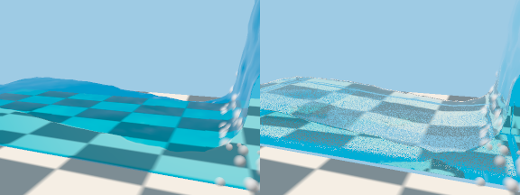
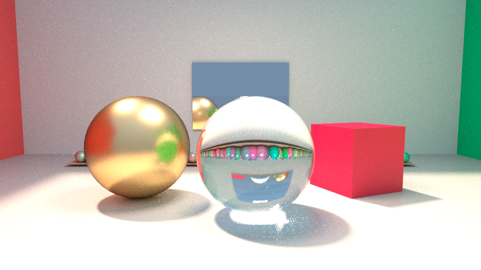

# 3D in NodeBased

NodeBased has a 3D scene graph that renders into the ordinary 2D comp. Geometry, lights and a
camera are assembled by `Scene3D`; `Render3D` turns that into the same float32, scene-linear,
premultiplied RGBA image every other node produces, so Grade, Merge, Roto and Write simply
follow it.

This page says what exists today and, just as plainly, what does not. The long-range plan —
USD, ray tracing, Gaussian splats, particles, fluids, Nuke parity — is in
[3D_ROADMAP.md](3D_ROADMAP.md) and none of it should be inferred from this page.

## Nodes

| Node | Output | What it does |
| --- | --- | --- |
| `Card3D` | geometry | A flat card. Connect `image` to texture it: this is the 2.5D workhorse. `rows`/`columns` (Nuke's own names) subdivide it into a grid of quads with correct UVs; a subdivided plane is just a `Card3D` with `rows`/`columns` above 1. |
| `Cube3D` | geometry | A cube; each face carries the full texture. |
| `Sphere3D` | geometry | A smooth-shaded lat/long sphere with a spherical UV map. `rows` (latitude bands) and `columns` (longitude segments) are Nuke's own names; the pole rings emit no degenerate or duplicated triangles. |
| `Cylinder3D` | geometry | A cylinder along +Y: `cyl_radius`, `cyl_height`, `rows` (height segments), `columns` (radial segments), and `cyl_caps` (`closed` or `open`) for flat end caps. |
| `ReadGeo3D` | geometry | A Wavefront OBJ from disk: polygons (triangulated), UVs and normals. |
| `Axis3D` | scene | A pure Nuke-style transform: parents whatever geometry, light or scene is wired into its one optional input. Chaining `Axis3D` nodes composes transforms in order through ordinary scene nesting. With nothing wired it is an empty scene. |
| `TransformGeo3D` | geometry | Bakes its transform into the input geometry's own vertices (and normals, through the inverse transpose), rather than adding a parent matrix. Unlike `Axis3D`, this acts before the geometry's own transform and any further parenting. |
| `MergeGeo3D` | geometry | Merges up to eight geometries (`geo0` to `geo7`, the same eight optional slots `Scene3D` uses, geometry only) into ONE geometry. Each input's full world transform is baked into its vertices, indices are offset per input, normals go through the inverse transpose and UVs are concatenated. Its own transform block is then baked on top, like a parent (so with one input that has no transform of its own it equals `TransformGeo3D`). A geometry holds a single colour, texture, material and projection: those come from the FIRST wired input and the other inputs' are dropped. If only some inputs carry normals the rest get smooth recomputed ones. Unwired slots are skipped and nothing wired gives an empty geometry. Disabled passes the first wired input. |
| `Normals3D` | geometry | Edits normals. `normals_mode`: `unchanged`; `recompute` (smooth per-vertex normals, area weighted; vertices sharing a position, like a sphere seam or pole, are smoothed together, but faces more than 50 degrees apart stay creased, so a cube stays flat); `flip` (negates the normals and reverses every face's winding); `unify` (makes winding agree across shared edges, turns closed surfaces outward, then recomputes). `flip_winding` then reverses winding and negates normals again in any mode (so `flip` plus `flip_winding` is the identity). The CPU and GPU shaders are two-sided (normals face the eye), so flipping does not change a render; it changes the geometry a downstream node or `WriteGeo3D` sees. (The knob is `normals_mode` because parameter names are shared across all nodes and `mode` already belongs to `Tracker`.) |
| `DisplaceGeo3D` | geometry | Moves each vertex along its normal by `displace_scale` * (image channel sampled bilinearly at the vertex UV) + `displace_offset`. The optional `image` input is evaluated like `Project3D`'s; unwired (or a geometry with no UVs) gives `displace_offset` alone. `displace_channel`: `luminance` (Rec. 709), `red`, `green`, `blue` (un-premultiplied) or `alpha`. Uses the geometry's own normals, or smooth recomputed ones when it has none. `recompute_normals` (on by default) recomputes normals from the displaced surface; off keeps the old ones. Displacement is in the geometry's object space, so subdivide (`rows`/`columns`) for detail. Disabled passes the geometry. |
| `Shrinkwrap3D` | geometry | Fits a `proxy` mesh onto the required `target` (any geometry or scene, flattened to world-space triangles). With no `proxy` wired it generates one enclosing the target from `wrap_shape` (`sphere` a lat/long sphere, `cylinder` an unrolled side plus two capped ends, `box` a six-face UV cross) at `wrap_resolution`, with clean, non-overlapping UVs; a wired `proxy` keeps its own UVs exactly as authored. `wrap_mode`: `nearest` finds the closest point anywhere on the target's surface (works on any shape, convex or not); `project` walks inward from each proxy vertex along its own normal and lands on the first hit, falling back to `nearest` where that ray finds nothing (a proxy that does not fully enclose a concave target). `wrap_offset` then moves the landing point along the target's normal, `wrap_falloff` (0 to 1) blends between the original proxy position and the wrapped one, and `wrap_smooth_iterations` runs that many passes of plain Laplacian smoothing over the proxy's own edges afterward, touching positions only, never UVs. Everything is computed and returned in world space. Disabled passes the target. |
| `ParticleEmitter3D` | particles | A deterministic particle emitter (see [SIMULATION.md](SIMULATION.md)): `emit_from` a point, the vertices, surface or volume of the optional `geo` input; rate per frame or per second, lifetime, speed, direction and spread, size and colour with variation, `seed`, `start_frame` and `substeps`, plus the transform block. Its output goes into a `Scene3D` or `Axis3D` slot and `Render3D` draws it as points. Bypassed, it passes its `geo` input. |
| `ParticleCache3D` | particles | Solves the particles wired into it through the disk-backed simulation cache: every frame is a checkpoint, scrubbing back never re-solves, and `cache_memory_mb` and `cache_disk_mb` bound the two tiers. Bypassed, it passes its input. |
| `Plume3D` | volume | A deterministic analytic smoke plume (`scene3d.analytic_plume`) of `plume_resolution` cells per side and `plume_seed`, under its own transform block; a source node like `Light3D` (it cannot be bypassed). Its output goes into a `Scene3D` or `Axis3D` slot, which apply their matrix to it, and `Render3D` raymarches it (see "Volumes" below). `MergeGeo3D` refuses it by slot type. |
| `ReadVDB3D` | scene | A Houdini Pyro or Blender OpenVDB cache as a scene holding one `Volume` (in-house reader, `nodebased/vdbio.py`, no extra package). `vdb_path` is a file or a padded frame pattern (`smoke.%04d.vdb`, `smoke.####.vdb`), shifted by `frame_offset`; `density_grid`, `temperature_grid` and `velocity_grid` name grids in the file (the panel lists them), `none` leaves a field out and `auto` (the default) picks `density`, `temperature` or `heat`, and `vel`, `velocity` or `v`; `voxel_scale` scales the volume about the file's origin; the transform block sits on top of the grid's own transform. Reads FloatGrid and Vec3fGrid (float32 or half) with zip, Blosc-LZ4 or no compression, and refuses frustum transforms and other grid classes with a named error; see docs/FLUIDS_SPIKE.md "Step B as built". A source node: it cannot be bypassed (a loaded document that carries the flag gets an empty scene). |
| `FluidSource3D` | fluid | Where a fluid solve gets its smoke, fire and push (Houdini Pyro's vocabulary; lengths are world units, rates per frame). `fluid_emit_from`: `point`, `sphere` (`src_center_*`, `src_radius`, `src_falloff` to a soft rim), or the `surface` or `volume` of the optional `geo` input (voxelised conservatively; `volume` also fills a closed mesh). `src_density`, `src_temperature`, `src_fuel` are added per frame, `src_vel_*` holds the air in the source at that velocity, `src_inherit_velocity` adds the motion of an animated `geo`, `src_noise_amount` and `src_noise_scale` break the emission up with seeded noise, `start_frame` and `end_frame` window it, and the transform block moves a point or sphere source (a `geo` source uses the geometry's own transform). `fluid_type` is `smoke` (the default, for `FluidSolver3D`) or `liquid` (for `FluidLiquidSolver3D`): each solver ignores the other kind's sources. For a liquid the footprint is filled with particles at the start frame (a still source fills once), and a source with a `src_vel_*` velocity keeps pouring until `end_frame`; `src_density`, `src_temperature`, `src_fuel`, `src_noise_*` and `src_falloff` are smoke knobs a liquid ignores. A source node: it cannot be bypassed. Wire it, through forces and colliders, into a `FluidSolver3D` or a `FluidLiquidSolver3D`. One source feeds one chain; a pool and a drop go in as one geometry (a `MergeGeo3D`) into the `geo` slot with `volume` emission. |
| `FluidForce3D` | fluid | Adds a force to the chain. `force_kind`: `buoyancy` (`buoyancy_lift` for temperature, `buoyancy_settle` for density, `ambient_temperature`; it replaces the solver's built-in buoyancy), `gravity` (along `force_dir_*`, weighing the smoke: dense smoke sinks, clean air does not), `wind` (a uniform acceleration along `force_dir_*` by `strength`, visible where the air can leave, i.e. an open boundary), `turbulence` (a divergence-free noise force of feature size `turbulence_scale`, evolving at `turbulence_speed`, seeded by `seed`) and `drag`. `from_frame` and `to_frame` window it. Bypassed, it passes the chain. |
| `FluidCollide3D` | fluid | Makes the `geometry` input (a geometry or scene) a solid: the cells it covers, filled if the mesh is closed, become obstacles the smoke cannot enter and the flow goes around. Frozen at the first frame of the document's range; with `animated` on, it is voxelised per substep from the animation (interpolated between the frame either side) and its own velocity pushes the fluid, the same convention as `ParticleBounce3D`'s `animated`. Bypassed, or unwired, it passes the chain unchanged. |
| `FluidSolver3D` | volume | The 3D smoke and fire solver on a MAC grid (`nodebased/fluid3d.py`, docs/FLUIDS_SPIKE.md "Step C as built"). The grid is `bounds_min_*` to `bounds_max_*` divided by `division_size` (the panel shows the derived `resolution`, read-only; a grid past 16.7 million cells is refused). `start_frame`, `substeps` and `seed` fix the timeline; `advection` is `maccormack` (sharper) or `semi_lagrangian`; `vorticity` is the confinement strength, `dissipation` and `cooling_rate` fade density and heat per frame; `boundary_x`, `boundary_y` and `boundary_z` are `closed` or `open` (smoke leaves); `tolerance` and `max_iterations` bound the pressure solve, which `pressure` runs on the `cpu` (conjugate gradient, the reference), the `gpu` (wgpu SOR pressure solve with the rest on the CPU), `resident` (the whole substep on the GPU with a multigrid pressure solve, `nodebased/fluid_gpu_solver.py`), `resident_sparse` (the same over active 8 cubed tiles, with sparse cache frames) or `auto` (`resident` from one million cells up when it fits the card, else the CPU). `fire` turns on fuel combustion above `ignition_temperature`; `burn_rate`, `flame_lifespan` and `fuel_inefficiency` control reaction, while `temperature_output` and `smoke_output` add heat and soot. `gas_release` feeds flame expansion into pressure projection. Its output is a `Volume` per frame with density, temperature, velocity, flame-rate and remaining fuel fields. `FluidSource3D.src_fuel` emits reactant; `WriteVDB3D` preserves the optional flame and fuel grids. The rendered temperature drives blackbody emission in `Render3D`. Bypassed, it contributes nothing. |
| `FluidCache3D` | volume | Keeps the solved frames of the `FluidSolver3D` wired into it, like `ParticleCache3D`: every frame is a checkpoint, scrubbing back never re-solves, `cache_memory_mb` and `cache_disk_mb` bound the two tiers, and it resumes from disk after a restart. `cache_precision` (`float32` or `float16`) and `cache_channels` (`density`, `density_temperature`, `density_temperature_velocity` or `all`) shrink what is served and stored for scrubbing; solver checkpoints stay exact so a solve resumed from disk matches a straight one. Bypassed, it passes its input. |
| `FluidUpres3D` | volume | Re-simulates density, temperature, flame and fuel frame by frame on a finer grid, guided by spatially and temporally sampled cached coarse velocity. `upres_factor` is 1, 2 or 4; `turbulence`, `swirl_size`, `grain`, `shredding` and `seed` control repeatable detail at the new scale. It performs no pressure solve and checkpoints its own frames (`cache_memory_mb`, `cache_disk_mb`); write the result through `Scene3D` and `WriteVDB3D`. CPU and GPU dense up-res paths are measured at 64³→256³ and 128³→512³; sparse tile storage is 12–14% of the dense density array after conversion, while sparse computation is still pending. See docs/FLUIDS_SPIKE.md “H2: production-size up-res and path-trace baseline”. |
| `FluidLiquidSolver3D` | particles | The FLIP/PIC liquid solver (`nodebased/flip3d.py`, docs/FLUIDS_SPIKE.md "Step E as built") on the same MAC grid and chain as `FluidSolver3D` (grid, `start_frame`, `substeps`, `seed`, `tolerance`, `max_iterations` as there; `pressure` is `cpu`, `gpu` (the wgpu SOR hook) or `auto`, the resident solvers are refused). `flip_ratio` blends FLIP (1) with PIC (0), `particles_per_cell` seeds 8 by default and the solver keeps 3 to 12 per cell, `liquid_gravity` is world units per second squared along -y, `viscosity` is implicit velocity diffusion in cells squared per frame and is off at 0; `viscosity_by_attribute=temperature` ramps local viscosity from 1× when hot to 10× when cool as the seeded particle temperature decays; `narrow_band` keeps particles within that many cell layers of the surface (0 keeps full FLIP), with bulk liquid and velocity carried on the grid. The selected pressure backend runs both pressure and weighted implicit viscosity; gpu uses WGSL compute for viscosity, while auto prefers GPU when an adapter is available and otherwise uses the CPU reference. The domain walls and `FluidCollide3D` cells are solid; the surface is free (p = 0 in air). Its output is a `ParticleInstance` per frame (a `ParticleRender3D` draws it as points or spheres at once; a `ParticleCache3D` keeps its frames) that also carries the signed-distance field of the liquid as a `Volume` on `.surface` (negative inside; `liquid_sdf` off skips it). Surface tension is not built. Bypassed, it outputs no particles. |
| `FluidSurface3D` | geometry | Turns a liquid's particles into a closed mesh with smooth outward normals: a Zhu-Bridson level set (`particle_radius` in world units, 0 is one particle spacing) sampled at `surface_resolution` times `detail_ratio` (capped at 4× the solver grid), meshed by marching tetrahedra, then `smoothing` rounds of volume-preserving Taubin smoothing. `temporal_smoothing` averages signed-distance fields from the selected number of frames on either side before meshing; `thin_sheet_preservation` expands the inside field by half a particle spacing to close sub-particle gaps in splashes. These can reduce particle-noise flicker and bead breakup, and temporal smoothing requires neighboring liquid frames to be solved. The mesh is watertight, capped at domain walls and carries per-vertex velocity for Render3D motion blur. |
| `FluidFoam3D` | particles | The splash of a liquid: the particles moving faster than `foam_speed` (world units per second) relative to the liquid within a cell of them, where the surface curves harder than `foam_curvature` (per world unit), as a second `ParticleInstance` (white, `foam_size` times the liquid's particle size, no stream). A liquid at rest has none. Bypassed, or given particles that are not a liquid, it outputs no particles. |
| `FluidWhitewater3D` | particles | A deterministic, cached post-simulation stream of foam, ballistic spray and buoyant bubbles. whitewater_backend selects auto, cpu or gpu, with auto preferring GPU compute when available. Its three mapped inputs follow Ihmsen et al. (2012): trapped-air potential sums approaching relative-neighbour speeds with `W(r,h)=1-r/h`; wave-crest potential sums convex-neighbour normal curvature with that kernel and gates it on outward normal speed; kinetic-energy potential maps `0.5 m |v|²` to 0–1. Each potential has min/max controls, while each output type has its own emission rate and threshold; foam uses foam_lifespan, while spray and bubbles use particle_lifespan. The liquid SDF assigns foam at the surface, spray in air and bubbles underwater; foam decays over `foam_lifespan`. The global `max_particles` is enforced and uint8 `whitewater_type` (0 foam, 1 spray, 2 bubbles) is available downstream. Moving liquid colliders transfer their measured surface velocity on contact. |
| `Project3D` | scene | Projects `image` through a `Camera3D` onto `geometry` (a geometry or a whole scene). See below. |
| `ReadUSD3D` | scene | A USD stage as a scene (optional `usd-core`). |
| `ReadUSDCamera3D` | camera | A USD camera (optional `usd-core`). |
| `ReadSplat3D` | scene | A 3D Gaussian splat cloud from a 3DGS `.ply` (baked-colour rendering on the CPU only). `Smooth normals` averages each splat's estimated normal over its nearest splats (see "Normals (splats)"). `Delight` fits and divides out the capture's own lighting (see "Delight (intrinsic decomposition)"). |
| `ReadAlembic3D` | scene | Polygon meshes from an Alembic (Ogawa) `.abc` as a scene. |
| `ReadAlembicCamera3D` | camera | A camera from an Alembic `.abc`. |
| `ReadGLTF3D` | scene | Meshes from a glTF 2.0 `.glb` or `.gltf`, with base colours and textures. |
| `WriteGeo3D` | scene | Passes its scene through and exports it to Wavefront OBJ on request. |
| `WriteSplat3D` | scene | Passes its scene through and writes its splats to a 3DGS `.ply` on request, transforms baked in. See "Exporting splats". |
| `WriteVDB3D` | scene | Passes its scene through and writes its one `Volume`, or its one liquid surface, to an OpenVDB `.vdb` on request. See "Volumes" ("Exporting to VDB"). |
| `Light3D` | light | Directional, point, spot or environment light. A point or spot light is aimed from its position at its target and has cone and falloff knobs; an environment light reads an optional image (an equirectangular map) and lights meshes and splats from all around. See below and "Environment light". |
| `Camera3D` | camera | Position, target, roll, film back (`focal`, `haperture`, `vaperture`), near and far planes, and a thin lens for depth of field (`fstop`, `focus_distance`, `aperture_blades`, `blade_rotation`, `anamorphic_squeeze`); the field of view is derived. See below and "Depth of field". |
| `Scene3D` | scene | Up to eight geometry, light or scene inputs under one transform. |
| `Render3D` | image | Renders `scene` through `camera` at its own width and height, in `raster`, `raytrace` or `pathtrace` mode (see "Path tracing"). |
| `Relight` | image | A 2D node: recombines `Render3D`'s `relight` bundle with new light colour/intensity, in comp. |

Connections are typed. An image cannot be wired where a scene is expected, and a rejected
connection leaves the document untouched. Viewing a geometry, light, camera or scene node
reports that it is not an image rather than failing obscurely; view the `Render3D`.

Every geometry node (including `Cylinder3D`), `Scene3D`, `Axis3D`, `TransformGeo3D`, `MergeGeo3D` and
`ReadSplat3D` carry the same
transform block, in Nuke's order: rotation order (`XYZ` by default; `XYZ` means Rx @ Ry @ Rz, so Z
acts first), translate, rotate (degrees), scale, uniform scale (multiplies all three scales) and
pivot (the point that rotation and scale hold still). The matrix is
T(translate) @ T(pivot) @ R @ S @ T(-pivot). Documents saved before uniform scale, rotation order
and pivot existed load with the identity values and render exactly as before. Geometry nodes also
have an RGBA surface colour. With a texture connected the colour tints it, so leave it white for
the plate as shot. All numeric parameters animate and accept expressions like any other knob.

**Two ways to move geometry.** `Axis3D` only ever adds another parent matrix — like wiring
something into a `Scene3D` with one slot — so a chain of `Axis3D` nodes composes exactly as nested
`Scene3D`s do, and the object it carries (geometry, light or a whole scene) keeps its own identity.
`TransformGeo3D` instead bakes its transform straight into the incoming geometry's own vertices and
normals, so the result is new geometry at rest, with an identity transform of its own; anything
wired above it (another `Axis3D`, a `Scene3D`) still parents the *baked* geometry as usual. Disabling
either passes its input through: `Axis3D` at the identity (structure preserved, nothing moved),
`TransformGeo3D` unbaked (vertices untouched), the same convention a disabled 2D `Transform` follows.
**Read-only local/world matrix readouts** (the 2026-09-19 3D UX direction) are in the properties
panel of every node that carries a transform: `Card3D`, `Cube3D`, `Sphere3D`, `Cylinder3D`,
`Scene3D`, `Axis3D`, `TransformGeo3D`, `MergeGeo3D`, `ParticleEmitter3D`, `Camera3D` and `Light3D`. Local is the node's own transform
matrix (translation-only for `Camera3D`/`Light3D`, which aim through `target_x/y/z` rather than a
rotation knob); world multiplies in every `Scene3D`/`Axis3D` ancestor's own transform, nearest
first, the same accumulation `scene_from_node` does at render time. Both are four rows of four
numbers and update whenever a knob (its own or an ancestor's) changes. `Camera3D` is never
parented by a `Scene3D`/`Axis3D` (only geometry, lights and scenes can be), so its world matrix
always equals its local one. A node wired into more than one parent shows the first parent found
rather than every one — a structural preview, not a claim about a canonical single parent.

**Camera film back** (lane L3 step 3, Nuke's model). `Camera3D` no longer stores a field of view; it
stores the lens:

| Knob | Default | Meaning |
|---|---|---|
| `focal` | 22.5390978 mm | Focal length. The default is the value that makes the vertical field of view exactly 45 degrees, what `Camera3D` always rendered with. |
| `haperture` | 24.576 mm | Horizontal film-back aperture (Nuke's default). |
| `vaperture` | 18.672 mm | Vertical film-back aperture (Nuke's default). |

The vertical field of view is `2 * atan(vaperture / (2 * focal))`, the horizontal one the same with
`haperture`; both appear as read-only readouts under the film-back knobs in the properties panel.
`Camera.fov` remains the one stored lens value every renderer, the splat rasteriser and the handles
read, so nothing downstream changed; `Camera.focal` and `Camera.hfov` are derived from it, so the lens
can never disagree with itself. The field of view is rounded to nine decimals, which is what makes the
default film back give exactly 45.0. The render aspect still comes from `Render3D`'s width and height;
`haperture` only feeds the horizontal-FOV readout. **Old documents:** a saved `Camera3D` with only `fov`
loads with Nuke's apertures and the focal length solved from that `fov`, so it renders pixel-identically.
An animated `fov` curve becomes a `focal` curve keyed to the same angles (exact at every key and for
constant curves; a linear curve now interpolates the focal length between keys). An expression on `fov`
cannot be converted and is dropped on load; the stored field of view still applies. **Readers keep the
lens:** Alembic and USD cameras fill all three knobs from the file (Alembic apertures are centimetres in
the file, converted to millimetres); `gltfio.load_camera` turns a glTF camera's `yfov` and `aspectRatio`
into the equivalent film back (vertical aperture 18.672 mm, focal length from `yfov`, horizontal aperture
`18.672 * aspectRatio`, or 24.576 mm when the file gives no aspect). A glTF camera is read through that
function only; `ReadGLTF3D` still loads meshes alone and there is no glTF camera node yet.

**Light3D spot cone and falloff** (lane L3 step 3, Nuke's knobs). `light_type` gains `Spot` after
`Directional` and `Point`. New knobs, all with limits:

| Knob | Default | Meaning |
|---|---|---|
| `cone_angle` | 30 | Full cone in degrees (1 to 180); full intensity inside it. |
| `cone_penumbra_angle` | 5 | Degrees added on each side of the half-angle over which the edge fades to zero (0 to 90). |
| `cone_falloff` | 1 | Exponent on the smoothstep across the penumbra; above 1 fades faster, below 1 slower (0 to 10). |
| `falloff_type` | No falloff | Point and spot distance falloff: `No falloff`, `Linear` (1/d), `Quadratic` (1/d^2), `Cubic` (1/d^3). |

`scene3d.light_attenuation(light, world_point)` is the one function that holds the model: it returns a
factor in [0, 1] (a float for one point, an array for (N, 3)) equal to the cone times the distance
falloff. A `Directional` light is 1 everywhere; a `Point` light applies only the distance falloff; the
falloff is capped at 1 inside one unit so it never brightens a light. Old documents load with these
defaults and light exactly as before.

**Status: every renderer we own applies the cone and falloff** (lane L4 step A). `Spot` takes the
position-based direction of a `Point` light, in the shading and in the shadow rays, and the light's
diffuse and specular terms are both multiplied by `light_attenuation`. A `Directional` light is
untouched, and a `Point` light with `No falloff` renders byte-identically to before.

| Where | Applies |
|---|---|
| CPU reference, raster and ray-traced (`scene3d._shade_fragments`, shadows included) | Cone and falloff, diffuse and specular, every output |
| GPU raster (`gpu3d.py`) and GPU ray tracer (`gpurt_render.py`) | Same formula in the shader from cone terms and falloff power in the light table, checked against the CPU within the GPU parity tolerance |
| Relit splats (`splatshade.py`, shared by the CPU and GPU splat paths) | Same multiply on the per-splat Lambert term |
| Editor viewport (`viewportgpu.py`) | Same formula in the shader (lane L4 step E): the light table grew from 32 to 64 bytes per light to carry the falloff power (`color.w`), the direction and the cone terms, and a `Spot` now lights the view with its cone and penumbra. `Point` and `Spot` lights also show their distance falloff. Shadows are still never shown in the viewport. Checked against the CPU reference on a spot-lit card (dark outside the cone, mean difference under 1.5 of 255) |

**Light3D shadow bias, blur and samples** (lane L4 step B, Nuke's Light knobs). Three knobs on every
`Light3D`, all with limits; the defaults reproduce the hard shadows of earlier versions byte for byte, and
old documents load with them:

| Knob | Default | Meaning |
|---|---|---|
| `shadow_bias` | 0.001 | How far a shadow ray's start is lifted along the surface normal, as a fraction of the scene extent (at least one unit), the epsilon the renderers always used (0 to 1). Raise it to remove self-shadow acne, lower it to close light leaks at contact. |
| `shadow_blur` | 0 | Soft shadows: the light's half-angle in **degrees** as seen from the shaded point, for every light type (0 to 45). 0 is the hard shadow. A Point or Spot light behaves as a disc of radius `distance * tan(blur)` facing the surface; a Directional light as a cone of that half-angle. |
| `shadow_samples` | 1 | Jittered shadow rays per shaded point when `shadow_blur` is above 0 (1 to 64). Ignored at blur 0. More samples give a smoother penumbra, at proportional cost. |

The CPU reference (`scene3d._shadow_trace`) averages the samples' visibility. The jitter is a Vogel spiral
turned by a hash of the point's world position, so a render is exactly reproducible, does not depend on
chunking or tiling, and needs no seed knob. It applies to mesh shadows in both the raster and ray-traced
modes, to mesh shadows on splats and to splat shadows on meshes and splats. The splat shadow caches key on
the light's bias, blur and sample count, so changing a knob retraces (`scene3d._light_key`).

**Which paths honour the knobs.** Both GPU shadow paths, the raster renderer in `gpu3d.py` (brute-force
and BVH shadow loops) and the GPU ray tracer in `gpurt_render.py`, take the bias in the shader and run the
same jittered-ray loop with the same hash and spiral (the light tables carry bias scale, tan of the blur
angle and the sample count). The GPU pattern hashes the float32 shading position it computes itself, so
its per-pixel rotation can differ from the CPU's inside the penumbra; the two agree within sampling noise
(mean 0.005), and each is exactly reproducible against itself. Not covered: the 3D viewport draws no
shadows. Shadows on relit splats and shadow catching (the same knobs) run on the GPU too, see "GPU shadows on
relit splats and shadow catching" below.

**Specular (splats).** What was lost: a capture's highlights live in its higher-order SH terms (the
view-dependent part of the colour), and relighting rebuilt each splat as `albedo x light` from the DC term
alone, so a relit splat carried no highlight at all; shadow catching multiplied the whole captured colour, so a
mesh shadow also darkened the highlight. Reproduced in `tests/test_3d_splat_specular.py` (a splat field with a
highlight lobe: direct render peak luminance 3.36; relit with `Keep specular` 0, the old behaviour, 0.076).
`ReadSplat3D` has a `Keep specular` slider (`splat_specular`, 0..1, default 0, older documents upgrade to 0;
`SplatInstance.specular`). The kept specular is the capture's view-dependent residual, its SH colour at the
instance's SH degree minus its DC-only colour, evaluated for the render's own camera. At k > 0 relighting adds
k x residual to the relit colour, so the highlight rides on top of the new lighting and `Relight` = 1 with
`Keep specular` = 1 and no lights and ambient 1 reproduces the direct render; the catcher multiplies only the
diffuse part, so a shadowed splat keeps its highlight. At 0 (the default) both behave byte for byte as before,
and DC-only clouds are unchanged at any value. GPU: relit colours are computed by the same function on the CPU
and uploaded, so the GPU splat path matches the CPU within the existing tolerance (tested); shadow catching
runs on the GPU too. What is not done: the highlight is captured, not computed, so it does not move when a light
moves (the residual is view-dependent only), a splat has no Blinn-Phong material, and the multichannel `relight`
bundle still rejects scenes with splats, so there is no per-light splat specular layer yet.
On the mesh side the bundle's `specular_L{i}` layers and the `Relight` node's `Specular` knob already carry a
real per-light layer (a shiny sphere under one light keeps its highlight through `Relight`, 0 removes it, 1
restores it; tested).

**Normals (splats).** A splat's normal is the shortest axis of its covariance, a line with no sign, and it
was only ever a per-pixel guess: flipped toward the ray in the `normals` data pass, flipped toward the eye at the
splat centre in relighting, and one splat deep (first hit). Three changes, tested in
`tests/test_3d_splat_normals.py`:

- **`normals_blend` Output on `Render3D`** (CPU only with splats: `Backend` `gpu` reports it unsupported and `auto` uses the CPU; a scene without splats runs on the GPU as the plain `normals` pass).
  World-space normals, the same convention as the mesh `normals` pass, RGB a unit vector and alpha coverage.
  Meshes give their first-hit normal. Splats give the alpha-weighted blend of their eye-facing normals,
  composited front to back with the weights the beauty pass uses, over any mesh behind them and hidden by any
  opaque mesh in front, then divided by coverage and renormalised. A pixel that two half-transparent splats
  cover therefore gets the direction between them (the first-hit `normals` pass reports only the nearer one,
  unchanged). Without splats it equals `normals` byte for byte. A flat splat card facing the camera reads
  exactly (0, 0, 1) and a splat plane matches the mesh plane within 1e-3 (tested); not antialiased, no
  `return_depth`. The shading passes still ignore splats.
- **Camera-facing orientation.** Every splat normal used for smoothing, blending and relighting is flipped
  toward the camera first, so the ambiguous sign is settled by the view (no visible normal points away).
  At `Smooth normals` 0 the relight and `normals` paths keep their own per-centre and per-pixel flips, unchanged.
- **`Smooth normals` on `ReadSplat3D`** (`splat_normal_smoothing`, integer 0 to 64, default 0, older documents
  upgrade to 0; `SplatInstance.normal_smoothing`). At k > 0 each splat's eye-facing normal becomes the mean of its
  own and its k nearest splats' normals, weighted by normal confidence (round blobs, which have no real normal,
  count for nothing), renormalised. Deterministic: ties in distance go to the lower index. On a synthetic plane with
  randomly tilted normals, k = 8 cut the mean error by more than half (tested). It applies to relighting
  (`Relight` > 0), the `normals` data pass and `normals_blend`, and leaves the depth of a splat fragment on its
  own unsmoothed plane. At 0 every existing render is byte for byte as before (tested).
  Neighbour search is exact up to 2,048 splats. Beyond that it is a uniform grid over the 3 x 3 x 3 cells
  around each splat, exact whenever the neighbour is within about one cell (99.8% of neighbours matched brute
  force on 3,000 random points), and it runs on every render, so it costs seconds per million splats.
- **GPU.** Relit colours come from the same function on the CPU and are uploaded, so the GPU picture uses the
  smoothed normals and matches the CPU within the existing tolerance (tested with `Smooth normals` 0 and 6).
  Not done: the `normals_blend` pass has no GPU implementation. (The relight bundle now accepts splat-only
  scenes: see "Delight (intrinsic decomposition)".)

**Known limit:** the shadow-catch multiplier for splats (`splatshade.shadow_catch`) weighs each light by
intensity and colour only, so a spot cone or falloff does not change how strongly a shadow is caught.

**Hierarchy** is nesting: wire a `Scene3D` into another `Scene3D` and everything inside
inherits the parent's transform — lights included.

## Camera projection

`Project3D` is the Project3D-style 2.5D workflow: wire an `image`, the projecting `camera` and the
`geometry` (or scene) that receives it. The texture is looked up per pixel from the world position
of the surface through the projection camera, so it stays stuck to the geometry when the render
camera moves, and it is perspective-correct on any surface, not just cards. The projection camera
may differ from the render camera and animates like any other camera.

- Filmback aspect is the image's aspect; `fov` is vertical, as for every camera.
- `Outside` decides what lies beyond the projection frustum (outside the image, nearer than the
  camera's near plane, past its far plane, or behind it): `transparent` draws nothing there and does
  not occlude, `clamp` smears the edge pixels (surfaces behind the projector are still dropped).
- `Backfaces` `skip` drops surfaces facing away from the projection camera, which stops a plate
  from bleeding through to the back of a card or cube.
- `Occlusion` `depth` stops the image landing on surfaces that the projection camera cannot see
  because other geometry in the scene is in the way. It renders a depth map of the whole scene from the
  projection camera (texture aspect, longest side capped at 512 pixels) and rejects fragments behind it.
  It is an approximation: the comparison uses the largest finite depth among the 3x3 neighbours plus a
  bias of max(0.2% of depth, 0.001) so flat cards, spheres and cubes never shadow themselves, which
  leaves a thin leak along occluder silhouettes and softens shadow edges at the map's resolution. Any
  occluder pixel with alpha above zero occludes, transparent ones included. It costs one extra CPU
  depth render per render call (only when some geometry asks for it) and is CPU-only: a projected
  scene with `Backend` `auto` renders on the CPU, and `gpu` reports it as unsupported. Default `off`.
- The geometry's own UVs and texture are ignored while projected; the colour still tints.

## Exporting geometry

`WriteGeo3D` exports its upstream scene to a Wavefront OBJ: **Export current frame**, or
**Export frame range** with a padded path such as `geo.%04d.obj`. Every transform (including
`Scene3D` hierarchy and keyframed animation) is baked into world-space positions, so an animated
scene becomes one OBJ per frame. Positions, UVs and per-vertex normals are written and read back
by `ReadGeo3D`; colours, textures, lights, cameras and projections are not exported. The file is
written atomically and the text is deterministic.

## Exporting splats

`WriteSplat3D` writes every splat in its upstream scene to one binary little-endian 3DGS `.ply`, in
the layout `ReadSplat3D` reads: `x y z`, `f_dc_*`, `f_rest_*` (as many bands as the richest source
has), `opacity` (logit), `scale_*` (log) and `rot_*`. **Export current frame** writes `splat_write_path`;
**Export frame range** needs a padded pattern such as `splats.%04d.ply` and writes one file per frame.
Evaluating the node never writes: like `WriteGeo3D` it only writes on the button, and it passes its
scene through unchanged, including when disabled. `splat_write_overwrite` (default off) must be on to
replace an existing file; the check covers every file of a range before the first is written. The
file is written atomically.

What is baked: the full world transform of each splat instance (`Axis3D` and `Scene3D` parents
included) is applied to the means, the covariances (so quaternions and scales) and the spherical
harmonics (rotated with the transform). `splat_sh_degree`, `splat_opacity` and `splat_scale` from the
`ReadSplat3D` node are baked too, so the file shows what the renderer shows. Several splat sources
in one scene merge into one file; a source with fewer SH bands than the richest is padded with zero
bands. A read followed by an untouched write keeps the stored scale logs, opacity logits and
quaternions bit for bit; once a transform or knob changes them they are re-derived and a re-read
matches to float tolerance (tests use 1e-6 for the reader test cloud), with the axis order and
sign of each quaternion possibly different but the same covariance.

Not written, because the PLY layout has no field for it or the value is not part of the splat data:

- `splat_relight`, `splat_shadow_catch`, `splat_cast_shadows`, `splat_specular` and
  `splat_normal_smoothing`: they are render settings of the `ReadSplat3D` node, so they do not travel
  with the file; a re-read starts them at their defaults.
- Per-splat visibility, selection, groups and any per-splat attribute beyond the layout above (the
  estimated normals are recomputed on read; the `nx ny nz` fields are written as zero).
- The colour space and orientation: a PLY has no metadata for them, so re-read with the same
  `splat_colorspace`. Splats of different colour spaces in one scene are refused.
- Meshes, lights, cameras and particles in the scene: only splats are written, and a scene with no
  splats is refused with an error rather than writing an empty file.
- Animated splat sequences as one file (a padded pattern writes one file per frame) and any
  compressed or `.splat` format.
- A transform with shear or non-uniform scale is written as the ellipsoid it produces (the covariance
  is exact); SH follows the rotation part only, as `SplatCloud.transformed` documents.

## USD import and export (optional)

Install the optional extra: `pip install nodebased[usd]` (`usd-core`, license field
`LicenseRef-TOST-1.0`). Without it the USD nodes report a clear error and nothing else changes.

- `ReadUSD3D` loads a `.usd/.usda/.usdc/.usdz` stage as a scene: meshes with UVs and normals, world
  transforms baked in, evaluated at the current frame (the frame number is used directly as the USD
  time code; there is no fps conversion). Composition (sublayers, references, variants, native
  instances) is resolved by USD. `Root prim` limits the load to a subtree. Invisible prims and
  non-`default`/`render` purposes are skipped.
- `ReadUSDCamera3D` loads a perspective camera (first one, or a chosen prim) into the ordinary camera
  type: position, orientation, roll, film back (focal length and both apertures), clipping, and the f-stop and focus distance (depth of field, see below). Lens distortion and shutter are ignored;
  non-uniform scale, shear and orthographic cameras are rejected.
- **Up axis and units.** A Z-up stage is rotated to Y-up on import (stage +Z becomes +Y), for meshes and
  cameras. `metersPerUnit` is applied when the stage authors it, so a centimetre stage comes in at
  metre scale; a stage that never authored it is left alone (USD's 0.01 fallback would shrink
  hand-written stages). Export always writes Y-up and 1 m, so Y-up/1 m files round-trip unchanged.
- Not loaded: materials (only constant `displayColor`/`displayOpacity`), subdivision (base cage is
  used), point instancers, curves, volumes, lights. Face holes are dropped.
- The render cache is keyed on the root file plus every file-backed layer the stage uses, so editing a
  sublayer re-renders.
- `WriteGeo3D` chooses the writer by extension. A `.usd/.usda/.usdc/.usdz` path writes meshes (points,
  normals, `st` UVs, display colour). **Export current frame** writes a static stage; **Export frame
  range** writes one file with time samples (topology must not change across frames); a padded
  pattern writes one file per frame instead. Import followed by export followed by import reproduces
  the geometry in tests.

## Alembic import

`ReadAlembic3D` and `ReadAlembicCamera3D` read Alembic `.abc` files with an in-house, read-only, pure
Python/NumPy Ogawa reader (`nodebased/alembicio.py`). It needs no extra package and never uses the
PyPI package called `alembic`, which is an unrelated database tool.

- **Meshes** (`AbcGeom_PolyMesh_v1`): positions, topology, indexed or face-varying UVs and normals. World
  transforms (including animated parents and the `inherits` flag) are baked in, points are interpolated
  linearly between the two stored samples around the requested time, faces are fan-triangulated, and the
  winding Alembic stores is reversed so front faces are counter-clockwise. Hidden objects, and objects under
  a hidden parent, are skipped. `Root object` limits the load to a subtree.
- **Cameras** (`AbcGeom_Camera_v1`): position, orientation and roll from the camera's transform chain,
  vertical FOV from focal length and vertical aperture, clip planes, focus distance as the look-at
  distance. The f-stop, focus distance and lens squeeze ratio become the camera's depth of field; film offsets, overscan and shutter are ignored.
- **Time.** Node time in seconds is frame divided by the document fps, so frame 1 at 24 fps reads
  t = 1/24 s, which is how Blender writes its archives. There is no offset knob yet.
- **Units and axes** are used as authored: Alembic carries no unit metadata and exporters convert to
  Y-up.
- **Skipped:** curves, points, subdivision meshes, NURBS, face sets and materials are not loaded; the
  inspector says how many objects were skipped. HDF5-backed archives are rejected with a clear message.
- **Memory.** The file is memory-mapped, not read whole, and no file handle stays open after a read. Each
  evaluation still decodes every visible mesh into memory as NumPy arrays and bakes the whole scene, so a
  cache with huge meshes needs that much RAM per evaluated frame. There is no lazy or per-object streaming
  yet. Large production caches are unmeasured.
- **Verification.** Tested against one small archive written by Blender 5.3, with hand-derived constants.
  Transform op stacks are verified only with hand-built arrays; archives exported from Maya, Houdini or
  other tools have **not** been tested. Windows has **not** been run.

## glTF import

`ReadGLTF3D` reads glTF 2.0 files, binary `.glb` or JSON `.gltf` with external or data-URI buffers and
images, with an in-house pure Python/NumPy reader (`nodebased/gltfio.py`) and no extra package. This is
the format the image-to-3D tools write (Pixal3D, WorldSculpt, SAM 3D Objects all produce GLB), so it is
the door their results come through.

- **Meshes:** triangle, strip and fan primitives, indexed or not, with per-vertex normals and UVs. World
  transforms (TRS or matrix, through the node hierarchy) are baked in, a mirroring transform reverses the
  winding so front faces stay counter-clockwise, and zero-area triangles are dropped. glTF is right-handed,
  Y-up, in metres, the same as the 3D scene, so nothing is converted except V, which glTF measures from
  the top of the image. Interleaved buffers, quantized attributes (`KHR_mesh_quantization`) and
  `KHR_texture_transform` are handled. `Root node` limits the load to a named node's subtree.
- **Materials:** the base colour factor becomes the surface colour and the base colour texture becomes the
  surface texture (`KHR_materials_pbrSpecularGlossiness` diffuse is accepted too). Textures are decoded
  as sRGB into the working space; the material's alpha is used only when `alphaMode` is `BLEND` or `MASK`,
  otherwise the surface is opaque, as the specification says. Textures larger than 2048 pixels on their
  longest side are box-filtered down. Metallic, roughness, normal, occlusion and emissive maps have no home
  in the renderer and are ignored.
- **Not loaded:** points, lines, cameras, lights, skins, morph targets, animations and vertex colours.
  Draco and meshopt compression and KTX2 textures are refused by name when a file requires them; sparse
  accessors are refused.
- The render cache is keyed on the file plus every external buffer and image a `.gltf` points at, so
  editing either re-renders.

## Rendering

- **Unlit until lit.** A scene with no lights renders surfaces at their authored colour and
  texture, which is what projecting plates onto cards wants. Add a `Light3D` and surfaces become
  Lambert-shaded by the lights plus `Render3D`'s `ambient`. Surfaces are two-sided.
- **Materials (legacy).** Every geometry node has `Specular` (0..1), `Shininess` (exponent) and `Emission`.
  Specular is Blinn-Phong: for each light, `specular x light colour x intensity x max(N.H, 0)^shininess`,
  white (the light's colour, not tinted by the surface), zero where the surface faces away from the light,
  multiplied by shadow visibility and by the surface alpha (output stays premultiplied); ambient gives no
  specular. Emission adds the surface's own albedo (colour x texture, premultiplied) times `Emission`, lit
  or not, unshadowed. All default to 0, so old documents render as before. Same formulas on the CPU
  renderer and the wgpu backend, which are tested against each other. This is the `material` choice's
  `standard` value, and the CPU shader only ever runs this path for it: nothing below is read.
- **Materials (physically based, plan "Production look" step R1).** `material` gains `pbr`: a metal/roughness
  Cook-Torrance GGX shader, the same BRDF `splatshade._cook_torrance` shades relit splats with
  (`docs/3D_FOUNDATION.md` "Physically based splat shading"), so a mesh and a splat under one light and
  environment match (tested: `tests/test_3d_pbr_mesh_material.py` `SplatMatchTests`, exact agreement, same
  metallic/roughness/base colour). **Knobs on every geometry node** (Card3D, Cube3D, Sphere3D, Cylinder3D,
  ReadGeo3D), read only when `material` is `pbr`: `Metallic` (0 dielectric .. 1 conductor, default 0),
  `Roughness` (0 mirror .. 1 fully rough, default 0.5) and `Specular` (the dielectric F0 knob, 0..1, default
  0.5, mapped `F0 = 0.08 x Specular`; 0.5 gives F0 0.04, the same default splats use). Base colour is the
  node's own `red`/`green`/`blue`/`alpha` (`Color`); there is no separate base-colour knob. **Design
  decision:** knobs on the geometry node, not a separate Material3D node feeding it, matching the existing
  `Liquid material` choice below (materials have been a per-geometry choice in this codebase since plan 3)
  rather than introducing a material-as-input wiring model; Nuke and Houdini both use a separate material
  node, but NodeBased's scene graph has no notion of a material socket today and building one is a larger
  change than one step. Direct light: diffuse `base_color x (1 - metallic) x (1 - F) x n.l`, specular
  `D x V x F x n.l x pi` (D the GGX distribution, V the Smith-Schlick visibility carrying `1 / (4 n.l n.v)`,
  F the Schlick Fresnel blended from `F0` to `base_color` by `Metallic`), energy conserving. Environment: the
  prefiltered diffuse and the split-sum specular (Karis's analytic fit and multiple-scattering compensation),
  exactly `splatshade.environment_terms`'s weighting for one constant metallic/roughness/F0 instead of a
  per-splat decomposition (`scene3d._mesh_pbr_environment`); there are no ray-traced mesh-to-mesh
  reflections for meshes (splats have those; a `pbr` mesh does not). Runs on the CPU rasterizer and the CPU
  ray tracer (`scene3d._shade_fragments`, shared by both, so they agree the same way the legacy path
  already did) within the CPU/CPU-ray-trace tolerance the rest of this file uses (tested at 1e-4, interior
  pixels). **CPU-only for now**: the wgpu rasterizer and the GPU ray tracer's material tables only carry
  the legacy Blinn-Phong fields (`specular`, `shininess`, `emission`); a scene with a `pbr` geometry raises
  `gpu3d.Unsupported` and `auto` falls back to the CPU reference, the same pattern environment light on
  meshes and liquid already use. **Left out of this step** (tracked for a later "Production look" step, not
  started): texture slots for every map (base colour keeps the existing single `texture`/UV mechanism, no
  separate metallic/roughness/specular/normal/opacity/emission maps yet), tangent-space normal mapping,
  `clearcoat` (deferred; no knob), glTF `pbrMetallicRoughness`/UsdPreviewSurface material import (both
  readers still carry base colour and its texture only, `docs/3D_FOUNDATION.md` "glTF import"/"USD import
  and export"), Alembic materials, and the material-ball reference render. Old documents have no `material`
  key and load as `standard`, so nothing above changes anything they render (tested:
  `tests/test_3d_pbr_mesh_material.py` `LegacyUnchangedTests`, byte-identical output with the new fields at
  every value, since the `standard` shader code path never reads them). Not implemented: metalness textures,
  transmission, USD/Alembic materials.
- **Liquid material** (plan 3 step D; `nodebased/liquid_render.py`). Card3D, Cube3D, Sphere3D, Cylinder3D, ReadGeo3D and
  FluidSurface3D have a `material` choice, `standard` (everything above, the default) or `liquid` (`FluidSurface3D`
  defaults to `liquid`), with `ior` (1.333), `absorption_color` (the colour that survives `absorption_distance` world
  units of liquid, default (0.55, 0.8, 0.95) over 1), `reflection` (0..1, scales the Fresnel reflection) and `roughness`
  (0..1, blurs the environment reflection and widens the light glint). In the ray-traced mode every ray that reaches a
  liquid surface splits into one reflection ray and one refraction ray weighted by the dielectric Fresnel term
  (total internal reflection is always full weight). The refracted ray bends by Snell's law, travels to its next hit and
  is dimmed by Beer-Lambert absorption, exp(-sigma x distance) per channel, over the distance it travelled inside; a ray
  that leaves the scene sees the scene's environments or, without them, the render's background colour; other surfaces
  are shaded like any ray-traced hit (the lights, no shadows); a liquid hit splits again, to 4 interfaces deep, then
  the branches take the escape colour. A **thin sheet**, the same liquid's next surface less than 2% of that
  geometry's largest extent behind the entry point, is one Fresnel-weighted interface: no bend, absorption over the
  actual path, so splashes do not go black. The lights add a Fresnel-weighted highlight. Liquid pixels are opaque
  (alpha 1), write depth, and `depth`, `normals` and the other data outputs see the surface like any solid. Old
  documents have no `material` and render as `standard`. Reflected and refracted light does not cast or receive
  shadows and the surface does not shadow other surfaces. Secondary rays see every triangle of the scene, including
  ones behind the camera. The GPU ray tracer (`gpurt_render.py`) follows the same tree with an explicit ray stack
  (measured largest difference from the CPU reference about 1e-5 on the test scenes); scenes with environments and
  meshes stay CPU-only, as before.
  **Raster mode (an approximation, CPU only):** the rasterizer cannot bend rays, so a liquid surface there is a
  screen-space stand-in (`liquid_render.raster_liquid`): the Schlick Fresnel reflection (scaled by `reflection`) of the
  environment or the background colour plus the lights' glints (the viewport's inspection headlight glints too), and the
  refraction as the picture already drawn behind the surface, shifted by the surface normal's tilt in the view
  (`ior - 1` times 0.1 frame heights at full tilt) and tinted by the absorption colour over a thickness guessed from the
  viewing angle. Liquid triangles draw after everything else, so a transparent surface in front of a liquid is painted
  over and one liquid does not refract another; a closed mesh draws its front faces only. It cannot reflect other
  meshes or see through to anything not yet drawn. The GPU raster renderer hands scenes with a liquid to the CPU
  (`Unsupported`); the OpenGL-style viewport pass (`viewportgpu.py`, lane L1's file) still draws a liquid as a plain
  mesh until its fragment shader gets a Fresnel tint.
- **Shadows** (CPU reference only). `Light3D` has a `Shadows` knob (off by default; old documents are
  unchanged). With it on, `Render3D` traces a ray from every shaded fragment to the light through all
  triangles in the scene, so every geometry casts and receives shadows; there are no per-object flags yet.
  A hit multiplies the light by (1 - the geometry's colour alpha), so an alpha 0.5 blocker halves it and
  alpha 0 casts nothing; texture alpha is not considered. Ambient is never shadowed. Shadows are hard
  (no soft or area lights). On the CPU the rays run through a bounding volume hierarchy
  (`nodebased/raytrace.py`, built once per render; scenes of 64 triangles or fewer use a plain loop), with
  results identical to the brute-force test. Measured for 960x540 rays (one per pixel) on this machine: about
  3.1 s for a 10,002-triangle scene and 4.0 s for 99,858 triangles (roughly 130,000-165,000 rays/s), plus a
  61-590 ms build; a 250,000-primitive build took about 1.5 s. A render whose estimated cost (rays x 16 x
  log2 triangles, plus the build) exceeds the built-in budget is refused with an error rather than hanging.
  The 3D viewport does not show shadows. The wgpu `Backend` implements the same shadow rules
  (same bias, alpha transmission and light handling) and is tested against the CPU reference on the same
  scenes (interior agreement and shadow edges within one pixel). Two GPU paths exist: a brute-force loop
  over all triangles per shadowed fragment, and BVH traversal in the fragment shader (used only when the
  adapter exposes enough storage buffers; otherwise the brute loop runs and results are identical).
  Which one runs depends on the adapter type and triangle count (discrete GPU above 20,000 triangles,
  integrated above 5,000, software above 500), because the measured winner differs: on the RTX 3080 Ti
  the brute loop was faster than the BVH up to 40,000 triangles (shadow cost 99 ms versus 286 ms at
  960x540, 40,002 triangles) while on the Radeon 8060S the BVH was about 4x faster at that size
  (283 ms versus 1,105 ms) and on llvmpipe faster from about 1,000 triangles. Measured brute throughput was
  roughly 40-300e9 pair tests/s (RTX 3080 Ti, noisy), 19-60e9 (Radeon 8060S) and 0.4-0.5e9 (llvmpipe).
  A first version of these numbers (15e9/s) was wrong: it divided whole-render time, which is dominated by
  host-side preparation (about 270 ms at 10,000 triangles and 1.1 s at 40,000), by the shadow work. The
  GPU limits the work one submission may carry by a per-adapter-type budget (brute: 4e10 discrete, 1e10
  integrated, 3e8 software, 2e9 unknown; BVH estimate units: 4e8, 4e8, 1e7, 2e8) meant to keep one
  submission near a second. The BVH estimate (16 x log2 triangles per ray) is an average: scenes with long thin overlapping
  triangles can cost far more per ray and are not guarded. A render whose work exceeds one submission
  is split into horizontal bands, each with its own submission and read-back (scissored passes; the results are
  bit-identical to a single submission, tested), up to 64 bands (`GPU_MAX_BANDS`); beyond that it is refused with the
  same 'Shadow rays exceed the GPU budget' message. Before banding, 1920x1080 with one shadowed light was refused
  above roughly 19,000 triangles on a discrete GPU; now, measured on an RTX 3080 Ti, 40,002 triangles took 1.49 s and
  90,002 triangles 3.53 s (BVH path). Cancellation is honoured before each band's submission and after its read-back,
  so latency is bounded by one band; a band that is already submitted still runs to completion. Replaying the draw
  list per band multiplies host preparation, so scenes that fit one submission are never banded;
  other adapters and Windows are unmeasured. GPU frame time for large meshes is currently limited by
  per-triangle host preparation, not by the shader. Projected geometry still renders on the CPU.
- **Mode.** `Render3D` has a `Mode` knob: `raster` (default, what every existing document uses) or
  `raytrace`, a CPU-only alternative that finds visibility by casting one ray per sub-sample through the
  bounding volume hierarchy instead of rasterizing triangles. It shares the shading code with the rasterizer
  and is tested for agreement with it on every output (beauty and all AOVs, interior pixels within 1e-4, at 1
  and 2 samples): same lights, shadows, specular, emission, textures, projections, transparency composited
  front to back, near/far clipping and antialiasing sample positions. It adds no new lighting features yet
  (no reflections or global illumination; soft shadows come from the per-light shadow knobs), and at present it is a foundation, not a quality
  upgrade. Per-pixel it sorts hits along the ray, so interpenetrating transparent surfaces composite correctly
  where the rasterizer's per-triangle sort can be wrong. Hits are found in bounded batches of the 8 nearest surfaces per ray (depth peeling), so
  surfaces hidden behind an opaque one cost almost nothing (70 stacked opaque cards render, as in the
  rasterizer). At most 64 surfaces may be composited along one ray, counting every shaded surface up to and
  including the first one that stops it (alpha 0.999 or more); a ray that would composite more, for example
  70 stacked half-transparent cards, raises an error. and a render over the CPU budget is refused. Measured once, 20,166 triangles at
  320x180, 1 sample, shadows on: rasterizer 4.57 s, ray-traced 1.01 s (CPU, this machine). On the GPU
  (`Backend` `gpu` or `auto`) `raytrace` runs as a compute ray tracer for every output except `splats` on triangle-mesh scenes, and for `rgba`
  on scenes that also contain splats when every mesh is opaque (no projected geometry; see "GPU ray tracing" below); everything else
  renders on the CPU with `auto` and is reported as unsupported by `gpu`. The viewport stays on the
  rasterizer.
- **Ties between coincident surfaces.** When surfaces of different colours sit at exactly the same
  distance along a ray, the ray-traced mode composites them in ascending primitive order front to back,
  while the rasterizer composites stable ties back to front, so their beauty results can differ for such
  exactly coincident geometry (transparency amounts still agree).
- **Gaussian splats (CPU reference renderer only).** `ReadSplat3D` loads a 3DGS `.ply` into the scene
  (`Scene.splats`, read by `nodebased/splats.py`) and `rgba` renders composite it:
  each Gaussian is projected with the EWA/perspective-Jacobian approximation plus the 3DGS 0.3 px
  low-pass, coloured from its spherical harmonics for the view direction (sRGB converted to scene-linear),
  sorted by depth and alpha-composited front to back. Splats and meshes are ordered per pixel: a splat fragment's depth is where the pixel ray meets the
  plane through the splat centre with its estimated normal (the shortest axis), falling back to the centre
  depth for grazing planes, when the plane depth strays more than 3 scale units, and for near-isotropic
  splats (smallest scale over the middle scale above 0.8), whose estimated normal is arbitrary; every mesh fragment
  (opaque or transparent) is merged with the splat fragments in exact depth order, so a splat can sit between
  two transparent cards or be partly hidden by an opaque mesh along the line where the surfaces cross.
  Each splat's screen-space covariance uses the 3DGS reference's clamped Jacobian (x/z and y/z limited to
  1.3 x tan(fov/2), the screen position stays unclamped), so large splats just outside the frame no longer
  smear across it. Measured on a real 3,409,742-splat outdoor capture (a CC BY 4.0 scan; the file is not
  part of the repository) at 640x360 on the CPU: about 51 s per frame (1,287 million
  tile evaluations, see the budget note below); the CPU reference is a correctness tool, and captures of that size
  need the GPU splat path (below) for interactive use. Splats among themselves stay ordered by centre depth (as 3DGS does), so overlapping splats at nearly equal
  depth can still blend in the wrong order. Scenes with only opaque meshes use a fast path; when transparent
  meshes are present the mesh fragments come from primary rays even in `raster` mode (both modes then give
  identical results); at most 16 mesh surfaces may lie in front of a ray's terminating surface. The layered path works in
  horizontal bands sized so its mesh-layer buffers stay near 64 MiB whatever the resolution (measured: a
  1920x1080 frame with one transparent card and a small cloud peaked at 154 MiB, 272 MiB at 2x2 supersampling;
  the full-frame version needed about 0.9 GiB and 3 GiB), with identical results for any band size. Plain `raster`
  renders (beauty and `splats`) with only opaque meshes use the rasterizer's own depth buffer, not primary
  rays, and are not subject to the ray-traced budget (1920x1080, a 20,000-triangle opaque grid plus one
  splat: 2.0 s at 1 sample, 2.7 s at 2, the same as without the splat). In the data passes the mesh values
  come from the rasterizer exactly as without splats, and a splat replaces a pixel only where its first hit
  is nearer than the mesh's. In and differs slightly from a pure rasterizer render
  at silhouette edges (measured up to 3e-4 in a textured test scene). Splats also appear in the data passes and in a splat-only pass. In `depth`, `normals`,
  `position`, `uv` and `object_id` a pixel's first hit is either the first mesh fragment with alpha above zero
  or the depth where the splats' accumulated opacity first reaches 0.5, whichever is nearer along the ray;
  a splat hit reports its per-pixel plane depth, its estimated normal (flipped to face the viewer), the world
  position of that point, zero UVs, and object id = number of meshes + 1 + the splat instance's index.
  The `splats` output (`Render3D` `Output`) is the splats' premultiplied contribution to the beauty pass,
  attenuated or hidden by meshes in front of them, without the mesh colour; it is all zeros without splats.
  The shading passes (`albedo`, `diffuse`, `specular`, `emission`) still ignore splats, because splats have
  no shading model until `Relight` is used (below). The wgpu backend does not render splats (`auto` uses the CPU). The 3D viewport shows splats as a layout proxy only (see "The 3D viewport").
- **Splat relighting (CPU).** `ReadSplat3D` has a `Relight` slider (0 = the baked
  colours, exactly as before; 1 = re-lit). Per splat, at its centre, the colour becomes
  `albedo x (ambient + sum of Lambert x light colour x intensity)` where the albedo is the SH DC term
  (view-independent colour) and the normal is the splat's shortest axis flipped to face the camera; splats
  that are nearly round (smallest scale close to the middle scale) have no reliable normal and use the
  viewer-facing direction instead, blended by `1 - s_min/s_mid`. The render's ambient and every enabled
  `Light3D` (directional or point) apply; the result is mixed with the baked colour by `Relight`. What this
  is not: the capture's own lighting is baked into the DC colour and is not removed, so relighting an
  unevenly lit capture double-lights it; normals are guesses from splat shape; higher-order SH is not re-lit
  (its view-dependent residual can be kept as a highlight with `Keep specular`, see "Specular (splats)"); the shading passes (`albedo`,
  `diffuse`, `specular`, `emission`) still ignore splats. The shading is a reusable function
  (`nodebased/splatshade.py`, `shade_splats`) meant to be called by the viewport later.
  **Shadows on relit splats (CPU).** For every `Light3D` with `Shadows` on, each relit splat sends a ray from its
  centre to the light. Meshes shadow it through the same triangle BVH as mesh shadows (alpha transmission), and
  other splats shadow it through a splat BVH: each splat along the ray attenuates the light by
  `1 - min(0.99, opacity x exp(-d^2/2))`, with d the Mahalanobis distance of the ray's closest approach to that
  splat (splats beyond 3 sigma are ignored). This is a closest-approach approximation of a Gaussian's optical
  depth, not a volume integral. So that a surface made of overlapping splats does not shadow itself, the emitter
  itself is skipped and other splats overlapping its own thickness (closest approach earlier than 2.5 x its
  largest scale) only count beyond that distance; on a sphere of splats this leaves a residual self-shadowing
  of up to about 3.5% (mean 3.2%) relative to the unshadowed relit render. Splats also cast shadows onto meshes: a mesh fragment
  lit by a light with `Shadows` on multiplies its light by the same splat transmittance along its shadow ray
  (splats cast whether or not they are relit; splats whose opacity is below 1/255 are ignored). One splat BVH
  is built once per caster set (see below) and shared by both directions. Two cheap speed-ups: only splats that survive view culling
  get shadow rays, and BVH nodes lying entirely before a ray's start offset are skipped (exact, verified
  bit-identical); shadows darker than 0.1% (`SPLAT_SHADOW_CUTOFF`) count as fully dark.
  Measured on this machine (CPU, a 200,000-splat sphere shell, opacity 0.6, one directional shadowed light,
  relit): 640x360 took 78-86 s before the pruning and 36.1 s after (5.3 s without shadows); 1920x1080 took 44.1 s
  after (12.1 s without shadows); the whole shell is inside the view and culling is by frustum and alpha, never by facing, so all 200,000
  splats get a shadow ray at either size. A mesh floor receiving splat shadows costs little (320x180 with 200,000 splats: 4.0 s without shadows,
  5.7 s with). That is still slow for interactive use and the shared budget estimate does not see overlap
  density, so treat splat shadows on the CPU as a batch/reference feature; the GPU path below does the same rays in
  a fraction of a second.
  **Shadows are kept between renders.** A splat's shadow depends on the casters, the mesh occluders and where the
  light is; it does not depend on the camera, the light's colour or intensity, ambient or `Relight`. The caster
  BVH and each splat's traced visibility are therefore cached across renders and only splats not yet seen are
  traced, so a camera move or a colour change over a lit capture pays for shadows once. Same 200,000-splat shell
  at 640x360: 36.4 s cold, then 5.3 s for the same frame, a moved camera, a recoloured light and `Relight` 0.5
  (5.3 s is the unshadowed cost); moving the light traces again (34.8 s, the BVH is reused). Warm renders are
  byte-identical to cold ones. Moving the light, the splat node, or any mesh occluder, or changing the node's
  `Opacity` or `Splat scale`, starts over. The cache holds about 206 bytes per caster (0.65 GiB for a 3.4M-splat
  capture), at most two caster sets and 1 GiB, and is per process, never written to disk.
  **Timing (CPU, 1920x1080, 200,000 splats, a sphere shell):** baked 12.3 s, relit without shadows 12.1 s (measured
  while another job was running on the machine, so treat as approximate); relighting itself costs almost nothing, shadows
  are the expensive part. Splats closer to the camera than 0.2 view units are culled even when the camera's near plane is
  smaller (the 3DGS reference does the same; large splats right in front of the eye otherwise smear the foreground).
  For the 3D viewport, `nodebased/splatshade.py` offers `instance_colors` (the exact per-splat linear colours the
  final render uses, relit or baked) and `instance_geometry` (world positions, rotations, sizes, opacity); the CPU
  renderer uses the same functions, so a GPU splat drawer can match it.
  **GPU splat rendering (`Backend` `gpu` or `auto`).** `nodebased/gpusplat.py` renders the
  same splat layer as the CPU renderer on the wgpu backend: CPU depth sort per frame (stable, back to front),
  a compute pass that projects each splat (clamped Jacobian, 0.3 px dilation, near cull at 0.2) and
  evaluates view-dependent SH degrees 1-3 on the GPU, then one instanced draw of alpha-blended quads with the
  CPU's per-pixel plane depth rule and an opaque-mesh depth texture. Baked colours of degree 0 are computed once
  and cached; relit colours are still computed on the CPU each call. Held against the CPU renderer: at most
  2e-3 (mean 2e-4) in the tests, 3.6e-3 worst case measured on a 200,000-splat shell with heavy overdraw
  (the CPU stops accumulating a pixel at 1e-4 transmittance, the GPU does not). Measured on an RTX 3080 Ti:
  200,000 splats at 1920x1080 in 0.09 s warm (CPU reference 12.4 s); the 3.4-million-splat capture in 0.33-0.42 s
  warm at 640x360, 1280x720 and 1920x1080 (CPU: about 51 s at 640x360, refused above), with an 11.6 s first call
  that builds and uploads the static buffers. It needs vertex-stage storage buffers (`check_capability` says
  when an adapter lacks them) and refuses renders whose buffers would exceed the adapter's limits or a 2 GiB
  cap. `Render3D` uses it for `rgba` output in `raster` mode when every mesh is opaque (no transparent or
  projected meshes), for baked and relit splats; the GPU mesh
  render supplies the opaque mesh depth, splats are composited over the mesh image before supersampling. A scene
  with a shadowed light and splats (relit splats, baked splats that cast shadows onto meshes, a caught shadow) is
  drawn through the GPU ray tracer, see "GPU shadows on relit splats and shadow catching". Everything
  else stays on the CPU with no silent differences: `auto` falls back and `gpu` raises a clear error for the data
  passes and the `splats` output, transparent or projected meshes mixed with splats, an adapter without
  vertex-stage storage buffers (or with fewer than 8 storage buffers for the shadowed case), and a
  render that would exceed the GPU memory cap. Measured by two people on an RTX 3080 Ti: 200,000 splats at
  1920x1080 0.09-0.17 s warm.
  This is the baked-colour look only when `Relight` is 0. `ReadSplat3D` knobs: file, orientation
  (`as_authored` or `colmap`, the +Y-down/+Z-forward frame of 3DGS/COLMAP captures), colour space
  (`srgb` default), SH degree clamp, opacity and footprint multipliers, and Nuke-style transform fields
  (translate, rotate, scale as XYZ numeric fields, uniform scale, rotation order, pivot). The decoded cloud
  is cached per file (path, size, modification time, orientation, colour space; LRU, 4 clouds / about 1 GiB),
  so re-evaluating does not re-read the file. Tested with generated fixtures (a chequer plane of flat
  splats plus meshes in front and behind), and read once from a third-party-generated 3DGS-layout file (an
  image-to-splat tool's output, 1,161 splats, SH degree 3); no real photogrammetry capture has been tried. Timings measured on the CPU (synthetic
  clouds, 320x180): 1k splats 47 ms, 20k 488 ms, 100k 2.4 s; a budget refuses renders that would exceed
  2 billion tile evaluations (`SPLAT_WORK_BUDGET`). The budget counts tile work: the number of (splat, pixel)
  tests the accumulation will actually do (splats binned to each 16x16 tile times that tile's pixels), which
  predicts time far better than bounding-box pixel counts did (five test scenes with 21-51 million bounding-box
  pixel pairs took 1.0 s to 49 s; tile work ran at 16-17 million evaluations per second on all translucent ones).
  2 billion is roughly 120 s at that rate on the development machine; it is a runaway guard, not a promise
  (early exit on opaque scenes makes real renders faster, and other machines differ). The refusal message
  gives the estimate. Measured on the real capture: 1,287 million evaluations at 640x360 (estimate 78 s, actual
  about 51 s) and 1,726 million at 1280x720 (estimate 105 s); neither is refused.
  **Progress and interactive renders.** `scene3d.render(..., progress=callback)` (and `Evaluator.progress`, which
  the desktop app can set) reports `("prepare", 0.0, {})`, then `("splats", fraction, info)` with `info` holding
  `tile_work`, `estimate_seconds` (reference rate) and, on updates, `eta_seconds`, and finally `("done", 1.0, ...)`.
  The fraction is over all tile work of the whole render (across the memory bands), at most about 200 updates,
  and the callback may raise `Cancelled` to abort. A render with a progress callback is treated as interactive: the
  splat work budget does not refuse it (the shadow and mesh budgets still apply). Renders without a callback
  (batch, agent, tests) are refused above the budget exactly as before. Measured on the real capture with
  progress: 1280x720 took 68 s (reference-rate estimate 105 s) and 1920x1080 took 95 s (estimate 142 s;
  refused before). The ETA is pessimistic early (at 10% it said 89 s and 120 s against 51 s and 74 s remaining,
  because the top of the frame is the heaviest) and within about 10 s from half way.
  **In the desktop app** the window installs one progress router on its evaluator (`renderprogress.py`), so
  every render it starts is interactive: a viewer frame or a single-image export over the budget shows a
  progress bar in the status bar with the percentage and the time left, and is not refused. Until 5% is done
  the text gives the reference-rate total and calls it rough; after that it gives the extrapolated time left.
  Cancelling (a newer edit, a scrub) is noticed between splat tiles. Thumbnails and sequence writes are not
  refused either but show no bar inside a frame. The agent CLI and batch renders have no callback and refuse
  as before. The GPU path reports no progress.
- **Catching shadows without relighting (CPU reference; also on the GPU).** `ReadSplat3D` has a `Catch shadows` slider (0 = off, the
  default, byte-identical to before). With it up, meshes between a `Shadows`-on light and the capture darken the
  capture's OWN colours, so a CG object dropped into a scan grounds itself while the scan keeps its look; `Relight`
  can stay at 0. Each splat's captured colour is multiplied by `1 - Catch * (1 - L_blocked / L_open)`, where `L` is
  the scene's light arriving at the splat centre: the render's ambient plus every light's intensity times its
  luminance, shadowed lights weighted by the mesh transmittance toward them (a half-transparent card lets half
  through). Ambient and lights with `Shadows` off dilute a caught shadow exactly as they would on a mesh. There is
  no Lambert term, because the capture's own shading is already in its colours and its normals are guesses. **Only
  meshes cast caught shadows:** the capture already contains the shadows its own splats threw when it was
  photographed, and no splat BVH is built for this, so it is cheap (one mesh shadow ray per visible splat per
  shadowed light, cached between renders like relit shadows). With `Relight` between 0 and 1 the caught capture is
  what gets blended with the relit result; at `Relight` 1 catching changes nothing, since relit splats already
  carry traced shadows. Limits: a splat object placed in a splat environment does not cast a caught shadow onto
  it (use `Relight` for that); the shadow is evaluated at splat centres, so large soft splats blur its edge;
  the viewport does not show it; alpha and the data passes are untouched. With `Backend` `auto` or `gpu` a
  caught-shadow render runs on the GPU (next section); the CPU is the reference it is tested against.
- **GPU shadows on relit splats and shadow catching** (lane L4 step D). `Backend` `auto` and `gpu` render a
  splat scene with a shadowed light on the GPU: meshes and other splats shadowing relit splats, splats
  shadowing meshes, and the caught shadow of `Catch shadows`. Only the shadow rays moved; the reference logic did
  not. `gpurt_render.GpuSplatShadows` subclasses the CPU's `scene3d._SplatShadows`, so the visibility cache (a
  camera or colour change over a lit capture traces nothing), the candidate rule (in front of the camera,
  drawable, touching the frame), the soft-shadow jitter, the light bias and the answers' meaning are the CPU's.
  Its two trace steps go through one compute pass (`visibility_main` in the ray tracer's shader): each ray runs
  the same mesh transmittance through the triangle BVH and the same ellipsoid transmittance through the packed
  caster BVH that the ray-traced beauty pass already used for splats casting on meshes, with a splat's own caster
  excluded and its start pushed beyond its own footprint, as on the CPU. Catch rays use the mesh only, so no
  caster BVH is built or uploaded. The GPU keeps its own visibility cache namespace, so a GPU answer never stands
  in for the CPU reference. A ray batch is split into bands by the same per-adapter budget as the other GPU
  shadow paths (`Shadow rays exceed the GPU budget` when even 64 bands are not enough), caster uploads keep the
  memory-cap refusal, and cancellation is checked before each band, so a cancel costs at most one band.
  `raster` mode with a shadowed light and splats is drawn through this ray-traced route (the raster shader has no
  splat casters); with opaque meshes the two agree on the CPU, and the GPU result is tested against the CPU
  reference of the mode you chose, within the splat parity tolerance (3e-3).
  **Still on the CPU:** the per-splat shading itself (`shade_splats`, the catch multiplier, the candidate
  selection and the visibility cache are NumPy), the caster BVH build, and the transformed clouds. Only the
  rays moved, which was cheap because the shader already had the transmittance functions. Transparent or
  projected meshes mixed with splats, the data passes and the `splats` output are still CPU-only.
  **Measured** (RTX 3080 Ti, 640x360: the 20,000-splat random cloud of `tests/test_3d_splat_render.py::test_large_cloud`
  with splat size 0.05 and opacity 0.5 so the shadows are visible, a floor card and one shadowed point light;
  the scene is spelled out in the lane's TASKLOG entry):
  relit shadows 9.6 s on the CPU (what `auto` did before this step, because the GPU refused the scene) against
  1.2 s on the first GPU call (shader compile and caster upload) and 0.22-0.34 s warm; caught shadows 8.0 s on
  the CPU against 0.37 s first and 0.34 s warm. Largest difference from the CPU image 6e-4 (relit) and 6e-4
  (caught), 1e-4 to 3e-4 in `raytrace` mode. One machine, one scene; Windows unmeasured.
- **Cast shadows on/off per capture (CPU).** `ReadSplat3D` has a `Cast shadows` choice (`on` is the default
  and is byte-identical to before; older documents load with `on`). Set it to `off` for an environment capture:
  a scan's sky shell, ceiling or far walls otherwise sit between every light and the scene and black out the
  meshes and relit splats inside it. `off` only removes the instance from the shadow casters. It still renders,
  still receives splat and mesh shadows when `Relight` is up, and still catches mesh shadows with
  `Catch shadows`. Instances left `on` keep casting onto everything, including onto an `off` instance. A
  non-casting instance costs nothing in the splat shadow budget, and when no instance casts and nothing is
  relit no splat BVH is built, so a mesh render inside such a capture equals the same render without the
  capture's shadows byte for byte. The switch is part of the shadow cache key, so flipping it never reuses stale
  visibility. Limits: it is all or nothing per `ReadSplat3D` (no per-region or per-light control), and the GPU
  path still refuses any scene that mixes splats, meshes and a `Shadows`-on light, even when nothing casts, so
  `auto` renders it on the CPU.


- **GPU ray tracing (milestones 1 and 2: visibility and beauty shading for triangle meshes).** `nodebased/gpurt.py` answers the
  ray tracer's visibility queries on the wgpu backend with a compute shader: BVH traversal (the same flat BVH
  as the CPU, bounds rounded outward to float32), closest hit and the K nearest hits per ray (K up to 8) ordered
  by (distance, primitive) with a peeling cursor, peeled all-hit lists, and primary rays built with the CPU's
  exact maths. It works in float32 with an inclusive edge tolerance of 1e-6 (no cracks on shared edges,
  tested) and a 1e-10 determinant threshold. Against the CPU ray tracer on 20,000 random rays through a
  20,000-triangle soup: identical hit/miss decisions, identical primitives, largest distance difference
  7.7e-6 relative, barycentrics within 3e-5; the tests hold 2e-4 relative distance and 1e-3 barycentric
  (tie and shared-edge cases may pick a neighbouring triangle). Measured on an RTX 3080 Ti, 1920x1080 primary rays
  on a sphere-and-ground scene: closest hit 5.4 million rays/s at 1,000 triangles, 3.3 million at 10,000 and
  2.7 million at 100,000 (the CPU: about 92,000, 30,000 and 13,000 rays/s, measured on a subset); eight nearest
  hits 1.0-1.2 million rays/s; full peeled all-hit lists only 0.28-0.30 million rays/s, because each peel is a
  separate submission and read-back. Milestone 2 (`nodebased/gpurt_render.py`, used by `Render3D` `Mode` `raytrace` with `Backend`
  `gpu`/`auto`) keeps hits on the GPU: one compute thread per ray peels surfaces in front-to-back order (the same
  (distance, primitive) cursor and shared-edge duplicate rule as the CPU, with the duplicate thresholds widened to
  1e-5 for float32), shades them with the CPU's model (textures with the CPU's per-triangle mip level and manual
  bilinear sampling from a packed buffer, tint, ambient and Lambert, directional and point lights, Blinn-Phong
  specular, emission, two-sided normals) and traces shadow rays through the same BVH (alpha transmission, bias and
  light-distance rules as the CPU), compositing premultiplied 'over' until an opaque surface, at most 64 surfaces
  (same error text as the CPU). It renders in row bands of up to 524,288 rays per submission with cancellation between bands. Held against
  the CPU ray tracer (interior pixels): 2e-3 in the tests, maxima 1.4e-6 on llvmpipe and below 1e-4 on an
  RTX 3080 Ti in the scenes measured. Triangles crossing the near plane pick the second sub-triangle's mip level exactly as the CPU does
  (tested on a near-clipped textured ground plane). Measured
  on the RTX 3080 Ti at 1920x1080 with a lit, specular, shadowed sphere on a ground plane: 0.35 s at 1,026 triangles,
  0.56 s at 10,002 and 1.91 s at 40,002 (CPU ray tracer, extrapolated from 320x180: about 33 s, 71 s and 127 s).
  Needs seven compute storage buffers (the device now requests up to 8). Milestone 3 adds every output except `splats` (`gpurt_render.render(..., output=...)`), with the CPU's
  semantics: the data passes `depth`, `normals`, `position`, `uv` and `object_id` take the first surface whose
  alpha is above zero (no antialiasing, background ignored, alpha = coverage), and `albedo`, `diffuse`, `specular`
  and `emission` are composited like the beauty pass without the background, so `diffuse + specular + emission`
  equals `rgba` over a transparent background on the GPU too (within 1e-5, tested). Held against the CPU tracer on
  a textured, specular, shadowed test scene with an alpha-0.5 blocker (interior pixels, RTX 3080 Ti): largest
  differences 1.4e-5 for depth, 5.3e-6 for position and normals, 2.6e-6 for `rgba`, 1.3e-6 for `uv`, 0 for `object_id`
  (exact), coverage IoU 1.0 for every output; the tests hold 2e-3 for the composited passes, 2e-4 relative for depth,
  1e-3 for position, `uv` and normals, and exact object ids. At 1920x1080 with 10,000 triangles the beauty pass took 0.66 s and the
  AOVs 0.77-1.2 s.
  Milestone 4 adds splats to `rgba` on the GPU tracer with the same scope as the GPU raster splat path: every
  mesh opaque, splats baked or relit without a shadowed light acting on them. Splats cast shadows onto meshes
  through GPU-side ellipsoid transmittance: the casters are built on the CPU exactly as the CPU renderer builds them
  (opacity scaled by `opacity_scale`, zero for instances with `Cast shadows` off, casters fainter than 1/255
  dropped), uploaded once with their BVH, and each mesh shadow ray multiplies its mesh transmittance by the
  ellipsoid transmittance (same closest-approach formula, same 3-sigma limit, same 1e-3 cutoff, same bias and
  light-distance rules), all in float32. The visible splat layer is composited with the GPU splat renderer over the
  tracer's image using the tracer's depth. Held against the CPU tracer (interior pixels, RTX 3080 Ti): 1.0e-4 for a
  floor shadowed by 20,000 splats, 1.0e-4 for a splat between two meshes and 1.1e-6 for a grazing ray through a thin,
  large splat (the tests hold 2e-3). Measured at 1920x1080 on the RTX: a mesh floor lit through 200,000 splats
  (casters and visible) 2.8-3.1 s with an 18 MiB caster upload; the real 3.4-million-splat capture as casters and
  visible splats over a floor mesh 33-45 s (not compared with the CPU, which would take far longer). Still on the CPU:
  relit splats under a shadowed light, splats with `Shadow catch`, transparent or projected meshes mixed with
  splats, every non-`rgba` output of a splat scene and the `splats` output.
- **Textures** are perspective-correct, bilinear, and mip-mapped per triangle so distant cards
  do not shimmer. Texture alpha is respected and stays premultiplied.
- **Transparency** composites in depth order. Opaque surfaces use the z buffer; transparent
  ones test it without writing. Interpenetrating transparent surfaces can still sort wrongly.
- **Clipping.** Geometry crossing the near plane is clipped, not dropped, so ground planes can
  run under the camera.
- **Fill rule.** A pixel centre lying exactly on an edge belongs to exactly one triangle (top-left rule),
  so shared edges of transparent geometry are never blended twice and never leave gaps.
- **Antialiasing** is `samples`×`samples` supersampling (1–4).
- **Output / AOVs.** `Render3D`'s `Output` selects one named pass per node (several AOVs mean several
  `Render3D` nodes, each re-rendering; the `multichannel` output below carries several in one file):
  - Beauty and shading passes, antialiased and composited in depth order. `rgba` includes the
    background colour; the others never do:
    `rgba`, `albedo` (colour x texture, unlit), `diffuse` (albedo x ambient plus shadowed Lambert; equals
    albedo when the scene is unlit), `specular` and `emission`. Identity, tested on CPU and GPU:
    `diffuse + specular + emission` equals `rgba` rendered over a transparent background.
  - Data passes, first hit only, never antialiased, background ignored, alpha = coverage: `depth`
    (view-space distance), `normals` (world space), `position` (world xyz), `uv` (texture or projection
    UVs, zero without UVs) and `object_id` (1-based index of the geometry in the scene, in the red channel).
    They are image data, not deep data. Transparent geometry with alpha above zero counts as a hit.
  - `normals_blend`: world-space normals like `normals`, but splats are alpha-blended rather than first-hit
    (CPU only when the scene has splats; see "Normals (splats)"). Identical to `normals` for scenes without splats, on the GPU too.
  - Measured GPU-versus-CPU differences on an RTX 3080 Ti: position/uv up to about 3.5e-4 (float32
    interpolation order); object ids match exactly.
- The background defaults to transparent, ready to Merge over a plate.
- Renders are cached like any other node and honour proxy tiers and cancellation.

**Backend.** `Render3D` has a `Backend` knob. `cpu` (the default, and what every existing document
uses) is the reference rasterizer described below. `auto` uses an optional wgpu GPU rasterizer
(`nodebased/gpu3d.py`) when the `wgpu` package (`pip install nodebased[gpu]`) and an adapter exist,
and silently falls back to the CPU renderer otherwise or when the scene uses something the GPU path
lacks (currently camera-projected geometry). `gpu` requires the GPU path and reports an error instead
of falling back. The GPU path renders rgba (flat colour, textures, Lambert lights, sorted
transparency, supersampling), depth and normals. It is tested for agreement with the CPU renderer on
interior pixels, not bit-identity: edge coverage differs slightly, textures are sampled in half
precision, and colour is float32 only on adapters that can blend float32 targets (otherwise half
precision). Timings and the backend decision are in [3D_BACKEND_SPIKE.md](3D_BACKEND_SPIKE.md); the
3D viewport has its own interactive wgpu renderer (`nodebased/viewportgpu.py`): meshes are uploaded once and
cached, each object is one draw call against a depth buffer, and orbiting rewrites only the camera matrix.
Measured on an RTX 3080 Ti at 960x600, a 64-segment sphere paints in about 1 ms per frame (the CPU reference
takes about 400 ms) and a 65,536-triangle sphere in about 1.4 ms. The viewport sorts transparency per object,
shades at most 16 lights, shows no shadows, and lets camera projections show through occluders. Without a
usable adapter it falls back to the CPU reference renderer and says so in its header line. On Windows the
viewport renderer has only run in the release workflow's tests, on a software adapter; nobody has run it on a
real Windows GPU.

The CPU renderer is a deterministic NumPy **CPU reference rasterizer**. It is correct and tested
against analytic answers, and it is not fast: think cards, primitives and modest meshes. Scenes
over 250,000 triangles are refused with an error instead of hanging the session. Measured GPU-versus-CPU timings, with their caveats, are in the spike document; nothing else here is a performance claim.

## Conventions

Right-handed, +Y up; the camera looks down −Z. World units are unitless. `fov` is vertical.
UV (0,0) is the bottom-left of the texture. Near/far are distances along the view axis.

## The 3D viewport

Toolbar → **3D viewport** opens a dockable editor view (it is saved with the workspace).

- Orbit: left drag · Pan: middle drag · Dolly: wheel · **F** frames the scene · **C** looks
  through the authored camera.
- It shows what `Render3D` will see — the scene wired into the `Render3D` upstream of the viewed
  node, evaluated through the real graph, so textures, animation, expressions and disabled nodes
  all match. Before anything is wired it shows the loose geometry in the document.
- Textures are evaluated at quarter resolution, and the view renders at half size while
  dragging, to stay responsive on the CPU renderer.
- The ground grid, axes, camera frustum and light markers are editor chrome: depth-tested
  against the scene and never part of a render. A headlight shades unlit scenes for legibility;
  that too is viewport-only.
- Navigation is local. Orbiting never edits `Camera3D`, so inspecting a shot cannot change it.
- **Particles** are drawn on the GPU with the same sprite pipeline as Render3D (points and spheres as
  discs, cards with their sprite texture, premultiplied over, depth-tested against the meshes, sorted far
  to near every frame), on top of everything else including editor lines. At most 250,000 per particle
  set are drawn; larger sets are strided evenly (`ViewportRenderer.particle_stride`). The CPU fallback
  draws them with the reference renderer. Selecting and dragging is unchanged: particles are never
  pick candidates.
- **Volumes** are raymarched live on the GPU with Render3D's shader (see "Volumes"): fast steps while
  orbiting, **V** toggles the finer quality setting, and the bottom-left note says which is active.
- **Lights** in the viewport follow Render3D's cone and falloff: a `Spot` is dark outside its outer
  angle and fades through the penumbra, `Point` and `Spot` apply their falloff type. **One key
  light casts a shadow (step R6, closed):** the brightest `Shadows`-enabled `Directional` or `Spot`
  light in the scene gets a 1024x1024 depth map of the opaque meshes (`viewportgpu.shadow_view_proj`,
  `_shadow_light`, `_render_shadow_map`), sampled with a small box filter by every shaded mesh and
  splat. `Point` is not supported (it would need a cube map); blended meshes do not cast; every
  other light stays unshadowed. Cost was negligible in what was measured (a two-mesh scene, RTX
  3080 Ti, 1920x1080: no measurable difference against the same scene with `Shadows` off).
- **Shaded meshes (plan "Production look" step R6).** A `pbr` material is lit in the viewport with the
  same Cook-Torrance GGX as the final render (`scene3d._shade_pbr_mesh`); a standard (Blinn-Phong)
  material keeps its look and also picks up the dome's diffuse and a mirror-reflection specular, as the
  CPU renderer's plain lit path does. **The dome** is one `Environment` (a scene with more than one shows
  only the first): prefiltered on the CPU into 9 spherical-harmonic coefficients and a six-tile
  GGX-roughness atlas (the final render's own prefilter, `envlight`, resampled to 64x32 per tile and
  reuploaded whenever the dome's fingerprint, intensity, rotation, blur or tint changes), sampled in the
  shader with a two-tile lerp instead of a texture array (no precedent for one in this project's wgpu
  binding yet). A simple `pbr` sphere under one light and a uniform dome agrees with the final render to
  the same pixel tolerance as the existing Blinn-Phong viewport tests (`tests/test_3d_viewport_shading.py`).
- **Gaussian splats are a layout proxy, not the render.** On the GPU every splat is an opaque
  camera-facing disc in its base (SH degree 0) colour, sized from the splat's middle axis and kept
  between 1 and 2.5 pixels in radius, depth-tested against meshes and editor lines. There is no
  blending and no view-dependent colour, so it reads like a coloured point cloud: enough to place
  cameras, lights and geometry against a capture, never a preview of the final look. `Relight`,
  `Opacity` and `Scale` are followed; relighting (step R6) uses the same Cook-Torrance GGX, the dome and
  the key light's shadow map as meshes. When the cloud has a de-lit layer (`nodebased.intrinsics`, `ReadSplat3D`
  `Delight`) the proxy reads its own per-splat albedo and roughness, blended toward the SH-DC colour and
  a neutral roughness of 1 by `Intrinsics mix` (`viewportgpu.splat_proxy`); `metallic` stays one constant
  per cloud, matching the final render's own limit there (a capture cannot show it). Without a de-lit
  layer the proxy uses the SH-DC colour as albedo and `roughness_scale` alone, as before (splats fainter
  than 0.05 after `Opacity` are hidden). At most
  1,000,000 discs are drawn per cloud; larger clouds are strided evenly and the bottom-left note says so
  ("1 in 4 of 3,409,742"). Moving the node re-uploads nothing. Measured on an RTX 3080 Ti at 1920x1080,
  the 3.4M-splat Nelson Ghost Town capture (strided to 1 in 4, so about 852,000 discs drawn) paints in
  about 4.1-4.4 ms per frame whether it is the proxy colour, GGX-relit under one light, or GGX-relit under
  one light and a dome: the cost is per drawn disc, not per shading term. Without a GPU the fallback
  renders the meshes and marks up to 200,000 splat centres per cloud as depth-tested 2 x 2 points,
  ignoring `Relight`; it never runs the splat rasterizer, which takes seconds to minutes per frame and
  refuses large captures. **F** frames the 10th to 90th percentile box of a cloud widened by a quarter,
  because captures wrap their subject in a far shell of sky and haze splats that would otherwise push the
  view out.
- **Look-dev background (step R6).** **B** shows the scene's dome behind everything empty instead
  of the solid clear colour (`ViewportRenderer.show_background`), from the same GGX-roughness atlas
  meshes and splats already sample (its sharpest tile, roughness 0), through a camera ray
  reconstructed per pixel from the four screen corners; a scene without an `Environment` is
  unaffected, and real geometry always wins over it. There is no separate full-resolution HDRI
  upload yet, so the background is as blurry as the atlas's 64x32 prefilter (open, below).
- **Progressive "Render" mode (step R6, `progressiverender`).** **P** switches the viewport to the
  R3/R4 path tracer instead of the rasteriser: every paint is one more trace, doubling its sample
  count (1, 2, 4, ... up to 64) from a fresh seed each time rather than resuming a running
  accumulation, so every step is a complete image and the sample count in the bottom-left is exact.
  The step right after a reset -- a new camera pose, document, view or gizmo drag -- renders at a
  quarter size on each side so it stays interactive while orbiting (measured on an RTX 3080 Ti
  through the path tracer's GPU backend: 2 to 17 ms once its pipelines are warm, for viewport-sized
  scenes); every later step is full size. Camera movement is detected the same way a reset is, so
  interaction always drops back to the cheap low-res pass. **Not denoised**: `output="denoise"`
  measured at about 1.1 seconds a call in this environment regardless of sample count (its normals
  and depth guide passes fall outside the fast GPU path and land on the slow CPU reference), a poor
  fit for a per-step call here; wiring it in as an occasional off-thread final-settle pass is later
  work (below). Particles are dropped before tracing (`progressiverender` strips them itself; the GPU
  path tracer this preview runs on still refuses them, "Particles in the path tracer" below).
- **Material-ball preview (step R6, closes R1's "Left out of this step" note, `materialpreview`).**
  Every `Card3D`/`Cube3D`/`Sphere3D`/`Cylinder3D`/`ReadGeo3D` properties panel shows a small fixed
  sphere carrying that node's own colour, specular, PBR metallic/roughness/specular and liquid
  knobs (not the node's own shape: the look-dev convention), under one light and a soft studio dome
  so a metal reads as more than a single highlight against black. The CPU reference renderer at a
  small fixed size, built once per panel build (on reselecting the node, most simply); a slider drag
  does not refresh it live.
- **Not done yet (step R6 "next").** More than one shadow-casting light, and shadows from splats or on
  blended meshes; denoising the progressive "Render" mode's settled image (above); a full-resolution
  HDRI background (today the same 64x32 prefiltered atlas meshes and splats sample, above); a live
  (not once-per-panel-build) material-ball preview; more than one `Environment` contributing at once.

## Delight (intrinsic decomposition)

Step B of "Splat relighting 2" (design and benchmark in `docs/SPLAT_RELIGHTING.md`). A capture has its
lighting baked into every splat's colour; `ReadSplat3D` can now fit that lighting and divide it out.

- **Knobs** on `ReadSplat3D`: `Delight` (`splat_delight`, off/on, default off, so old documents are unchanged),
  `Delight iterations` (`splat_delight_iterations`, 1 to 200, default 12), `Delight smoothness`
  (`splat_delight_smoothness`, 0 to 1, default 0.5), `Delight light order` (`splat_delight_light_order`, 0 to 2
  directional lobes over an ambient term, default 1) and `Use intrinsics` (`splat_use_intrinsics`, on/off,
  default on; off relights from the captured colour as before even when a layer exists).
- **What it builds** (`nodebased/intrinsics.py`, NumPy only, deterministic, no training): per splat `albedo`
  (linear RGB), `roughness`, an oriented `normal` with a confidence, an `occlusion` term (1 open, 0 closed) and
  the cast-shadow `visibility` the fit used, plus the fitted environment (ambient RGB and up to two clamped-cosine
  lobes with direction and colour). It sits on `SplatCloud.intrinsics` beside the untouched captured SH
  (`WriteSplat3D` and the ordinary render still see the capture).
- **The fit.** Normals: the shortest axis blended with a plane fitted to the 16 nearest centres, one sign per
  splat from an upright convention (surfaces facing up or down face up; steep ones face away from the vertical
  axis) averaged over neighbours. Light: neighbouring splats mostly share an albedo, so the log ratio of their
  colours is the log ratio of their shading; a Huber-loss Gauss-Newton fit of the ambient and lobe amplitudes
  to those ratios discounts the sparse albedo edges, the lobe direction comes from a sweep of the sphere and a
  shrinking pattern search, and a cast-shadow mask from a height map of the cloud's own centres removes the sun
  where it is blocked. Albedo is the colour divided by the fitted light, scaled so the 99th percentile of the
  brightest channel is 0.8 (absolute albedo is not identifiable from a capture: this white point is a
  convention), then blended toward chromaticity-similar neighbours by `Delight smoothness`.
  Occlusion is a point-neighbourhood proxy, not ray-traced. Roughness comes from the energy in the SH bands above
  DC (1 when the capture has degree 0).
- **Reported error.** `Intrinsics.report['reproduction_rmse']` is the RMS of `albedo * fitted light - capture`;
  `Intrinsics.reproduction()` re-applies the fitted "original lighting" for comparison.
- **Cache.** The fit runs once per cloud fingerprint (path, size, mtime, orientation, colour space), knob values
  and algorithm version, and is stored through `simcache` (`SimCache` disk tier when the app has one, a small
  in-process table otherwise). A cancelled fit stores nothing. Progress reaches the status bar as
  "De-lighting splats" through the existing render-progress hook; cancellation uses the evaluation's cancel event.
  Limit: 2,000,000 splats (unmeasured above the benchmark sizes; the shared 3.4 M capture is refused).
- **Relighting from it.** With a layer and `Use intrinsics` on, relit splats use the albedo instead of the DC
  colour, the fitted normals, occlusion on the ambient term and the physically based shading described under
  "Physically based splat shading"; with `Keep specular` the captured highlight still rides on top.
- **The relight bundle takes splat-only scenes.** `Render3D` `Output` `relight` (and the `relight` pass of
  `multichannel`) on a scene of splats returns `albedo`, `normals`, `position`, `roughness`, `occlusion`,
  `diffuse`, `specular`, `emission` and per light `diffuse_L{i}`/`specular_L{i}`, plus the environment layers
  described under "Physically based splat shading"; the sums equal the relit beauty (tested to 2e-4). A scene mixing
  splats with geometry or particles still raises. The `Relight` node multiplies its ambient by the bundle's `occlusion` layer when its
  `Use occlusion` (`use_intrinsics`) knob is on (default), which changes nothing for mesh bundles.

Measured on the synthetic benchmark (`tools/benchmark_relight.py`): see "Step B: measured" in
`docs/SPLAT_RELIGHTING.md`. It helps a scene lit by one sun with no cast shadow and does not help a scene whose
shadow it cannot separate from albedo.

## Volumes

`scene3d.Volume` is a scene member like a splat cloud or a particle set: a regular grid of `density`
(and optionally `temperature` and a cell-centred `velocity`, world units per second in the volume's own
space) with a `voxel_size`, an `origin` (the minimum corner of voxel (0, 0, 0)) and a column-vector
`matrix` that `Scene3D` and `Axis3D` multiply onto it. `Scene.volumes` holds them. `Plume3D` (analytic),
`ReadVDB3D` (an OpenVDB file) and `FluidSolver3D` and `FluidCache3D` (the solver of docs/FLUIDS_SPIKE.md) produce
them. A solved volume also carries an optional `flame` grid (the burn rate of a fire solve, fuel per frame) and the
`stream` of the run it came from; the raymarch and the passes draw the density, temperature and velocity as for any
volume and do not use `flame`: the fire look below is driven by the temperature channel alone.

**Rendering (CPU reference, `nodebased/volumerender.py`).** `Render3D` marches one ray per pixel through
every volume, front to back in steps of `volume_step_size`, with absorption and single scattering from each
light (Directional, Point and Spot, cone and falloff included), shadow rays through the smoke, and
depth compositing against the opaque meshes. The full model is the module docstring; the knobs, with
Houdini Pyro's names, are:

| Knob | Meaning |
| --- | --- |
| `volumes` | `on` raymarches the scene's volumes, `off` ignores them on every backend |
| `volume_step_size` | World units per march segment (default 0.05) |
| Density scale (`volume_density_scale`) | Multiplies the stored density (default 1) |
| Shadow density (`volume_shadow_density`) | Multiplies the density shadow rays see; 0 lights the smoke unshadowed |
| `volume_shadow_steps` | Equal segments per shadow ray (default 16) |
| Scattering, Absorption (`volume_scattering`, `volume_absorption`) | The two parts of extinction; scattered light is what you see |
| Smoke color (`volume_red`, `volume_green`, `volume_blue`) | Tint of the scattered light |
| `volume_fps` | Frames per second for the motion-vector pass (default 24) |
| `volume_depth_threshold` | Scaled density at which the `depth` output sees the smoke (default 0.1) |
| Motion blur (`volume_motion_blur`) | Shutter length in frames (default 0, sharp). Needs a velocity field; see below |
| `volume_motion_samples` | Equal steps of the shutter (default 8) |
| Quality (`volume_quality`) | `custom` (the default) uses the step size and shadow steps above; `preview`, `medium` and `final` set them from the volume's diagonal: 48, 128 or 256 march segments across the longest diagonal, 6, 12 or 24 shadow segments, and 2, 3 or 4 multiple scattering octaves |
| Anisotropy (`volume_anisotropy`) | Henyey-Greenstein g, -0.99 to 0.99 (default 0, isotropic). Positive scatters forward: smoke lit from behind glows, smoke lit from the camera's side dims |
| Multiple scattering (`volume_multi_scatter`), blur (`volume_multi_scatter_blur`) | Amount 0 to 1 (default 0, exactly the single scattering render) and how far the octaves thin the medium the shadow ray sees, 0 to 1 (default 0.5) |
| Fire intensity (`volume_fire_intensity`) | Gain of the blackbody emission; 0 (the default) switches fire off |
| Temperature scale (`volume_temperature_scale`), threshold (`volume_fire_threshold`) | Kelvin per unit of the stored temperature (default 1500) and the kelvin the glow starts above (default 600) |
| Fire light (`volume_fire_light`) | How strongly the fire lights the smoke around it (default 1); 0 keeps only the smoke's own glow |
| Fire color ramp (`volume_fire_ramp`) | Empty is the blackbody colour; `kelvin:r,g,b;kelvin:r,g,b` stops (ACEScg radiance, linear between stops) replace it |

**Where the look controls live.** They are Render3D knobs (with the `volume_` prefix the existing ones carry), not a
`VolumeShader3D` attached to each Volume. One look per render is what the multichannel EXR passes, the GPU shader (one
parameter block per draw) and the viewport (which renders every volume in one pass over the finished mesh image) all assume,
a per-volume node would need a new scene member field and a per-volume parameter block in both renderers, and a fire look is
mostly a property of the shot. If two plumes ever need different looks, that is the point to add the node; the knob names
would move over unchanged.

A scene with no lights shows the smoke in its own colour, like unlit meshes. `Backend` `gpu` and `auto`
raymarch the beauty image, the control passes and the `depth` output on the GPU (next section); the
ray-tracer mode and scenes that also hold splats stay CPU-only (`gpu` reports them, `auto` falls back). A CPU
frame that would need more than 300 million density lookups is
refused; lower the resolution or antialiasing samples, raise `volume_step_size` or cut
`volume_shadow_steps`. Not modelled: smoke shadowing smoke, and depth interaction
with particles, splats or transparent surfaces (they are treated as behind a volume).

**Fire, multiple scattering and the phase (plan 3 step B).** The full model is the module docstring of
`volumerender.py`; in short:


*Reference render (`tools/render_fire_reference.py`, CPU, analytic plume, Render3D's ACEScg to sRGB view): left, single
scattering, no fire; right, fire (`volume_fire_intensity` 0.9, `volume_temperature_scale` 3200, `volume_fire_threshold` 1000,
`volume_fire_light` 3), multiple scattering 0.7 with blur 0.6, anisotropy 0.35, quality `final`.*

- **Fire.** Where temperature times `volume_temperature_scale` (kelvin) exceeds `volume_fire_threshold` a sample emits the
  blackbody radiance: the Planck spectrum through the CIE 1931 observer, mapped to scene-linear ACEScg (as
  docs/COLOR_MANAGEMENT.md expects for emission: linear light, no display transform inside the march), scaled to luminance 1
  and multiplied by `(K / 1500)^4`, so a hotter flame is whiter and much brighter. It is tabulated at 64 log-spaced knots
  from 400 K to 8000 K (hotter than 8000 K reads the last knot) and both renderers read the same table, uploaded in the
  parameter block. The emission coefficient is `volume_fire_intensity` times the scaled density, attenuated by the smoke in
  front like scattered light. The temperature ramp `volume_fire_ramp` replaces the table with your own colours over kelvin.
  Emission adds energy only: it never changes alpha, and a volume without a temperature field does not glow.
- **Fire lights the smoke.** The emission field is block-averaged to a coarse grid (at most 32 cells a side), blurred with a
  Gaussian of 15 % of the longest box side and added to the light arriving at every smoke sample, times
  `volume_fire_light`. It is isotropic and unshadowed: an approximation of the fire as a soft area light on its own volume,
  cheap enough to rebuild when the temperature changes (GPU: one small `rgba32float` texture cached like the density). In a
  scene without lights the smoke source is `color * (1 + fire light)`.
- **Multiple scattering.** Each light's contribution is `(1 - m) * L0 + m * mean of the octaves`, where L0 is the single
  scattering term and octave n sees the same shadow ray through a medium thinned by `b^n` (`b = 1 - 0.75 * blur`) with a phase
  rounded by `0.5^n` (Wrenninge's art-directable octaves, with the weights normalised). It fills shadows and softens edges,
  costs no extra density lookups, cannot exceed the unshadowed light, and `volume_multi_scatter` 0 is the single scattering
  render exactly.
- **Phase.** Henyey-Greenstein normalised to 1 at g = 0. Ambient light ignores it.

Measured 2026-09-26 on the reference plume (48 cells a side): the CPU reference takes 3.6 s for the step A look and 17 s
for the reference render's settings at 320 by 320 (most of that is `final` quality's 256 march segments and 24 shadow
segments; the multiple scattering octaves and the phase add no density lookups). On the RTX 3080 Ti the GPU takes 0.039 s
with quality `final` and the step A look and 0.041 s with the full look at 1280 by 960, so the extra terms cost about 5 %.
The viewport draws the smoke with the default look (its own step and shadow counts); the Render3D look controls apply to
Render3D.
Not modelled: the flame (burn rate) channel as a separate emission source, fire light that is shadowed by smoke or meshes, a
real diffusion solve for multiple scattering, and adaptive sampling.

**Motion blur.** With `volume_motion_blur` above 0 and a velocity field on the volume, the density at each march
sample is the average of `volume_motion_samples` reads at `p - v t`, the mid-points t of a shutter that opens
forward from the frame and lasts `volume_motion_blur` frames at `volume_fps` (`v` is the volume's own velocity
per second at the sample). It is a warped density lookup along the shutter, not a 2D blur, so a plume smears
along its own motion by speed times shutter and no further, and mass is kept. The beauty, `volume_density`,
`volume_temperature` and `depth` outputs use it; `volume_motion` (the pass carries the unblurred vectors) and
`volume_vorticity` do not, and shadow rays read the sharp density. A volume without velocity is not blurred. The
GPU shader does the same (the velocity field is one extra `rgba32float` texture, cached by digest, uploaded only
while a shutter is open); the work budget counts one extra lookup per shutter sample.

**Shadows exchanged with the scene.** A light with `Shadows` on shadows the smoke through the scene's meshes
(hard two-sided triangle rays with the material alpha, and casting splats on the CPU) and the smoke shadows the
scene: meshes, relit splats and the shadow catcher of a splat instance are multiplied by `exp(-shadow_density *
sigma_t * integral of scaled density)` along the ray to the light, summed over the volumes, so a plume darkens
the floor beneath it and `volume_shadow_density` scales both directions (0 switches both off). The mesh shadow
on the smoke is hard (the light's `shadow_blur` is not applied to smoke samples) and the smoke shadow on a mesh
is applied in the `rgba` output only. On the GPU the raymarch tests the shadow-casting meshes with the same
triangle table the raster shader uses (brute force, so a frame with very many triangles is split into bands or
refused by the work budget), and the raster mesh shader marches up to four volumes for its optical depth term
(a scene with five or more volumes and shadowing meshes is CPU-only). Relit splats and the catcher take the same
term from the shadow provider (`volume_shadows`), on the CPU and in the GPU provider; a GPU Render3D frame that
mixes splats and volumes still renders on the CPU.

**Control passes.** `Output` `volume_density` (integrated scaled density), `volume_temperature`
(integral of temperature times scaled density), `volume_vorticity` (integral of the magnitude of the curl
of the velocity, 1/s) and `volume_motion` (the forward vector in pixels per frame, R = x right, G = y up as
Nuke stores it, of the density-weighted mean position of each ray) are single-purpose outputs that
stop at the mesh depth, never antialiased, with alpha 1 where the ray met smoke. `volume_id` is the number
of the nearest Volume member with smoke on the ray (1 for the first member of the scene, 0 for none, in R, G
and B; alpha 1 where an id was found), for masking. The `depth` output takes
the nearer of the mesh and the first sample whose scaled density reaches `volume_depth_threshold`. The five
names are also multichannel `passes` (below), rendered with the same smoke knobs. The CPU raymarch is the
reference; `Backend` `gpu` and `auto` compute the same passes with the same names and conventions on the GPU
(`gpuvolume.render_passes`, one draw per volume into an `rgba32float` image, added on the host in the
reference's order; the parity tests hold 2e-3 of the pass maximum). The GPU takes the mesh depth from its own
raster depth render, so a card cuts the smoke exactly as on the CPU.

**GPU volume raymarch (`nodebased/gpuvolume.py`).** The GPU path is a line-by-line port of the CPU
reference: the same knobs, the same lights (Directional, Point, Spot with cone and falloff through the shared
`attenuation` function), the same per-segment integral, shadow rays through the same grid and the same
compositing rule, so the two agree to about 1e-5 in float32 (the parity tests hold 2e-4 mean, 2e-3 worst
pixel). It draws after the meshes and particles as a full-screen pass that reads the mesh depth buffer, so
geometry inside or behind a plume is right, and volumes draw far to near, which composites to the same image
as the reference's near-to-far order. Density is one `r32float` 3D texture per volume filtered by hand
(zero-padded trilinear, eight `textureLoad`s), so it needs no filtering feature and matches the reference at
the border. Textures are cached per adapter by a digest of the density bytes: scrubbing back to a cached
frame, orbiting, moving a light or changing a knob uploads nothing (a new grid costs one upload, about
0.2 s for 128 cubed and 1.8 s for 256 cubed including the digest and the first pipeline build; a cached
frame adds 2 ms of setup). Limits: a grid larger than the adapter's 3D texture side, or grids together
larger than the adapter memory budget (3 GiB discrete, 1 GiB integrated, 512 MiB software), raise
`Unsupported`; a frame whose estimated density lookups exceed one submission budget (1e10 discrete, 8e9
integrated, 4e7 software) is split into row bands, and one that cannot fit 64 bands is refused with the
knobs to lower. Temperature, velocity and vorticity are uploaded only when a pass or a shutter reads them
(temperature and velocity are 4 and 16 bytes per voxel; the vorticity grid is derived on the CPU and cached with
the velocity).

Timing, RTX 3080 Ti, 1920 by 1080, `Plume3D`-style analytic plume, density scale 8, ambient 0.1, steady
state (median of three), one Directional light or three (Directional, Point with quadratic falloff, Spot).
The CPU reference refuses frames over 300 million lookups, so it was run at 1/8 width and height (240 by
135) and the time scaled by 64 (marked est.); `tools/benchmark_volume_render.py` reproduces the table.

| Grid | Lights | March step | GPU | CPU reference (est. at 1080p) |
| --- | --- | --- | --- | --- |
| 128 cubed | 1 | 0.05 | 0.03 s | 27 s |
| 128 cubed | 1 | one voxel (1/128) | 0.04 s | 163 s (over the CPU budget) |
| 128 cubed | 3 | 0.05 | 0.04 s | 76 s |
| 128 cubed | 3 | one voxel (1/128) | 0.06 s | 488 s (over the CPU budget) |
| 256 cubed | 1 | 0.05 | 0.05 s | 32 s |
| 256 cubed | 1 | one voxel (1/256) | 0.07 s | 407 s (over the CPU budget) |
| 256 cubed | 3 | 0.05 | 0.05 s | 96 s |
| 256 cubed | 3 | one voxel (1/256) | 0.11 s | 1182 s (over the CPU budget) |

The Radeon 8060S renders the same 128 cubed frames in 0.02 to 0.06 s and llvmpipe (software) 0.03 s for a
480 by 270 frame with one light at step 0.05 and 0.76 s with three lights at one voxel. The unit cost is
almost independent of the grid size because the march step, not the grid, sets the sample count; the step
size is the quality knob.

**In the 3D viewport** volumes are raymarched by the same shader in a second pass over the finished
frame, cut at the geometry's depth buffer (the nearest of the four multisample depths hides the smoke), lit
by the viewport's lights with shadow rays, and premultiplied over the resolved image; the gizmos, markers and
grid are painted after it and stay on top. While orbiting the march uses 48 steps across the largest
volume's diagonal and 6 shadow steps; **V** switches to the quality setting (192 steps, 16 shadow steps), and
the bottom-left note says which is active. A frame that would cost more than a quarter of the submission
budget is coarsened automatically, and a grid over the adapter limits is hidden with the reason in the note
while everything else still draws. The CPU fallback does not raymarch: it draws the meshes and says volumes
need the GPU viewport.

### Exporting to VDB

`WriteVDB3D` (lane L6, `nodebased/vdbio.py` `write_scene`; docs/FLUIDS_SPIKE.md "WriteVDB3D as built") writes the
one `Volume` of its upstream scene, or its one liquid surface (`ParticleInstance.surface`, below), to an OpenVDB
`.vdb` on request, with the same in-house writer `ReadVDB3D`'s tests build their fixtures with. `Density` is
always written; `temperature`, `fuel`, `vel` (the velocity, a `Vec3f` grid) and `flame` are written only when the solved
volume carries them. A liquid surface becomes one `level set` grid named `surface`, active only within `Narrow
band` voxels of the zero crossing (the same narrow-band convention a real OpenVDB level set uses); farther
voxels are not stored, so a small puff or a thin shell is far smaller than a dense file of the same box. A scene
that has both a fluid volume and a liquid surface, or more than one of either, is refused by name: route the
smoke and the liquid through two `WriteVDB3D` nodes. `Compression` is `zip`, `none` or `blosc`; only `zip` and
`none` compress for real here (this module's Blosc encoder decodes real files but only re-encodes a valid,
uncompressed Blosc container), so `blosc` exists to exercise the reader's chunk format, not to shrink files.
`Half float` stores the grids as 16-bit halves, like Blender's own smaller caches. `Node file or sequence`
follows a padded pattern such as `smoke.%04d.vdb`; an existing file is refused unless `Overwrite` is on. Like
`WriteGeo3D` and `WriteSplat3D`, evaluating the node never writes and always passes its scene through unchanged,
including when disabled; only **Export current frame** and **Export frame range** write to disk. Every
grid it writes round-trips through `ReadVDB3D`/`vdbio.read_grid`. Blender 5.3 Alpha independently loaded
all four smoke grids and its Geometry Nodes sampling measured the density minimum, maximum and mean equal
to the exported array. Houdini was not tested.

## Liquids

`FluidLiquidSolver3D`, `FluidSurface3D` and `FluidFoam3D` (lane L6 step E; the solver is in docs/FLUIDS_SPIKE.md "Step E as built") make a liquid from particles. Nothing new is added to `Scene`: the liquid is a `ParticleInstance` (drawn today as points, spheres or cards by `ParticleRender3D`), the surface is a `Geometry` with per-vertex normals (drawn by every mesh renderer), the foam is another `ParticleInstance`, and the signed-distance field is a `Volume` on `ParticleInstance.surface`.

`FluidWhitewater3D` runs as a deterministic post-pass over cached liquid frames. Its potential equations follow Ihmsen et al., “Unified spray, foam and air bubbles for particle-based fluids” (2012, [author-hosted paper](https://cg.informatik.uni-freiburg.de/publications/2012_CGI_sprayFoamBubbles.pdf), DOI: 10.1007/s00371-012-0697-9). Type-specific rates and thresholds control how the mapped source potentials become foam, spray and bubbles. The result carries its class in `ParticleInstance.whitewater_type`: foam (0), spray (1) and bubbles (2). This per-particle data survives `ParticleRender3D` and is available to `Instance3D`; bubbles switch to foam when they reach the SDF surface, while foam expires after its configured lifespan.

### Foam and spray, and a reference render

`ParticleRender3D` has a `foam` representation for the tagged splash particles of `FluidFoam3D`: white, lit, soft discs
(a round shaded disc lit by the same fixed direction as `spheres`, its premultiplied colour and alpha fading with
(1 - r squared) squared toward the rim, so overlapping discs build up like whitewater). `foam_density` (0..1, default 1) draws that
fraction of the particles, a fixed subset chosen by particle id, so raising it only adds particles and a frame stays
deterministic. `spray_size` (default 1) multiplies the disc size on top of `size_scale`. Both are draw-time knobs, like
`size_scale`: they never change the solve or a `ParticleCache3D`. Foam discs depth-test against whatever the surface
wrote, in every renderer that draws particles: a disc behind the liquid surface is hidden, one in front is drawn (the
liquid surface writes its depth in the ray-traced mode from the primary ray and in the raster mode from its front
faces). The GPU sprite pipeline and the editor viewport draw it with the same formulas. Documents saved before foam load
with `foam_density` 1 and `spray_size` 1.



`python tools/render_liquid_reference.py` makes the picture above (frame 22 of a 0.8 by 1.2 by 1.5 block released in a
3.2 by 1.6 by 1.6 box on a 0.1 grid; the floor is a checkerboard, so the refraction and the absorption tint show).

### Request to lane 4: rendering the liquid surface

*Status: parts 1 to 3 are built (see "Liquid material" under Materials above; the request below is the original text).*

The surface mesh is an ordinary opaque geometry today, shaded like any other, so it reads as painted plastic. What it needs from the renderers, in order of value (lane 6 does not touch `raytrace.py`, `gpurt*.py`, `viewport*.py` or Render3D):

1. **Refraction.** A `Geometry` has no material flag for it. Suggested: an optional `Geometry.ior` (default 0 meaning opaque; water 1.33) and `Geometry.transmission` (0 to 1), carried through `merge_geometry` like `specular`. In the ray tracers (CPU and GPU) a ray that enters such a surface bends by Snell's law, follows the inside up to the next hit, and leaves; Beer-Lambert absorption over the inside path length with a `Geometry.absorption` colour (water: red absorbed first) gives the tint and the depth cue. Total internal reflection and a bounce cap of 6 are enough for a liquid.
2. **Reflection.** Fresnel-weighted (Schlick with the same `ior`) mirror reflection of the environment light and the scene, on the same surface flag. The ray tracers already trace reflections; the request is to make the weight follow Fresnel for a transmissive surface instead of `specular`.
3. **Thin sheets.** A splash sheet a fraction of a cell thick is one surface layer of the marching-tetrahedra mesh with both faces of the sheet close together. Refraction must therefore treat a ray that exits again within a few percent of the scene size as passing through a thin film (no bend, and absorption over the actual path) instead of tracing it as a full-depth solid; otherwise sheets go black. Rays that start inside a liquid (a camera under the surface) should find the surface from inside; the mesh is closed and its normals are outward, so the inside is the side opposite the normal.
4. **Foam.** The foam particles are white `ParticleInstance` points with no stream; drawing them as spheres or cards with the liquid works today. Whitewater on the surface itself (a foam texture by curvature) needs the curvature as a vertex attribute; say so if you want it and lane 6 will add a `Geometry.curvature` array.
5. **The viewport.** A raster pass cannot refract; a fresnel-tinted, alpha-blended surface with the normals is enough there. `Render3D`'s `volumes` toggle does not apply: the liquid is not a `Volume` (its `.surface` field is a signed distance, not a density, and must not be raymarched as smoke).

Ready for lane 4 to consume: `FluidSurface3D`'s mesh (closed, outward normals, welded vertices) and the liquid's `ParticleInstance`. Not there yet: a material with `ior`, `transmission` and `absorption`, and any renderer support for it.

## Area lights

Plan "Production look" step R2. `Light3D`'s `light_type` gains `Rect` (width/height), `Disc` (radius) and
`Sphere` (radius): a real-size emitter facing `target` (Sphere is isotropic and ignores it), instead of the
angular `shadow_blur` disc the legacy types use for their own soft-shadow approximation.

- **Knobs.** `area_width`/`area_height` (Rect), `area_radius` (Disc/Sphere), `area_normalize` (off: `intensity`
  is the emitted radiance directly, so a bigger light of the same intensity is brighter, like a real emitter;
  on: `intensity` is a power, independent of size), `two_sided` (Rect/Disc emit from both faces), `light_samples`
  (1 to 256, default 4; light-surface samples per shading point, both the irradiance estimate and the shadow's
  softness), `exposure` (photographic stops, `intensity x 2**exposure`) and `light_color_mode` (`RGB` or
  `Kelvin`, the latter deriving the colour from `kelvin`, 1000 to 40000, Tanner Helland's blackbody fit). Old
  documents default every one of these (`area_width`/`area_height` 1, `area_radius` 0.5, `light_samples` 4,
  `area_normalize`/`two_sided` off, `exposure` 0, `light_color_mode` RGB); `shadow_blur`/`shadow_samples` are
  read only by the legacy types and untouched by this step.
- **Irradiance and shadows** (`scene3d._area_light_contribution`, the CPU reference; meshes only this step, see
  "Left out" below). A Monte Carlo estimate over `light_samples` fixed points on the light's own surface (an R2
  low-discrepancy sequence, the plastic constant, mapped to a rectangle, a concentric-disc map, or a full
  sphere): `E(x) = (Area / count) x sum_k radiance x cos(light_k) x cos(surface_k) / distance_k^2 x visibility_k`,
  each sample's own hard shadow ray toward its own point on the light (no extra angular jitter, unlike
  `shadow_blur`: the light's own size supplies the softness). Exact in the limit; `tests/test_3d_area_lights.py`
  checks a Rect's unoccluded irradiance against a converged Riemann sum of the same physical integral (within
  2%) and that a blocker's penumbra widens as the light grows (Disc radius 0.05, 0.5 and 1.5, `area_normalize`
  on so the three stay comparably bright). Specular reuses `splatshade._cook_torrance` at a centre-point,
  inverse-square approximation of the light (no test exercises area-light specular directly).
- **CPU-only for now**: like PBR materials and environment light on meshes above, a scene with a Rect/Disc/Sphere
  light raises `gpu3d.Unsupported` and `auto` falls back to the CPU reference; the wgpu rasterizer and the GPU
  ray tracer's light table only carry the legacy Directional/Point/Spot/Environment fields.
- **Left out of this step** (not started): splats, volumes and the `relight` bundle output do not light-sample
  Rect/Disc/Sphere yet (they skip them rather than misreading them as Directional, which their existing
  `kind in _POSITIONAL` fallback would otherwise do; `instance_passes`'s per-light channels stay present but
  zeroed so the bundle's channel indices do not shift); `visible_to_camera` (drawing the light's own shape into
  the beauty image); the HDRI dome half of plan "Production look" step R2 (an equirectangular Environment light
  with importance sampling for crisp sun shadows) is a separate, unstarted deliverable.

## Environment light

Step C of "Splat relighting 2" (design in `docs/SPLAT_RELIGHTING.md`). `Light3D` gains the type `Environment`. It is
a `Light3D` type rather than a node of its own because it reuses everything a light already has: the `light` output
type, the `Scene3D` slots, bypass, the viewport marker and the document defaults. It differs in two ways. It
takes the optional `image` input, and it is a separate scene item (`envlight.Environment`, held in
`Scene.environments`) rather than a `Light`, so no light loop that reads a position or a direction sees it.

- **Knobs.** `image` (an equirectangular latitude-longitude map, scene-linear ACEScg through Read, unpremultiplied
  before use; with nothing wired the light is a uniform sky of its colour), `intensity`, `red/green/blue` (a tint),
  `env_rotation` (degrees about +Y, positive turns the environment counter-clockwise seen from above; -360 to 360)
  and `env_blur` (0 to 1, added to every roughness, so 1 makes the whole light diffuse). Old documents load with
  rotation and blur at 0.
- **Prefilter** (`nodebased/envlight.py`, NumPy only): the split sum. Diffuse light is the cosine-convolved radiance
  as nine spherical-harmonic coefficients; specular light is the map blurred by a GGX lobe at roughness 0, 0.2, ...,
  1 (level 0 is the map itself, the others are 64 x 32), looked up along the reflection direction and blended
  between levels. The prefilter runs once per image fingerprint (a hash of the pixels) and is cached in process, so
  rotation, intensity, tint and blur never recompute it. A uniform map of value v lights a white diffuse surface to v
  (there is no 1/pi left over), the property the white furnace test checks. Convention: `u = 0.5 + atan2(x, -z) / 2pi`,
  `v = acos(y) / pi`, the map centre looks down -Z.
- **Meshes.** The environment adds its diffuse light to a lit mesh's radiance and, when the material has `specular`,
  its reflection along the mirror direction (roughness from the Blinn-Phong shininess as `sqrt(2 / (shininess + 2))`).
  So a splat and a mesh under one environment match. The CPU renderer only: the GPU renderer falls back to it for a
  scene that has an environment and geometry (splat-only scenes stay on the GPU). The editor viewport does not show
  environment light yet.

## Path tracing

Plan "Production look" step R3. `Render3D`'s `render_mode` gains `pathtrace`: a unidirectional path tracer with a
GPU implementation (`nodebased/gpupathtrace.py`, WGSL) and a NumPy CPU reference (`nodebased/pathtrace.py`) that the
tests hold the GPU to. `render_backend` `cpu` runs the reference, `gpu` the GPU (an error when it cannot), `auto` the
GPU with a fall-back to the reference. It renders meshes and instances, and (step R4, on both; see "Splats and smoke
in the path tracer") Gaussian splats and smoke and fire volumes; particles composite over the trace and an emissive
one lights its surroundings, CPU reference only (step R7 of 7 finish; see "Particles in the path tracer" below), the
GPU still refusing them.



- **Knobs.** `pt_samples` (1 to 65536, default 64) is samples per pixel; the older `samples` stays the
  antialiasing supersampling of the raster and ray-traced modes, so a document means what it always meant.
  `max_bounces` (default 8), `diffuse_bounces` (4), `specular_bounces` (8) and `transmission_bounces` (8) cap the
  scattering events of a path in total and by kind; `time_limit` (seconds, 0 is off) and `noise_threshold` (relative
  standard error of a 16 by 16 tile's luminance, 0 is off; a tile stops after at least 16 samples once it is under
  it) end the render early; `pt_seed` fixes the random numbers (same seed, same image, on either backend). Old
  documents get the defaults on load.
- **Bounce counts.** A count is the number of scatterings a path may have. The ray that leaves the last allowed
  scattering is still traced for emitters and the environment, so `max_bounces` 1 is exactly direct lighting: light
  sampled at the first hit plus mirror views of lights and sky. `tests/test_3d_pathtrace.py` holds it to the
  ray-traced renderer's own direct lighting (a Lambert and a PBR scene, two shadowed lights, within 5% of the mean
  on the CPU and the GPU). A scattering that reaches its kind's cap sends its ray on for emitters only. Russian
  roulette starts after the third scattering.
- **What it computes.** At every vertex, next-event estimation: one sample per analytic light (Directional, Point,
  Spot with their cone and falloff; Rect, Disc and Sphere by area sampling) and one per environment, drawn from a
  luminance cumulative distribution (rows, then columns within a row), each with a shadow ray and combined with the
  BSDF sample by the power heuristic. The BSDF is R1's: Lambert diffuse plus GGX with Smith visibility and Schlick
  Fresnel (the same `splatshade._cook_torrance` response splats use), the specular lobe sampled through the visible
  normal distribution (Heitz 2018), the diffuse weight `(1 - metallic) x (1 - specular albedo)` from `envlight.dfg`
  with its multiple-scattering compensation, so a rough dielectric under a uniform sky neither gains nor loses
  energy (the white furnace tests pin it at 1 within 3 to 4%). A `roughness` of 0.02 or less is a perfect mirror.
  Legacy (`standard`) materials keep their whole albedo and gain a GGX lobe only when `spec_amount` is above 0.
  The `liquid` material is one more branch of the integrator: a Fresnel choice of reflection or Snell refraction,
  Beer-Lambert absorption while the path is inside, with total internal reflection (glass and water need
  `transmission_bounces`; a clear slab transmits `(1 - F) / (1 + F)` and a ball in a white furnace is invisible,
  both tested).
- **Units.** As everywhere here, an intensity 1 light lights a white diffuse surface facing it to exactly 1, so
  analytic lights emit pi times `intensity x color`; an environment's texels are radiance as they are (uniform 1
  lights a white surface to 1). `ambient` is a uniform sky of that radiance, occluded by geometry, that camera rays
  never see. Shadows are always traced, whatever a light's `shadows` says (a path tracer without them is not one).
  The environment is read texel by texel, the field the CDF samples, so light and BSDF sampling estimate one
  integral; use a map of 2k or more for sharp reflections.
- **Progressive and cancellable.** A pass takes `pass_samples` samples for every pixel whose tile is still active;
  the render checks `time_limit`, retires quiet tiles and reports progress after each pass, and stops between
  passes (the GPU also between row bands, each within one submission budget) when cancelled. The GPU keeps the
  running sums on the card and reads them once at the end (or after each pass when `noise_threshold` is on).
- **Outputs.** `rgba` and the shading components `emission` (the surface's own emission at the first hit), `diffuse`
  and `specular` (light reaching the first hit directly, by the lobe that took it), and the new
  `diffuse_indirect` and `specular_indirect` (light that arrives after more bounces, filed under the lobe the first
  bounce chose; a liquid interface counts as specular). `rgba` is their sum, tested to 2e-5 on the CPU. `albedo` and
  the data passes `depth`, `normals`, `position`, `uv` and `object_id` come out of the same tracer; the data
  passes are one un-jittered ray per pixel, coverage in alpha, never antialiased, as in the other renderers.
  `denoise` is the filtered beauty (see "Denoising"). `multichannel` takes `beauty`, `normals`, `depth`, `albedo` and
  `denoise`. Cryptomatte still runs on the antialiased ray-traced reference.
- **Instances are not flattened.** One top-level tree over every shape (geometries and instances) and one
  bottom-level tree per unique mesh; each shape carries its inverse matrix, so a thousand copies of a mesh upload its
  triangles once (`tests/test_3d_pathtrace.py` counts them) and the picture equals the flattened scene's.
- **Measured** (`tools/benchmark_pathtrace.py`, under the exclusive GPU lock): on 2026-09-27 the furnished scene (9 meshes, 4,440 triangles, 150 instances of a 2,208-triangle
  ball on one shared tree, one Rect light, one sky with a sun, glossy floor, metal, glass and a mirror) at 1920 by
  1080 with the defaults (8 bounces) takes **42.7 ms per sample on the RTX 3080 Ti eGPU (Vulkan), 23 samples per
  second**: the slope between 2, 6 and 18 samples (404, 570 and 1156 ms end to end), so the build and upload cancel.
  The first render, which also builds the scene, compiles the shader and uploads it, took 716 ms for one sample. The
  reference frame above (960 by 540, 256 samples) is `python tools/benchmark_pathtrace.py --image`. The CPU
  reference is a test oracle and was not benchmarked; it traces the 16 by 16 Cornell tests in about a second.
- **PBR texture maps** (Plan "textures, visible lights, denoiser controls, caustics" step X1, CPU only so far).
  A mesh's `metallic_roughness_texture` (glTF's packing: G roughness, B metallic), `normal_texture` (tangent-space,
  a flat per-triangle tangent from the UVs) and `occlusion_texture` (attenuates the diffuse response) override the
  shape's own scalar knobs per texel; `emissive_texture`/`emissive_color` add light on top of the existing
  `emission x base colour` term, independent of it. Every map is read at its top mip, like the base colour texture;
  a geometry with none of them renders exactly as before. The glTF reader (`gltfio.py`) fills them from
  `pbrMetallicRoughness` and the normal/occlusion/emissive extensions when a material states more than a base
  colour (an asset with only `baseColorFactor`/`baseColorTexture` still renders as `standard`, not `pbr`). The USD
  reader (`usdio.py`) fills them the same way from a mesh's bound `UsdPreviewSurface`: `diffuseColor`/`opacity`
  become the geometry's colour (a material with nothing beyond those still renders as `standard`), `metallic` and
  `roughness` (factors and textures, combined into the glTF G/B packing, resampled onto a shared resolution when
  both are textures of different sizes) become `metallic`/`pbr_roughness`/`metallic_roughness_texture`, and
  `normal`/`occlusion`/`emissiveColor` fill the matching fields. Only a plain `UsdUVTexture` feeding an input
  directly is read (a procedural node graph, or the texture node's own `scale`/`bias`, is not); an opacity texture
  is not read, only the scalar factor. The GPU path tracer raises `gpu3d.Unsupported` for any of them, like it
  already does for a base colour texture. Left out: divergent UV sets or `KHR_texture_transform`/USD primvar
  readers other than the mesh's own `st` per map (only the base colour texture's texcoord and transform are read),
  the raster and ray-traced render modes, and area lights/the HDRI being visible to camera rays (still step X2).
- **Left out, stated.** Textures (a textured surface raises `gpu3d.Unsupported` on the GPU and is read at its top
  mip on the CPU), projections, more than one environment on the GPU, particle lighting (R7), emissive meshes as light
  sources (they are found by BSDF sampling only), area
  lights being visible to the camera ray itself (a light is seen in reflections and refraction but not directly),
  glass and liquids casting shadows on the NEE rays as opaque objects (so no caustics), liquid `roughness` and thin
  sheets, transparent shadows (alpha below 0.5 does not block a shadow ray; coverage is stochastic) and spectral
  effects. The GPU and CPU agree statistically (same random streams, f32 against f64), not bit for bit.

## Splats and smoke in the path tracer

Plan "Production look" step R4: first on the CPU reference (`nodebased/pathtrace.py` with `nodebased/ptsplats.py` and
`nodebased/ptvolume.py`), then, in the finish step of the same day, on the GPU (`nodebased/gpupathtrace.py`; see "On the
GPU" below). `render_backend` `auto` and `gpu` run a scene that has splats or volumes on the card, `cpu` runs the
reference; `auto` falls back to the reference, and says why in `stats["fallback"]`, when there is no usable adapter or a
buffer is too big for it.

**Splats.**

- A splat is an ellipsoidal Gaussian. Along a ray its opacity is `min(.99, opacity x exp(-d2 / 2))` with `d2` the
  squared distance, in the splat's own scaled frame, from the ray's closest approach to its centre, truncated at three
  sigma (the density the shadow rays and `splatindirect` already use). A ray meets every splat it crosses with that
  probability, decided by a hash of the path key and the splat, and takes the nearest one it meets; the chance that a
  splat is the first is `alpha x prod(1 - alpha_before)`, so a stack of translucent splats converges to the composite
  the ray-traced renderer draws (tested: two half-opaque sheets give `0.5 red + 0.25 blue`, coverage `0.75`).
- A hit splat is a surface. It takes the de-lit albedo, roughness and normal from Delight when the instance has them
  (`use_intrinsics`, `intrinsics_mix` of a half or more), else the captured DC colour as a diffuse surface with the
  estimated normal, and goes through the same BSDF as a mesh with the instance's `metallic`. The shading normal is the
  ray-traced relight's: the splat normal turned to the viewer and blended toward the view by the normal confidence.
  `relight` mixes as it always has, `relight` of lit shading and `1 - relight` of the capture's own colour, which is
  emitted (SH, view dependent), so a relight of 0 is a glowing splat that lights what is near it.
- Splats **receive** light (every light, the environment and the ambient sky, next-event estimated and MIS-weighted like
  a mesh), **cast** it (shadow rays take the product of `1 - alpha` of the casters they cross, on meshes and on other
  splats; `cast_shadows` off removes an instance), and **bounce** it (a splat vertex scatters, so it lights meshes and
  other splats). Rays leaving a splat skip that splat and its coplanar neighbours, `splatindirect`'s rule, so a sheet
  does not shadow itself. Because splats are in the same tracer they appear in mirrors and through glass (tested: a red
  splat sheet behind the camera in a metal mirror, a green sheet behind a glass slab at `(1 - F) / (1 + F)`).
- **Against the ray-traced relight.** At `max_bounces` 1 a relit captured-colour sheet under a sun and ambient matches
  the ray-traced render within 3% of the mean colour (its centre pixel within 3%), and the de-lit sheet within 8% (the
  ray-traced relight weights the diffuse lobe by `1 - Fresnel(v.h)`, the path tracer by the split-sum albedo it uses on
  meshes; `tests/test_3d_pathtrace_splats.py`).
- Data passes take the raster's rule (the first splat where the accumulated opacity reaches one half), deterministic;
  `object_id` numbers the splat instances after the geometries.
- **Measured** (2026-09-27, CPU reference, 48 by 48 pixels, 8 samples, 3 bounces, a sun and ambient): 16,000 paths per
  second with 5,000 splats and 11,800 with 40,000 (the splat BVH is built in 0.04 s and 0.3 s). That is a reference,
  not a production speed: a 1080p frame at 64 samples is hours. The GPU twin below is what makes it usable.
- **Limits.** The traced occlusion of the de-lit layer is not used (the tracer has its own); `intrinsics_mix` is a switch
  at one half; a splat is hit at its ray's closest approach, so a splat seen edge on has a position error of order its
  own thickness.

**Smoke and fire** (`Volume` members, the same density, `volume_*` knobs and `VolumeSettings` as the raymarch).

- The medium is sampled, not marched. Free flight is **delta tracking** against each volume's majorant (its largest
  density times the extinction factor); tentative collisions are real with probability `sigma_t / majorant`, and the
  first real collision of the set of volumes is the nearest of each one's own (independent Poisson processes). A path
  that reaches the surface behind a volume passes unattenuated; the surviving fraction is the transmittance (tested
  against the raymarch's Beer-Lambert alpha to 0.03).
- A real collision absorbs the path with probability `absorption / (absorption + scattering)`, otherwise scatters it:
  the smoke `color` tints it and a Henyey-Greenstein phase function (`volume_anisotropy`, normalised over the sphere,
  positive is forward scattering) picks the continuing direction. The collision does light sampling like a surface:
  every analytic light, the environment (CDF sampled) and the ambient sky through the phase sampling, MIS-weighted, with
  a shadow ray that meets meshes, splats and every volume (`exp(-tau)`, the raymarch's shadow optical depth with
  `volume_shadow_steps` and `volume_shadow_density`). Scattering continues up to the bounce limits, so smoke is lit by
  the dome, by light bounced off meshes and splats, and by other smoke. `volume_multi_scatter` and `volume_fire_light`
  are ignored: the tracer computes what they approximate. A scattering-only cloud in a uniform sky of 1 renders as 1
  (tested), absorption darkens it, the colour tints it.
- Units. The phase function is the physical one, the raymarch's is 1: one scattering event lit by a light of intensity
  `I` gives `I / 4` per unit optical depth here, and a thick cloud's brightness comes from real multiple scattering, so a
  path traced cloud needs `max_bounces` above 1 to reach the raymarch's look.
- **Fire** emits `fire_intensity x Le(K) x sigma` per unit length where `temperature x volume_temperature_scale` exceeds
  `volume_fire_threshold` (the raymarch's blackbody or ramp table), added at every tentative collision as
  `emission / majorant`, attenuated by the same transmittance. Seen directly it matches the raymarch (tested within 8%
  on the hot half of a cube, the cold half black); a path that reaches it from a mesh or a splat brings its light back,
  so fire lights meshes, splats and smoke (tested: a flame above a floor and above a splat sheet, warm coloured, falling
  with distance). Smoke is a medium a ray can be refracted into, so it is seen through glass (tested at
  `(1 - F) / (1 + F)`) and in mirrors.
- **Limits.** A box is the whole majorant, so a large box around a small plume costs many null collisions (a
  hierarchical majorant grid is the fix, not built); no motion blur; the data passes other than `depth` do not see
  volumes (`depth` takes the raymarch's first sample at its density threshold, merged with the surfaces' depth); the
  smoke does not take `volume_multi_scatter` or `volume_fire_light`.

**On the GPU** (`gpupathtrace.py`; the same integrator, the same random numbers, so the card and the reference agree
statistically, not bit for bit).

- **Layout.** The splats' tree is appended to the same node and order buffers as the mesh trees, walked with a stack of
  its own; the splat records (9 vec4, 144 bytes each: position, scale, axes, opacity for hits and for shadows, albedo,
  normal and confidence, roughness, metallic, de-lit flag, `relight`, size, instance), the spherical harmonics of the
  instances that show their capture (`relight` below 1, up to their degree), each volume's header, density and
  temperature grids (one f32 a cell) and the 64-entry fire table are appended after the environment texels in the
  environment buffer. No binding was added, so the adapter needs no more than the mesh path tracer did (seven storage
  buffers). A 40,000-splat cloud is 5.8 MB; a 256 cubed grid is 67 MB a field.
- **Shader variants.** `shader_source(splats, volumes)` compiles the shader for the kind of scene: a mesh-only scene gets
  none of the splat or smoke code, splats without smoke get no smoke code and the other way round. With it always
  compiled in, a mesh-only scene took 2.4 times as long per sample (113.6 against 46.5 ms at 1080p on the furnished
  scene, measured 2026-09-27) although the branches never ran, because the extra code costs registers. Each variant is
  compiled once per process. The mesh-only shader is the R3 one plus a few unused uniform fields, and it is as fast as
  before (22.0 against 23.0 ms per sample at 1280 by 720, the same scene).
- **What runs.** Splat hits by the same coin flip (`pcg(key + splat)` at random dimension 56, nearest present splat
  wins), the same closest-approach opacity, the same coplanar rule for the surface a ray leaves, the same shadow
  transmittance `prod(1 - alpha)` on meshes and other splats, the capture's colour evaluated from its spherical
  harmonics (degree 0 to 3, sRGB curve when the capture is sRGB) as emission under `1 - relight`. Smoke by the same delta
  tracking against each box's majorant (the collision hash is `(path, vertex, volume, step, slot)`), the same real and
  null collisions, absorption, Henyey-Greenstein scattering with light sampling at the collision (lights, the
  environment, shadow rays that meet meshes, splats and every volume), the same fire emission by the track-length
  estimator (with more than one volume the events are found first and the fire is summed up to the final one, so a
  volume behind another one's collision adds nothing) and the same midpoint-rule shadow optical depth. Grids are read
  zero-padded trilinear in the `[ix, iy, iz]` order the raymarch uses, which a test pins with an oblong, turned cloud.
- **Data passes.** `depth`, `normals`, `position`, `uv` and `object_id` take the first splat where the accumulated
  opacity reaches one half, found by peeling (a tree walk for the nearest splat after the previous one, up to 512
  layers) rather than a sort; `depth` merges the raymarch's first sample in smoke exactly as the reference does
  (`pathtrace.merge_volume_depth`). `albedo` is the first hit's, the smoke's colour where the first event is in smoke.
- **The denoiser gets its variance.** The GPU sums each pixel's luminance and its square already (for the adaptive
  tile stop); `stats["variance"]` now hands the filter the same estimate the reference gives it, instead of a guess from
  the picture. With splats and smoke the filtered beauty is 2.1 times closer to a 4,096-sample reference at 16 samples
  (a Cornell room with a splat panel and a smoke puff, 32 by 32; the reference tracer measures 2.15 on it) and its
  mean moves by 0.1%.
- **Tests** (`tests/test_3d_pathtrace_gpu_soft.py`). Every test of `test_3d_pathtrace_splats` and
  `test_3d_pathtrace_volumes` that renders through `pathtrace.render` runs again with the GPU forced (the closed
  forms, furnaces, mirrors and glass, shadows both ways, fire that lights meshes and splats, the view-dependent capture
  at every `relight`, the relit sheet against the ray-traced relight), then the two backends are compared directly: a
  sun-lit sheet agrees per pixel to 1e-4, meshes with splats and smoke under lights and a sky agree in mean to 4%,
  an oblong turned cloud and two overlapping fires agree, and the data passes agree pixel for pixel. Run to
  convergence (smoke lit by a sun and by a sky, 8,192 samples against 2,048) the means differ by 0.3%; in the eight-scene
  comparison at 256 samples the ratios lie between 0.996 and 1.017, which is the noise of the reference. Guarded by `gpu3d.available()` like every GPU test.
- **Measured** (`tools/benchmark_pathtrace.py --soft`, 2026-09-27, RTX 3080 Ti over USB4, Vulkan; the card was idle but
  another lane's test suite held a shared lock, so read it as good to about 10%): the furnished room with a 40,000-splat
  shell and a 48 cubed smoke and fire puff added takes **0.53 to 0.59 s per sample at 1920 by 1080 (about 1.8 samples per
  second)** with the defaults (8 bounces); the first render, which builds both trees and compiles the variant, 1.3 s.
  A shell of splats that fills the frame, a sun and ambient, 3 bounces: **18 to 21 million paths per second with 5,000
  splats and 11 to 12 million with 40,000, against 15,600 and 12,500 on the CPU reference, roughly 1,000 times**. A
  200,000-splat shell renders at 3 million paths per second.
- **Limits.** The splat tree may not be deeper than the 64-entry stack (`gpu3d.Unsupported`, and `auto` falls back); a
  buffer over the adapter's binding limit is an error that `auto` also answers with the reference; a band is
  an eighth of the paths of a mesh-only one for scenes with splats or smoke (`SOFT_SLOWDOWN`, 65,000 paths) so a
  submission stays short; the smoke's
  majorant is still the whole box (a hierarchical grid is the fix); the volume knobs `volume_multi_scatter` and
  `volume_fire_light` are ignored as on the reference.
- **Which adapters run splats and smoke on the GPU** (`soft_supported`, lane L4 step G). The 0.31.0 tag showed the
  splats-and-volumes shader variant giving wrong pictures on an AMD integrated GPU (a mis-shaded albedo and a beauty
  pass about ten times too dark where a splat cloud and smoke shared a scene) and on Microsoft's software driver
  (NaN, 27 tests on Windows). The cause found on AMD: that one variant, at an 8x8 compute workgroup, miscompiled on
  AMD's driver (RADV/ACO); recompiling it at 4x4 (`_wg_size`, only for scenes that carry both splats and smoke) fixed
  every case measured on the Radeon 8060S and left the mesh-only and single-feature variants at 8x8, unchanged and
  unslowed. AMD now runs splats and smoke on the GPU. Microsoft's software driver is still untested (nobody here can
  run D3D12) and stays off the GPU path until it is; `auto` and every other adapter fall back to the CPU reference
  where `soft_supported` says no. `NB_GPU_SOFT=1` lifts the limit for debugging.

## Particles in the path tracer

Step R7 of 7 finish. The CPU reference (`nodebased/pathtrace.py`) no longer refuses a scene with
particles. A particle is not a traced shape: it never occludes or scatters a camera or shadow ray, so
it casts no shadow of its own and does not appear in a reflection, a refraction or another particle's
view. What it does get: `render` composites every `ParticleInstance`'s own visible sprites over the
finished trace exactly as `scene3d.render`'s raster and ray-traced modes do (`scene3d._draw_particles`,
tested against the trace's own depth for correct occlusion by whatever mesh, splat or volume is
already there), and a particle whose baked `emission` (`particle_emission`/an emission ramp, "Particle
materials and shading" above) is greater than zero becomes a real Point light (`_particle_lights`),
sampled by next-event estimation and shadow-tested like a Light3D, so it lights its surroundings, not
just its own drawn pixel. The GPU path tracer (`nodebased/gpupathtrace.py`) draws particles too now (R7
of 7 finish (2), `pathtrace.render`'s `backend="gpu"`/`"auto"` branch): it still never traces a particle
itself (`gpupathtrace.render` gets the particle-free scene), but `pathtrace._composite_gpu_particles`
composites the same sprites over its result afterwards, tested against a CPU first-hit depth pass for
occlusion the same way the CPU reference's own composite is, and any emissive particle's synthetic light
was already folded into the scene the GPU traces, so it lights the GPU trace's surroundings too. The
CPU's own data outputs (`depth`, `normals`, `position`, `uv`, `object_id`) and the `motion` pass still
ignore particles (unlike `scene3d.render`'s raster/ray-traced `depth`/`position`/`object_id`, "Particle
materials and shading" above).

## Denoising

`nodebased/ptdenoise.py`: the spatial half of SVGF on an a-trous wavelet. The beauty is divided by the first-hit
albedo (so texture is never blurred), then filtered by four passes (steps 1, 2, 4, 8 pixels; a 61 by 61 reach for four
5 by 5 filters) whose tap weights multiply the normal agreement, the plane distance in depth, the albedo difference and
the radiance difference against the pixel's own variance (the tracer's sample variance of the mean, blurred and
propagated through the passes). A pixel that is noisy accepts far neighbours, a converged one keeps its detail, and a
shadow edge the guides cannot see stops the filter through the radiance term. Coverage (alpha) stays as estimated, so a
silhouette keeps its exact edge. The GPU tracer hands the filter the same variance estimate as the reference (from
the luminance moments it already sums).

- **Outputs.** `Output` = `denoise` is the filtered beauty (path tracer mode only; other modes say so). The
  multichannel passes gain `albedo` (any mode) and `denoise` (path tracer only), so one EXR holds the raw `R G B A`
  beauty, `albedo.R/G/B`, `normals.X/Y/Z`, `depth.Z` and `denoise.R/G/B`: the guides an external denoiser reads, next to
  the untouched beauty (`pathtrace.guide_aovs` is the same passes for a caller).
- **Measured** (`tests/test_3d_pathtrace_denoise.py`; Cornell box, 6 bounces, CPU; a reference is 768 to 1024 samples of
  the same scene): mean squared error against the reference falls by **2.4 times at 16 samples on a 32 by 32 image and
  4.2 times at 64 by 64** (6.2 times at 4 samples, 2.5 at 64), and the mean moves by 0.1% (about 0.3% at 32 by 32),
  under a 1.5% test bound; on the GPU beauty the factor is about 2 at 32 by 32. Bigger images gain more because the
  filter has more like neighbours. A box blur of the same reach with no guides does worse. Filtering costs about 30 ms
  at 64 by 64 in NumPy.
- **What it does not do.** No temporal accumulation (a sequence is filtered frame by frame); the albedo division assumes
  an albedo-tinted response, so a tinted mirror or metal is filtered less faithfully than a diffuse surface (the radiance
  term stops it where the noise is low); a shadow cast at a slant onto a textured floor is filtered along the floor.
- **OpenImageDenoise** (checked 2026-09-27, not added). Intel's library is Apache 2.0. The maintained Python binding on
  PyPI is `pyoidn` (MIT), version 2.5.0.1 of 2026-06-14, with binary wheels for Linux `manylinux2014_x86_64` (about
  84 MB), Windows `win_amd64` (about 53 MB) and macOS (Intel and Apple silicon), all bundling the OIDN library; the
  older `oidn` package (Apache 2.0) stopped at 0.3a0 in 2023. So it can be an optional extra on both platforms without
  a compiler. It was not added because it puts 50 to 85 MB into each platform's package for a filter the EXR guides
  already feed from outside, and because a learned filter's output can differ across CPUs and drivers (not checked
  here), which the tests here rely on being fixed; the guide passes above are exactly its
  inputs (`color`, `albedo`, `normal`), so wiring it later is a switch on top of `pathtrace.guide_aovs`. Decision for
  DiMo or Gonzo: add it as an optional `oidn` extra behind a Render3D knob, or leave the built-in filter.

## Physically based splat shading

Step C of "Splat relighting 2" (design, decisions and measurements in `docs/SPLAT_RELIGHTING.md`). A relit splat
that has a de-lit layer (`Delight` on, `Use intrinsics` on) is shaded with a Cook-Torrance GGX BRDF for every scene
light and for the environment, energy conserving, in linear light. A splat without a layer keeps its captured-colour
Lambert shading, plus the environment's diffuse light; every default reproduces earlier renders.

- **Knobs** on `ReadSplat3D` (all four load at their defaults in old documents): `Metallic` (`splat_metallic`,
  0 to 1, default 0; constant over the cloud, because a capture cannot show it), `Roughness` (`splat_roughness`,
  0 to 4, default 1; multiplies the de-lit roughness, 0 is a mirror), `Intrinsics mix` (`splat_intrinsics_mix`, 0 to 1,
  default 1; 1 is the physically based shading of the de-lit layer, 0 the captured colour lit as before, in between a
  linear blend, for a cloud whose decomposition is poor) and `Reflection samples` (`splat_reflection_samples`, 0 to 64,
  default 0; mesh reflection rays per splat, 0 reads the prefiltered environment only).
- **Direct light** (`splatshade._shade_pbr`, the CPU reference; the GPU draws these per-splat colours): diffuse
  `albedo * (1 - metallic) * (1 - F) * n.l`, specular `D * V * F * n.l * pi` with D the GGX distribution, V the
  Smith-Schlick visibility (which carries the 1 / (4 n.l n.v)) and F the Schlick Fresnel with F0 blended from 0.04 to the
  albedo by `Metallic`. The pi keeps the convention that a light of intensity 1 gives `albedo * n.l` (as it always did).
  Directional, Point and Spot lights (cone, falloff) all go through it, scaled by the traced visibility.
- **Visibility.** A light with `Shadows` on sends its BVH rays from every relit splat: meshes and other splats block it
  (splat-on-splat occlusion, with the light's `Shadow bias`, `Shadow blur` and `Shadow samples`); this was already the
  splat shadow path and now feeds the physically based shading and the bundle. Environment diffuse light is occluded by the
  layer's `occlusion` (a point-neighbourhood proxy, not ray-traced); the environment casts no traced shadows.
- **Environment** (see "Environment light"): diffuse is the prefiltered irradiance times `albedo * kd`, specular the
  split-sum reflection `prefiltered(R, roughness) * (F0 * A + B)` with Karis's analytic fit for A and B and the
  multiple-scattering compensation `1 + F0 * (1 / (A + B) - 1)`. kd is `(1 - metallic) * (1 - dielectric specular
  albedo)`, so a white surface under a uniform light returns exactly that light for every roughness and metallic value
  (the white furnace test: the worst deviation over roughness 0.05 to 1, metallic 0 to 1 and three view angles is 0.03 percent; the test allows 0.5).
- **Reflections** (`scene3d._MeshReflector`, CPU reference). With `Reflection samples` above 0 and geometry in the
  scene, each relit splat traces that many closest-hit rays: one is the mirror direction, several are GGX importance
  samples (a deterministic Hammersley set turned by a golden-ratio hash of the splat index, so a render is exactly
  repeatable). A hit returns the surface colour lit by the scene's lights (unshadowed), `ambient` and the environments'
  diffuse light; a miss reads the environment, unblurred when several rays already span the lobe and at the splat's
  roughness when there is only the mirror ray. Splats do not reflect splats or textures; a mesh's texture and emission are
  not read. Cost is `splats * samples` rays against the mesh BVH and is checked against the CPU work budget.
- **The relight bundle** (`Render3D` `Output` `relight`, splat-only scenes) gains `environment_diffuse` (the
  kd-weighted diffuse light times occlusion, before albedo), `environment_specular` (the prefiltered environment reflection
  with its BRDF weight), `reflections` (what traced mesh reflections add to or take from that lookup; zero without meshes) and
  `visibility` (the traced direct-light visibility, lights averaged by intensity times luminance), and each shadowed
  light's `diffuse_L{i}`/`specular_L{i}` response now carries its traced visibility. The `Relight` node reads them: new knobs
  `Environment` (`environment`, 0 to 1, default 1) scales the environment's diffuse and specular light and `Reflections`
  (`reflections`, 0 to 1, default 1) the traced reflections; `Specular` scales all specular, `Diffuse` the per-light and
  environment diffuse. Bundles without those layers (mesh bundles) are unchanged.
- **Which paths do what.** The CPU and GPU splat drawers both draw the per-splat colours this shading produces (the GPU path
  computes them on the CPU and draws them, as before), so they match within the existing blend tolerance (tested at 3e-3
  on a shaded, environment-lit sphere). A scene with an environment and geometry, or with reflection samples and
  geometry, goes to the CPU renderer. The editor viewport shows neither environment light nor the physically based shading.

## Indirect light and occlusion on relit splats

Plan "Splat relighting 2", step D (`nodebased/splatindirect.py`; measurements and the quality report are in
`docs/SPLAT_RELIGHTING.md`). A relit splat instance can trace hemisphere rays through the scene and gain two terms
the direct lights and the environment lookup cannot give it.

- **Knobs** on `ReadSplat3D` (all four load at their defaults in old documents, which render exactly as before):
  `Indirect samples` (`splat_indirect_samples`, 0 to 256, default 0 = off; rays per splat), `Indirect distance`
  (`splat_indirect_distance`, world units, default 1; how far the rays look), `Denoise` (`splat_denoise`, 0 to 1,
  default 0) and `Quality` (`splat_quality`, `preview` / `medium` / `final`, default `medium`).
- **What is traced.** From every splat, `Indirect samples` cosine-weighted rays leave along the eye-facing side of its
  geometric normal (only the sign follows the eye; the sample pattern never depends on the camera) and run up to
  `Indirect distance` through the splat BVH and, when the scene has meshes, the mesh BVH. Splats that lie in the emitter's
  own tangent plane with a parallel normal are skipped, so a flat sheet stays at occlusion 1. One pass gives both terms:
  **ambient occlusion**, the mean transmittance of the rays, which scales the ambient and environment diffuse light (never
  the direct lights, which have their own traced shadows) on top of the de-lit layer's own `occlusion`; and **one diffuse
  bounce**, the mean radiance the rays pick up from the nearest significant splat (alpha 0.1 or more on the ray) or the
  nearest mesh, weighted by how much of the ray the surfaces cover, added to the diffuse light and multiplied by the albedo
  and `1 - metallic`. A hit splat's radiance is its albedo under the scene's direct lights (with their traced
  visibility, computed for the hit splats only and cached with the shadows), `ambient` and the environments, lit on the side that
  faces the ray; a hit splat that is not relit contributes its captured colour; a mesh hit its colour lit by the
  scene's lights (unshadowed), as in the reflections. Nothing is traced for a miss: the sky is already in the environment term.
- **Deterministic and temporally stable.** The directions of splat `i` are a function of `i`, the sample index and a seed
  (a stratified set, azimuth from a Hammersley sequence turned by an integer hash of the id), never of the frame or the camera,
  so two renders of a static scene are bit identical and a scrubbed or orbited sequence carries a fixed pattern instead of
  sparkle. `hemisphere_directions(..., frame=n)` shifts the pattern for callers that want the noise to move.
- **Budget and renderers.** The work is `splats * samples` rays against the splat casters and the meshes, checked against the
  CPU work budget before any ray is traced (`ValueError` naming Indirect samples and the preset). The CPU reference renderer
  does it; the GPU renderers draw the per-splat colours it computes (so they match within the blend tolerance) and refuse
  a scene with indirect light **and** meshes with `Unsupported`, which the callers turn into the CPU renderer. The rays
  themselves are CPU work in both; a wgpu gather over the splat BVH is not built.
- **Guided denoiser** (`splatindirect.guided_denoise`). `Denoise` (0 to 1) smooths **only** the bounce layer and the traced
  mesh reflections, never the direct lights, the environment lookup or the beauty's shadows: each splat averages itself with
  its 8 nearest neighbours (two passes), each weighted by distance, by how well its normal agrees with the splat's and by how
  close its albedo is, so noise averages away inside a surface while geometric and texture edges stay. 0 returns the
  undenoised arrays themselves (the render is bit identical), 1 is the full filter, in between blends; with no indirect
  samples and no traced reflections there is nothing to filter and the render does not change. The `reflections` and
  `indirect` bundle layers carry the denoised values.
- **Quality preset.** `Quality` scales **Indirect samples** and **Reflection samples** (x0.25 `preview`, x1 `medium`, x4
  `final`; a nonzero count never drops below 1), in every renderer, in the budget check and in the bundle. Light `Shadow
  samples` are set on the light and are not scaled.
- **Editor viewport.** A relit cloud with `Indirect samples`, at most 30,000 splats and no stride shows its occlusion and bounce in
  the viewport's splat discs: traced once on the CPU at the `preview` preset from the scene's splats (no meshes, no
  shadows), uploaded as one vertex row per splat, and reused until the scene, lights, ambient or knobs change or more
  than 2 percent of the splats would now face the other way from the eye. Larger clouds keep the plain lit preview.
- **Bundle.** `Render3D` `Output` `relight` gains an `indirect` layer (the bounce, already times albedo, and already inside
  `diffuse`), and `occlusion` carries the traced occlusion times the layer's own. The `Relight` node adds `Indirect`
  (`indirect`, 0 to 1, default 1) for that layer.

## Relight passes (multichannel bundle)

`Render3D`'s `Output` has a `relight` choice: one CPU raster evaluation that returns the ordinary
beauty image plus, in `Raster.layers`, `albedo`, `normals`, `position`, `diffuse`, `specular`,
`emission`, and per enabled light `diffuse_L0`/`specular_L0`, `diffuse_L1`/`specular_L1`, ... in
`Scene3D`'s wiring order. The per-light channels are unitless response terms (Lambert/Blinn-Phong
times the traced shadow visibility for that light, when it has `Shadows` on) with no light colour,
intensity or ambient folded in, so a downstream node can recombine them with different light values
without re-rasterizing the mesh; summed with the render's own lights and ambient they reproduce the
`diffuse`/`specular` outputs exactly. `raster.Raster` gained an optional `layers` field for this;
every other Raster (including ones derived by `with_pixels`/`aligned`/`fit`) still has `layers=None`,
so nothing else in the pipeline is affected. `relight` is raster-mode only (`Mode` `raytrace` and
`Backend` `gpu` both raise a clear error), always renders at one sample regardless of `Samples`, and
does not support scenes that mix splats with geometry or particles (a splat-only scene is supported, see
"Delight (intrinsic decomposition)"; a clear error names each limit). See "Design: relight passes and
multichannel plumbing" in docs/3D_ROADMAP.md for the full design.

**The `Relight` node** consumes the bundle: an `image` input (must carry `.layers`, or a clear error
names the required `Render3D` `Output`), an optional `camera` input (`Camera3D`, accepted but not yet
used by the shading math), and `light0`..`light7` optional inputs (`Light3D`, paired **by index** with
the bundle's `diffuse_Li`/`specular_Li` channels — wire lights to `Relight` in the same order they were
wired into the original `Scene3D`; a light wired past the bundle's channel count contributes nothing,
without an error). Knobs: `Ambient` (a colour, independent of the render's own ambient), `Diffuse` and
`Specular` (0..1, scale only the per-light response sums, not `Ambient`, so either at 0 turns off that
kind of light without killing the ambient fill), `Mix` (0..1, blend between the recombined result and
the input's own beauty pixels; `0` reproduces the input exactly, byte for byte). Output:
`mix * (albedo * (ambient + diffuse_knob * sum_i diffuse_Li * light_i.color * light_i.intensity)
+ specular_knob * sum_i specular_Li * light_i.color * light_i.intensity) + (1 - mix) * input.pixels`,
alpha unchanged. With the same lights, colours and intensities as the original render, `Diffuse` and
`Specular` at 1 and `Mix` at 1, this reproduces `diffuse + specular` from the bundle exactly (not
`emission`, which `Relight` does not model in this milestone). A disabled `Relight` node passes its
`image` input through unchanged.

## Multichannel output (layers in one EXR)

`Render3D` `Output` = `multichannel` renders the passes named in its `Passes` knob, a comma-separated list
of `beauty`, `normals`, `depth`, `relight`, `albedo`, `denoise` and the five volume layers `volume_density`,
`volume_motion`, `volume_temperature`, `volume_vorticity` and `volume_id` (default `beauty,normals,depth`; unknown names are an error
that lists the valid ones; the knob is a text field until a checklist widget exists). The result is a
`Raster` whose `.pixels` are the beauty (transparent black when `beauty` is off) and whose `.layers` hold
the rest, each the value of the single-purpose output of the same name (tested for equality):

- `normals`: the splat-aware `normals_blend` pass (equal to `normals` without splats); `depth`: the `depth` pass.
- `relight_light1_diffuse`, `relight_light1_specular`, `relight_light2_...`: the relight bundle's unitless
  per-light response terms, numbered from 1 in `Scene3D` wiring order (lights with intensity 0 are skipped
  and do not use a number). These keep the bundle's limits: raster mode, one sample, no splats.
- `albedo`: the first-hit albedo (premultiplied); `denoise`: the path tracer's filtered beauty (path tracer mode only,
  see "Denoising"; with `albedo`, `normals` and `depth` it makes the EXR a complete input for an external denoiser).
  In path tracer mode `beauty`, `normals`, `depth`, `albedo` and `denoise` are the passes it produces.
- `volume_density`, `volume_motion`, `volume_temperature`, `volume_vorticity`, `volume_id`: the volume control
  passes. `Backend` `gpu` or `auto` raymarch them on the GPU (`auto` falls back to the CPU reference when the
  scene needs it, `gpu` reports why); `beauty`, `normals`, `depth` and `relight` stay CPU here. In the EXR
  `volume_motion` is `volume_motion.X/Y` and `volume_id` is the single channel `volume_id.R`.

`Write` on an EXR path writes the beauty as the plain `R G B A` channels and every layer into the **same
part** as `layer.channel` names: `normals.X/Y/Z`, `depth.Z`, and `name.R/G/B` for anything else, all at the
node's `bit_depth` (`half` or `float`; half depth loses precision, choose `float` for exact data). Layers are
data and take no colour transform; the beauty is written as before, in the working space. A `PNG` path writes
only the beauty. `Read` on an EXR returns every `layer.channel` group in `Raster.layers` (X/Y/Z or R/G/B
map to RGB, a single channel such as `depth.Z` fills RGB, alpha 1), and the `layer` knob can still pick
one group as the image (`normals` reads as its X/Y/Z).

What the 2D graph can do with layers today: `Viewer`, `Write` and `NoOp` (and a bypassed `Write`) hand the
raster on with its layers, so Read -> Write, or Render3D -> Write, round-trips every layer; `Relight`
reads the relight bundle's own layers, and `Shuffle` (`layer`), `STMap`, `IDistort` and `VectorBlur`
(`uv_layer`) pick layers (docs/PARITY_2D.md, "The control loop"). Every other 2D node works on the beauty and
returns a raster without layers. Results with layers are never spilled to the disk cache
tier (it stores one array per result), so they are recomputed after memory eviction.

## The conditioning bundle

`Write` with `Conditioning bundle` (`bundle`) on writes, for every frame it renders, the multichannel EXR
described above and a JSON manifest beside it: `shot.0012.exr` gets `shot.0012.bundle.json`. It needs an
EXR path (a PNG path with the option on is refused). The manifest is what a diffusion or transform model,
or a person, needs to interpret the layers and to tie a result back to its frame:

```
{ "format": "nodebased-bundle", "version": 1,
  "frame": 12, "image": "shot.0012.exr", "file_type": "exr", "bit_depth": "float",
  "width": 1920, "height": 1080,
  "beauty": { "channels": ["R","G","B","A"], "space": "scene-linear working space, premultiplied" },
  "layers": [ { "name": "motion", "channels": ["motion.X","motion.Y"],
                "convention": { "units": "pixels per frame",
                                "direction": "forward: where the pixel moves by the next frame; x to the right, y down",
                                "range": "unbounded", "space": "image" } }, ... ],
  "camera": { "render_node": "Render3D1", "node": "Camera3D1", "type": "Camera3D", "width": 1920, "height": 1080,
              "position": [x,y,z], "target": [x,y,z], "roll": 0.0, "fov": 45.0, "focal": 50.0,
              "haperture": 36.0, "vaperture": 24.0, "near": 0.1, "far": 1000.0 },
  "write_node": "Write1", "fingerprint": "<64 hex characters>" }
```

- `layers` lists every named layer of the raster in order, with the exact EXR channel names (`normals.X`,
  `depth.Z`, `motion.X`/`motion.Y`, `uv.U`/`uv.V`, `name.R/G/B`) and its convention. Known layers: `normals`
  (unit vector, world space, `[-1, 1]`), `depth` (scene units along the view ray, grows away from the camera),
  `position` (scene units, world), `uv` (normalised texture coordinates, `[0, 1]`, u right, v up),
  `motion` (pixels per frame, x right, y down, forward), `density`, `temperature`, `vorticity` (the
  simulation's own units), and the relight terms (unitless response). Any other layer is recorded with every
  convention field `"unspecified"`; the bundle never guesses.
- `camera` is the camera of the first `Render3D` reached from the `Write` by following inputs, read from a
  `Camera3D` node at the written frame (animation resolved); a camera from a file records only its node, and
  an image with no `Render3D` upstream has `"camera": null`.
- `fingerprint` is the evaluator's cache digest of the `Write` node at that frame, tier 1: it changes
  exactly when anything feeding the image changes (a knob, a curve, a source file), so a bundle can be
  checked against the document that made it.
- Written next to the EXR atomically. Pixels are unaffected by the option.

`ReadBundle` (`path`, `bundle`, `colorspace`, `alpha_mode`) reads a model's output image for the graph's
frame. `path` and `bundle` are single files or padded patterns (`model.%04d.png`, `shot.%04d.bundle.json`).
It evaluates only when the manifest is a version-1 NodeBased manifest, its `frame` is the graph's current
frame and the image's size equals the manifest's `width` by `height`; otherwise it raises an error naming the
mismatch, so a result rendered for frame 3 can never land on frame 4. The output has no layers. It is whole-image
only (not on the tile path) and re-reads when either file changes. The fingerprint is not compared
automatically. Tests: `tests/test_2d_parity_step_5c_bundle.py`. The 2D nodes that consume the layers are in
docs/PARITY_2D.md ("The control loop").

## Depth of field

Step R5 gave `Camera3D` a thin lens. `fstop` 0 (the default) is a pinhole, so every old document and every renderer
draws exactly what it drew before; with an f-stop the path tracer and the ray-traced mode blur whatever is off the
focal plane. Raster mode, the splat viewport and the data passes (`depth`, `normals`, `position`, `uv`, `object_id`)
stay sharp.

| Knob | Default | Meaning |
|---|---|---|
| `fstop` | 0 | F-number. 0 is a pinhole; the aperture diameter is `focal / fstop` millimetres. |
| `focus_distance` | 5 | Distance in scene units from the camera, along the view axis, to the plane that is sharp. |
| `aperture_blades` | 0 | 0 (or fewer than 3) is a round aperture; 3 to 16 a regular polygon, so bokeh takes that many corners. |
| `blade_rotation` | 0 | Degrees; turns the polygon. |
| `anamorphic_squeeze` | 1 | Divides the aperture's width, so a squeeze of 2 makes bokeh twice as tall as it is wide. |

One scene unit is one metre (the focal length and film back are millimetres), so a 50 mm lens at f/1.4 focused at 3
units blurs a point 12 units away by a few pixels on a 1080 line image; a small scene wants a wider aperture. The
lens sits at the camera position. Every path starts at a point of the aperture (two random dimensions of its key, the
same ones on the CPU reference and the WGSL twin) and aims at the point of the focal plane its pixel looks at. The
aperture radius is scaled by S / (S - f), so the spread on the sensor is the textbook circle of confusion
`c = A f |S - s| / (s (S - f))` for a point at depth `s` (`nodebased/lens.py` `circle_of_confusion_px`), not its
f << S approximation. Focus breathing (the field of view changing as the lens focuses) is not modelled.

- **Path tracer.** Everything it traces blurs: meshes, instances, splats and smoke. The GPU twin matches the CPU
  reference pixel for pixel on a test scene (same random streams).
- **Ray-traced mode.** The mean of 16 full renders per `samples` (16, 32, 48, 64), each with its primary rays started
  at a Hammersley point of the aperture. Meshes, instances and liquids blur; splats, smoke and particles are
  composited from the pinhole view and stay sharp. The depth returned with the image is the pinhole one.
- **Imported cameras.** Alembic (`f_stop`, `focus_distance`, `lens_squeeze_ratio`) and USD (`fStop`, `focusDistance`,
  converted to metres) carry their values in; an f-stop of 0 is a pinhole in both. Alembic has no units, so its
  distances are read as metres.
- **Pick focus.** `lens.pick_focus_distance(camera, scene, width, height, x, y)` returns the view depth under a
  pixel, which is what a viewer pick-focus click writes into `focus_distance`.
- **Tested.** An in-focus point is as sharp with the lens as without; the blur circle of a point in front of and
  behind the focus plane matches the thin-lens formula in pixels (second moment, within 6 percent on the path
  tracer, 8 percent ray traced); polygon bokeh has the analytic second moment of its blade count; rotation turns
  it; squeeze 2 makes it twice as tall; the GPU matches the CPU.

## Motion blur

Step R5's second half. `Render3D` blurs what moves across a shutter in the path tracer, the ray-traced mode and raster mode.
It is off by default (`motion_blur` 0), so an old document renders as before.

| Knob | Default | Meaning |
|---|---|---|
| `motion_blur` | 0 | 1 turns the geometry, instance, particle and camera blur on. |
| `shutter` | 0.5 | Shutter length in frames. 0 is the sharp image, exactly. |
| `shutter_offset` | centred | `start` (closes at the frame), `centred`, `end` (opens at the frame) or `custom`, TimeBlur's offsets; `custom_offset` moves the centre. |
| `motion_samples` | 8 | Times across the shutter, first at the open and last at the close (one sample is the middle). |

Smoke keeps its own `volume_motion_blur`, which opens at the frame and runs forward; the two are independent.

**What moves.** Render3D evaluates its `scene` and `camera` inputs at every sample time (a nested evaluation at a
fractional frame, like TimeBlur), so an animated transform, an animated camera and a time-sampled Alembic or USD mesh
(deformation) arrive through the graph and need nothing else. A solver caches whole frames, so what it makes carries a
velocity instead: `FluidSurface3D` gives every vertex the mean velocity of the liquid particles in its neighbourhood
(`Geometry.velocities`), `Instance3D` keeps its points' velocities (`InstanceSet.velocities`) and particles have
theirs. `motionblur.advect_scene` moves each along its velocity (units per frame, the solvers' own) by the part of a
frame between the frame the solver returned (it truncates the time) and the sample time.

**Sampling.** On the CPU reference every path carries its own shutter time (an index into the sample times, chosen so
a pixel's consecutive samples cover the shutter once and neighbouring pixels are not in step) through the one sampling
loop: the sample count, the adaptive noise stop, the time limit and the progress are those of the render as a whole,
and the mean is the blurred image. The GPU twin cannot carry a time per path, so it takes the times as equal shares
instead (`ceil(pt_samples / motion_samples)` each, its own seeds, the time limit split the same way) and averages the
separate renders; the two backends agree. The ray-traced and raster modes render each time and average them. The data
passes (`depth`, `normals`, `position`, `uv`, `object_id`) are never blurred and read the middle time. `relight` and
`multichannel` outputs blur too: the beauty and the passes that carry light and colour (`albedo`, the relight
bundle's lighting terms) average across the shutter, the same data-like passes stay sharp at the middle time.

**The motion pass.** `Render3D` Output `motion`, or `motion` in the multichannel passes, writes the screen-space motion
of the meshes in pixels per frame, x to the right in red and y down in green, alpha 1 where a mesh is under the pixel
centre: where the pixel's surface point is one frame later as seen by the camera one frame later, minus where it is now.
A moving object, a deforming one (velocity carriers move along their velocity; other meshes are paired by triangle with
the scene a frame later) and a moving camera all show. Splats and smoke have no vectors. The layer is the vector image
`VectorBlur` reads with its `forward` method, so a sharp render with a `motion` layer blurs in 2D to about the length of
the 3D blur.

**Tested.** The blur of a translating cube is speed times shutter in pixels in the three modes; it is centred; shutter 0
is the sharp image byte for byte and motion blur off likewise; an animated camera blurs a still scene; a rotating dot
smears along its circle across the shutter's angle; a time-sampled Alembic mesh smears; velocity carriers advect (and
back); liquid surface vertices carry particle velocities; the motion pass equals the analytic translation, camera-pan
and rotation vectors; the GPU shares match the CPU.

## Particle materials and shading

Step R7 of 7. `ParticleRender3D` gains a `particle_material` ("standard", the old fixed "headlight"
look, or "pbr") and attribute ramps that read the solved age (fraction of life) or speed (world units
per frame, `particle_ramp_by`) into colour, opacity, size and self-emission: `particle_color_ramp`,
`particle_opacity_ramp`, `particle_size_ramp` and `particle_emission_ramp` are each a `"t:v[,v...];..."`
stop list (`nodebased.scene3d.evaluate_particle_ramp`, the same grammar `volumerender.parse_fire_ramp`
uses), baked into that frame's `colors`/`sizes`/`emission` once, here, never inside the solve. Every
default is "off": an old document renders exactly as it did before this step.

A `"pbr"` particle drawn as `"spheres"` is lit by the scene's lights and dome through the same
Cook-Torrance GGX BRDF (`metallic`/`roughness`/`specular`, `particle_metallic`/`particle_pbr_roughness`/
`particle_pbr_specular`) a `pbr` mesh uses, and shades like a mesh sphere of the same material and
position under the same light; `"points"` and `"cards"` shade as a flat disc facing the camera.
`particle_cast_shadows` (on by default once `"pbr"`) makes the particle an occluder other `pbr`
surfaces test against (a hard-edged analytic ray-sphere test, `scene3d._particle_shadow_scale`), and a
`"pbr"` particle also receives shadows from the scene's meshes through the render's existing shadow
context. `particle_emission`/the emission ramp brighten the particle's own drawn colour (self-glow);
this does not yet light neighbouring surfaces (see "Known limits" below).


`Instance3D` needed no new mechanism for per-instance material variants and tints: `expand_instances`
already turns each instance into a full `Geometry` copied from its own source mesh (`replace(source,
...)`), so two source meshes with different `material`/`metallic`/`pbr_roughness` keep their own look
per variant, and `inst_color_from_points` already tints the copy's `color`, which a `"pbr"` source
shades from exactly as `color_from_points` always tinted a `"standard"` one.

## Known limits

What does not exist, and what exists with caveats. Each item is a fact about the code at this commit.

**Rendering**
- PBR mesh materials (`material` `pbr`, plan "Production look" step R1): CPU raster and CPU ray trace only
  for `Render3D`'s own output; the wgpu rasterizer and the GPU ray tracer raise `gpu3d.Unsupported` and fall
  back to the CPU reference under `auto`. The interactive 3D viewport is a separate, approximate path (step
  R6, "The 3D viewport" above): it shades `pbr` materials with the same GGX and dome on the GPU, without
  shadows, so it is not this limit's `gpu3d.render` path and not a preview of every final-render term
  (no traced reflections, no ray-traced shadows). No texture slots yet (base colour only, through the
  existing single-texture mechanism), no tangent-space normal maps, no `clearcoat`, and
  glTF/UsdPreviewSurface/Alembic import still carry base colour only, not the metallic/roughness/normal/emission
  maps a `pbrMetallicRoughness` or UsdPreviewSurface material may define.
- One AOV per `Render3D` node except the `multichannel` output, which renders each requested pass in turn
  (one raster per pass, so cost scales with the pass count; `beauty`, `normals`, `depth` and `relight` only,
  CPU only). Multichannel EXR files hold one part; there is no deep or multi-part output, and the File > Export
  command still writes RGBA only (a `Write` node writes the layers).
- Equal-depth ties: where two surfaces of different colours sit at exactly the same distance along a ray, the
  ray-traced mode composites them in ascending primitive order front to back while the rasterizer composites
  stable ties back to front, so `raster` and `raytrace` beauty can differ for exactly coincident geometry.
  Transparency amounts still agree. (Reason: the two modes discover surfaces differently, by ray hits sorted by
  (t, primitive) versus a per-triangle depth sort, and neither has a defined answer for a true tie.)
- A shadow ray that lands exactly on the shared diagonal of a transparent card counts both triangles (alpha 0.5
  card gives visibility 0.25 instead of 0.5). Raster and ray-traced modes build shadow triangles in float32 and
  float64 respectively, so a shadow-edge sample can flip between modes on grid-aligned scenes (seen up to 0.158
  over 320 pixels).
- Shadows are hard: no soft or area lights, no per-object cast/receive flags, none in the viewport.
- No deep output. Depth of field exists in the path tracer and the ray-traced mode only (see "Depth of field"), motion blur in those and raster mode (see "Motion blur"; not with the relight or multichannel outputs). Global illumination, reflections and refraction exist only in
  `pathtrace` mode (see "Path tracing" for what it leaves out); `raster` and `raytrace` shade direct light.
- The rasterizer refuses scenes over 250,000 triangles; the CPU ray tracer and shadow paths have work budgets.

**GPU (optional `wgpu` extra)**
- Liquid viscosity and whitewater potentials/motion have WGSL compute paths. Their remaining simulation work is host-side: liquid particle/grid transfers, whitewater neighbor-list construction and emission ranking, lifespan expiration, collider sweeps, and cache I/O. `auto` on both solvers prefers GPU compute when an adapter is available.
- `Backend` `auto` falls back to the CPU renderer for projected geometry, ray-traced renders of the `splats` output, splat scenes outside the supported subset (see
  "GPU ray tracing" and "GPU splat rendering" above), splats outside
  the supported GPU subset (see "GPU splat rendering" above), and when the adapter cannot render `rgba32float`
  or has too few storage buffers.
- A submitted GPU job cannot be interrupted, but heavy shadow renders are split into banded submissions (up to 64) so
  cancellation latency is one band and HD renders with a shadowed light and tens of thousands of triangles are no
  longer refused (40k triangles at 1080p: 1.5 s). Renders needing more than 64 bands of the per-adapter budget are
  still refused. Frame-to-band replay costs host time in proportion to the number of bands.
- Frame time for large meshes on the GPU is dominated by per-triangle host preparation, not the shader.
- The GPU ray tracer covers every output except `splats` for triangle meshes, and `rgba` for splat scenes with opaque
  meshes, including shadows on relit splats and shadow catching; no projected geometry. A caster upload larger than the
  adapter's memory cap or storage binding limit is refused (`auto` then renders on the CPU). The GPU splat renderer sorts on the
  CPU each frame, needs vertex-stage storage buffers, and its first call for a large cloud builds and uploads static
  buffers (11.6 s for the 3.4-million-splat capture, then 0.3-0.4 s per frame).

**Particles** (see [SIMULATION.md](SIMULATION.md))
- Drawn as hard-edged camera-facing discs, shaded spheres or cards (`rgba` output). The GPU raster path
  draws them too (lane L4 step E: one instanced draw after the meshes, matching the CPU within the GPU
  parity tolerance), so `auto` now picks the GPU for particle scenes; a `particle_material` "pbr"
  particle instead raises `gpu3d.Unsupported` (R7 of 7 finish (2)), the same way a mesh's own "pbr"
  material does, so `auto` falls back to the CPU's lit, shadowed Cook-Torrance GGX look ("Particle
  materials and shading" above) rather than drawing the old fixed "standard" look for it by mistake.
  Still CPU-only otherwise: the ray-tracer mode and a scene that holds both particles and splats
  (`gpu3d.Unsupported`, `auto` falls back to the CPU). The 3D viewport draws them (see "The 3D
  viewport") with the old fixed look, not the new material. `depth`, `position` and `object_id` now
  draw particles too on both backends (R7 of 7 finish, finish (2) for the GPU raster path's own copy of
  the same three, `gpu3d.particle_data`/`particle_pipeline`'s "mode" branch of `_PARTICLE_SHADER`),
  matching a mesh's own first-hit, unantialiased data output: nearer than a mesh, splat or volume
  already there and occludable by one, hardware depth-tested opaque so the nearest particle wins
  regardless of draw order; and Cryptomatte now gives every particle its own `CryptoObject` id
  (`cryptomatte3d._names`); `normals`, `uv`, `motion` and the relight bundle still ignore particles
  entirely on both backends. The path tracer now draws particles too on both backends (see "Particles in
  the path tracer"): their sprites composite over the trace and an emissive one lights its surroundings
  as a real, shadowed light. A "pbr" particle receives shadows from meshes and casts them onto
  other `pbr` meshes in raster/ray-traced mode; particle-on-particle shadows and shadows onto a
  "standard" (non-pbr) mesh are not implemented anywhere.
- Emitters only so far: no forces, collisions or instancing; emission geometry is sampled at the start frame.
- `FluidWhitewater3D`'s `whitewater_type` (foam/spray/bubbles) gets a sensible default look per type
  (`scene3d.WHITEWATER_LOOKS`, baked in by `apply_particle_look` ahead of any ramp) instead of the flat
  white, fully opaque particles it used to hand `ParticleRender3D`.

**Gaussian splats**
- Beauty rendering, relighting, shadows on relit splats, splats casting shadows and shadow catching run on the GPU
  for the supported subset (the per-splat shading and the shadow cache stay on the CPU); transparent meshes mixed
  with splats and every data/AOV pass with splats are CPU-only. The viewport draws a layout proxy, not the render.
- CPU time is large for real captures: a 3.4-million-splat capture took about 51 s at 640x360; renders whose
  tile work exceeds 2 billion evaluations (roughly 120 s) are refused when there is no progress callback. With one (the interactive path) nothing is refused: 1280x720
  took 68 s and 1920x1080 (2,339 million evaluations) 95 s on the real capture.
- Shadowed relighting costs tens of seconds for 200,000 splats (36 s at 640x360, 44 s at 1080p here).
- Relighting treats the SH DC term as albedo, so lighting baked into a capture stays; normals come from splat
  shape; splats are ordered by centre depth against each other; the shading AOVs ignore splats.
- Only 3DGS `.ply` files are read (no `.splat`, compressed or animated formats). Verified on generated fixtures,
  one third-party-generated file and one real capture.

**Interchange**
- No FBX. USD: no materials, lights, point instancers or camera export; the stage is opened twice per
  evaluation. Alembic: no curves, points, subdivision or materials; every visible mesh is decoded per
  evaluation; only Blender-written archives were tested.

**Platform**
- CI runs the whole test suite on Linux and Windows for every commit, but installs neither the `gpu` (wgpu) nor
  the `usd` extra, so the GPU and USD tests skip there (81 of 1079 on Linux, 82 on Windows at `5156d72`). The release workflow
  installs both extras before its own full run: its Windows runner has only a software adapter, so the GPU
  tests run there with their frame-time checks skipped, and its Linux runner has no adapter, so they skip.
  GPU timings, real-capture results and everything seen by eye come from one Linux machine with a discrete
  GPU; no real GPU has been used on Windows, and nothing has been run on macOS.

## Lane 6 step notes

- Step H1 of 2: GPU weighted implicit liquid viscosity (including temperature-driven coefficients) and GPU whitewater potentials/motion. The solver backend selects GPU viscosity with auto preferring an available adapter; whitewater has its own whitewater_backend. The GPU path retains CPU-side deterministic emission selection, lifespans, particle cap, collider response and cache behavior. Targeted tests passed on NVIDIA GeForce RTX 3080 Ti, AMD Radeon 8060S integrated adapter and llvmpipe. Timings are recorded in SIMULATION.md.

- Step H2 of 2 (partial): production-size dense up-res measured on CPU and RTX 3080 Ti at 64³→256³ and 128³→512³; post-conversion sparse storage is 12–14% of dense density. A 256³ smoke path-trace baseline is recorded. Sparse active-tile computation and empty-space skipping remain unimplemented. Details and limits: docs/FLUIDS_SPIKE.md “H2: production-size up-res and path-trace baseline”.

## Lane 4 step notes

- Step R7 of 7, part 1 (particle materials, attribute ramps, lighting and shadows; CPU raster and CPU
  ray-traced mode). See "Particle materials and shading" above and the Particles "Known limits" entry
  for exactly what is CPU-only and what particles still do not do (GPU, the path tracer, data outputs
  and Cryptomatte, particle-on-particle shadows, shadows onto a "standard" mesh).
- Step R7 of 7, finish 1: particles in the `depth`/`position`/`object_id` data outputs and Cryptomatte
  (CPU raster/ray-traced mode), `FluidWhitewater3D` default looks per `whitewater_type`, and particles in
  the CPU path tracer with an emissive one lighting its surroundings as a real light ("Particles in the
  path tracer" above). Left out: the GPU rasterizer's own particle draw (`gpu3d.py`) still keeps its old
  fixed look and the GPU path tracer still refuses particles outright; `normals`/`uv`/`motion` and the
  relight bundle still ignore particles everywhere.
- Step R7 of 7, finish 2: the three items finish 1 left out on the GPU. A `particle_material` "pbr"
  particle now raises `gpu3d.Unsupported` instead of silently drawing the old fixed look, so `auto`
  correctly falls back to the CPU's lit, shadowed material. The GPU raster path's own `depth`,
  `position` and `object_id` now draw particles too, hardware depth-tested opaque against whatever mesh
  pass already ran so the nearest particle wins regardless of draw order (`gpu3d.particle_data`,
  `particle_pipeline`'s `data` pipeline variant, `_PARTICLE_SHADER`'s "mode" branch). The GPU path
  tracer draws particles too: it still never traces one itself, but `pathtrace._composite_gpu_particles`
  composites the same sprites `scene3d._draw_particles` draws for every other mode over its result
  afterwards. `normals`, `uv`, `motion` and the relight bundle are unchanged and still ignore particles
  everywhere, on both backends, by design (not a gap left for a later step).
- Step G (GPU splats and smoke on AMD and Windows): found the cause of the 0.31.0 tag's wrong AMD pictures
  (see "Which adapters run splats and smoke on the GPU" above) and fixed it with a smaller compute workgroup for
  that one shader variant. `tests.test_3d_pathtrace_gpu_soft`, `tests.test_3d_pathtrace_splats`,
  `tests.test_3d_pathtrace_volumes`, `tests.test_3d_pathtrace_denoise` and `tests.test_3d_pathtrace` are green on
  the RTX 3080 Ti, the Radeon 8060S and llvmpipe, with `soft_supported` now saying yes to AMD (no
  `NB_GPU_SOFT` override needed). Left out: Microsoft's software driver, which nobody here can run; it stays off
  the GPU path.
- Step X1 of 2 (finish 1): the USD reader (`usdio.py`) now fills the PBR texture maps from a mesh's
  bound `UsdPreviewSurface` the same way the glTF reader does (see "PBR texture maps" above for the
  exact fields and exclusions). Left out: the GPU path tracer still refuses every PBR texture map, and
  area lights/the HDRI being directly visible to the camera stays step X2.
