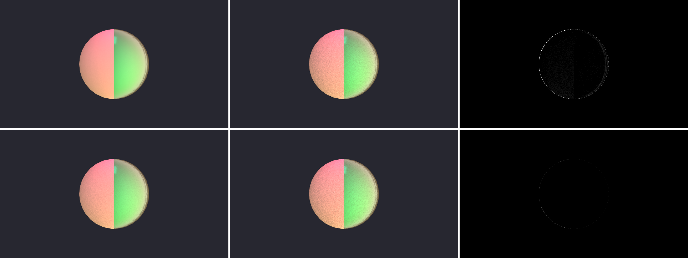
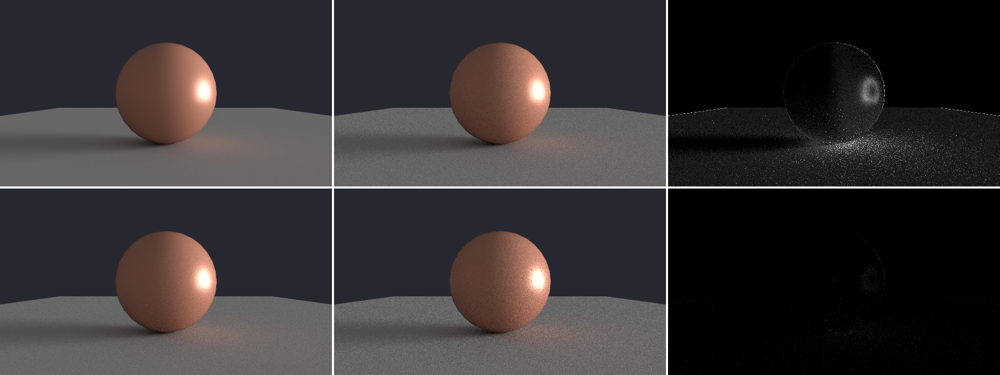
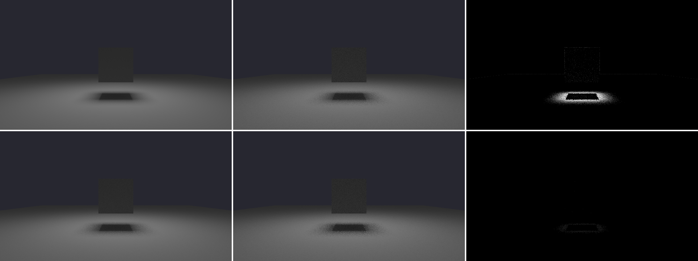

# v0.34 — adaptive sampling in the path tracer: fixed 64 against a noise target

Plan "Rendering 6", step R1. `Render3D`'s path tracer gained `Sampling` `adaptive` (docs/3D_FOUNDATION.md, "Adaptive
sampling"): each pixel takes 16 samples, then 8 more per pass until its own noise estimate is under `Noise threshold`
or it has `Max samples`. This page measures what that buys against the fixed 64 samples a `Render3D` takes today, on
the three comparison scenes `tests/test_3d_gpu.py` names X1, Y1 and Z1.

Measured October 2, 2026 between 6:40 PM and 6:56 PM PDT on commit `549010a` (this page's own commit is the next one on
the branch), Linux 7.2.7-ogc1.1.fc44.x86_64, Python 3.12.13, NumPy 2.5.3, on this workstation with the exclusive GPU
lock held for every run (no test suite was using the cards). Script: `tools/benchmark_adaptive.py`.

## What was measured

- **Scenes.** X1: a PBR sphere with a base-colour texture, a metallic-roughness map, a normal map, an occlusion map and an
  emissive map, lit by a Rect light, a Point light and a smooth environment. Y1: a PBR sphere on a floor under an
  environment with a hard sun. Z1: a cube casting a soft shadow from a Disc area light with 16 light samples. Default
  camera, 8 bounces, the path tracer's GPU backend.
- **Renders.** `fixed` at 16, 32 and 64 samples (seed 1); `adaptive` at noise threshold 0.01 and 0.05 with Render3D's own
  defaults (16 minimum samples, 256 maximum, passes of 8, seed 1); and the reference, `fixed` 1024 samples with seed 777.
  The fixed 16 and 32 rows are there because the adaptive renders turn out to use about that many samples on average:
  they are what the same cost buys when it is spread evenly.
- **Wall time** is the median of three renders after a warm-up render, from the call into the path tracer to the
  returned image. It includes building the scene, packing it and uploading it, which cost the same whatever the
  sampling; the fixed 16 row is the nearest thing to that floor.
- **PSNR** is against the reference, over all pixels, on what the viewer shows (values clipped to 0 to 1, sRGB encoded,
  peak 1). The reference carries noise of its own, so no row can reach infinity; the same seeds give the same PSNR on
  every adapter, which is why one PSNR column serves all the tables below.
- **Samples** is the per-pixel count the render took (`stats["samples"]`): mean, and the largest count of any pixel.

## NVIDIA GeForce RTX 3080 Ti, 1280 by 720

| scene | sampling | wall time | PSNR | mean samples | max samples |
| --- | --- | ---: | ---: | ---: | ---: |
| X1 | fixed 16 | 201 ms | 40.9 dB | 16.0 | 16 |
| X1 | fixed 32 | 239 ms | 43.9 dB | 32.0 | 32 |
| X1 | fixed 64 | 311 ms | 46.8 dB | 64.0 | 64 |
| X1 | adaptive 0.01 | 437 ms | 41.8 dB | 16.4 | 256 |
| X1 | adaptive 0.05 | 239 ms | 40.9 dB | 16.0 | 184 |
| Y1 | fixed 16 | 193 ms | 31.7 dB | 16.0 | 16 |
| Y1 | fixed 32 | 247 ms | 34.5 dB | 32.0 | 32 |
| Y1 | fixed 64 | 334 ms | 37.3 dB | 64.0 | 64 |
| Y1 | adaptive 0.01 | 437 ms | 35.3 dB | 28.8 | 256 |
| Y1 | adaptive 0.05 | 325 ms | 32.3 dB | 16.3 | 256 |
| Z1 | fixed 16 | 157 ms | 42.8 dB | 16.0 | 16 |
| Z1 | fixed 32 | 175 ms | 45.7 dB | 32.0 | 32 |
| Z1 | fixed 64 | 247 ms | 48.7 dB | 64.0 | 64 |
| Z1 | adaptive 0.01 | 211 ms | 44.4 dB | 16.8 | 120 |
| Z1 | adaptive 0.05 | 167 ms | 43.0 dB | 16.0 | 32 |

## AMD Radeon 8060S (integrated), 1280 by 720

| scene | sampling | wall time | PSNR | mean samples | max samples |
| --- | --- | ---: | ---: | ---: | ---: |
| X1 | fixed 16 | 120 ms | 40.9 dB | 16.0 | 16 |
| X1 | fixed 32 | 174 ms | 43.9 dB | 32.0 | 32 |
| X1 | fixed 64 | 286 ms | 46.8 dB | 64.0 | 64 |
| X1 | adaptive 0.01 | 223 ms | 41.8 dB | 16.4 | 256 |
| X1 | adaptive 0.05 | 154 ms | 40.9 dB | 16.0 | 184 |
| Y1 | fixed 16 | 155 ms | 31.7 dB | 16.0 | 16 |
| Y1 | fixed 32 | 239 ms | 34.5 dB | 32.0 | 32 |
| Y1 | fixed 64 | 402 ms | 37.3 dB | 64.0 | 64 |
| Y1 | adaptive 0.01 | 474 ms | 35.3 dB | 28.8 | 256 |
| Y1 | adaptive 0.05 | 255 ms | 32.3 dB | 16.3 | 256 |
| Z1 | fixed 16 | 71 ms | 42.8 dB | 16.0 | 16 |
| Z1 | fixed 32 | 90 ms | 45.7 dB | 32.0 | 32 |
| Z1 | fixed 64 | 127 ms | 48.7 dB | 64.0 | 64 |
| Z1 | adaptive 0.01 | 95 ms | 44.4 dB | 16.8 | 120 |
| Z1 | adaptive 0.05 | 73 ms | 43.0 dB | 16.0 | 32 |

## llvmpipe (software Vulkan on the CPU), 160 by 90

This is the adapter where the cost of a sample is the cost of the pixels it covers, so it shows what adaptive sampling
saves when nothing else sets a floor. PSNR here differs a little from the tables above because the image is smaller.

| scene | sampling | wall time | PSNR | mean samples | max samples |
| --- | --- | ---: | ---: | ---: | ---: |
| X1 | fixed 16 | 39 ms | 39.8 dB | 16.0 | 16 |
| X1 | fixed 32 | 66 ms | 42.9 dB | 32.0 | 32 |
| X1 | fixed 64 | 105 ms | 45.7 dB | 64.0 | 64 |
| X1 | adaptive 0.01 | 77 ms | 41.2 dB | 17.4 | 256 |
| X1 | adaptive 0.05 | 43 ms | 40.0 dB | 16.1 | 128 |
| Y1 | fixed 16 | 55 ms | 31.7 dB | 16.0 | 16 |
| Y1 | fixed 32 | 82 ms | 34.6 dB | 32.0 | 32 |
| Y1 | fixed 64 | 145 ms | 37.2 dB | 64.0 | 64 |
| Y1 | adaptive 0.01 | 178 ms | 35.3 dB | 29.4 | 256 |
| Y1 | adaptive 0.05 | 63 ms | 32.2 dB | 16.3 | 112 |
| Z1 | fixed 16 | 12 ms | 42.2 dB | 16.0 | 16 |
| Z1 | fixed 32 | 20 ms | 45.4 dB | 32.0 | 32 |
| Z1 | fixed 64 | 40 ms | 48.5 dB | 64.0 | 64 |
| Z1 | adaptive 0.01 | 18 ms | 43.9 dB | 16.9 | 112 |
| Z1 | adaptive 0.05 | 11 ms | 42.5 dB | 16.0 | 24 |

## NVIDIA GeForce RTX 3080 Ti, 2560 by 1440

| scene | sampling | wall time | PSNR | mean samples | max samples |
| --- | --- | ---: | ---: | ---: | ---: |
| X1 | fixed 16 | 815 ms | 41.0 dB | 16.0 | 16 |
| X1 | fixed 64 | 1234 ms | 46.9 dB | 64.0 | 64 |
| X1 | adaptive 0.01 | 1229 ms | 41.9 dB | 16.4 | 256 |
| X1 | adaptive 0.05 | 1086 ms | 41.0 dB | 16.0 | 200 |
| Y1 | fixed 16 | 888 ms | 31.7 dB | 16.0 | 16 |
| Y1 | fixed 64 | 1380 ms | 37.3 dB | 64.0 | 64 |
| Y1 | adaptive 0.01 | 1684 ms | 35.3 dB | 28.7 | 256 |
| Y1 | adaptive 0.05 | 1288 ms | 32.3 dB | 16.3 | 256 |
| Z1 | fixed 16 | 843 ms | 42.7 dB | 16.0 | 16 |
| Z1 | fixed 64 | 1025 ms | 48.7 dB | 64.0 | 64 |
| Z1 | adaptive 0.01 | 873 ms | 44.4 dB | 16.8 | 120 |
| Z1 | adaptive 0.05 | 826 ms | 43.0 dB | 16.0 | 32 |

## With the adaptive renders capped at 64 samples, RTX 3080 Ti, 1280 by 720

`--max-samples 64` gives adaptive at most fixed 64's budget. The fixed rows are the same renders as above.

| scene | sampling | wall time | PSNR | mean samples | max samples |
| --- | --- | ---: | ---: | ---: | ---: |
| X1 | fixed 64 | 301 ms | 46.8 dB | 64.0 | 64 |
| X1 | adaptive 0.01, max 64 | 299 ms | 41.8 dB | 16.4 | 64 |
| X1 | adaptive 0.05, max 64 | 200 ms | 40.9 dB | 16.0 | 64 |
| Y1 | fixed 64 | 335 ms | 37.3 dB | 64.0 | 64 |
| Y1 | adaptive 0.01, max 64 | 287 ms | 35.0 dB | 27.4 | 64 |
| Y1 | adaptive 0.05, max 64 | 235 ms | 32.3 dB | 16.3 | 64 |
| Z1 | fixed 64 | 249 ms | 48.7 dB | 64.0 | 64 |
| Z1 | adaptive 0.01, max 64 | 177 ms | 44.4 dB | 16.7 | 64 |
| Z1 | adaptive 0.05, max 64 | 160 ms | 43.0 dB | 16.0 | 32 |

## Where the samples went

One sheet per scene, 640 by 360, two rows by three columns: the 1024-sample reference over fixed 64, adaptive 0.01 over
adaptive 0.05, and the two adaptive renders' per-pixel sample counts (black is the minimum of 16, white the largest
count in the pair). X1 puts its extra samples on the sphere's silhouette and, sparsely, across its textured face; Y1 on
the glossy highlight, the contact shadow and the floor beside the sphere; Z1 on the shadow and its edge.

## What the numbers say

Measured:

- **Against fixed 64, adaptive takes far fewer samples and scores lower.** At threshold 0.01 the mean is 16.4 samples on
  X1, 28.8 on Y1 and 16.8 on Z1 (64 for fixed) and PSNR is 5.0, 2.0 and 4.3 dB under fixed 64; at 0.05 the mean is 16.0,
  16.3 and 16.0 and PSNR is 5.9, 5.0 and 5.7 dB under.
- **At the same average cost, adaptive scores a little higher.** Against fixed 16 on X1 and Z1 and fixed 32 on Y1 (the
  nearest fixed budget to each mean): +0.9, +0.8 and +1.6 dB at 0.01. At 0.05 it is level with fixed 16 (+0.0, +0.6 and
  +0.2 dB), because 0.05 lets almost every pixel stop at its 16 minimum samples: it is a 16-sample render with a few
  extras for the noisiest tiles, whose largest counts reach 32 to 256.
- **On llvmpipe, where a sample costs what its pixels cost, the time follows the samples.** Adaptive 0.05 takes 41%, 43%
  and 28% of fixed 64's time (X1, Y1, Z1); adaptive 0.01 takes 73%, 123% and 45%. Y1 at 0.01 is slower than fixed 64
  because 29 samples on average and a tail to 256 cost more than 64 even samples there.
- **On the two GPUs the time does not follow the samples.** Every render pays the same scene build, pack and upload
  (the fixed 16 row: 201 ms on the RTX at 1280 by 720, 815 ms at 2560 by 1440), and the pixels that run on to 256 samples
  are a few tiles per pass, a serial tail of about 30 passes at 10 to 15 ms each at 2560 by 1440. Adaptive 0.05 is 77%
  (X1), 97% (Y1) and 68% (Z1) of fixed 64's time on the RTX at 1280 by 720 and 88%, 93% and 81% at 2560 by 1440. Adaptive
  0.01 is slower than fixed 64 on X1 and Y1 at 1280 by 720 (141%, 131%) and level with it on X1 at 2560 by 1440. On the
  AMD card it is faster on X1 and Z1 and slower on Y1. With adaptive capped at 64 samples (the last table) the tail is
  at most 64 samples and 0.01 is level or faster than fixed 64 on all three scenes (99%, 86%, 71%).
- **A larger share of the saving shows with a larger frame and a slower card.** The RTX time for adaptive 0.01 on X1
  goes from 141% of fixed 64 at 1280 by 720 to 100% at 2560 by 1440.

Inferred, not measured:

- The saving would grow with a heavier scene or a bigger frame (the fixed floor shrinks as a share, and a sample costs
  more); the 2560 by 1440 rows lean that way, no heavier scene was run.
- A real production scene has far more flat area than these three, which would favour adaptive; none was measured.

Limits:

- One seed per row, and medians of three renders: differences of a few percent in wall time are inside the run-to-run
  spread (fixed 64 on X1 at 1280 by 720 measured 301, 310, 311, 312 and 319 ms in five separate runs).
- Three small scenes, one camera each, and a PSNR on clipped sRGB values: a bright sun pixel above 1 counts as 1.
- A pixel stops when its first 16 samples look alike, so a feature that a 16-sample pixel mostly misses (a thin
  bright highlight, a small gap in a shadow) can stop early and stay noisy. A higher `Min samples` guards against it.
- Windows was not run; CI on the pushed commit was not read.

## Reproducing

    flock /tmp/nb-gpu.lock python tools/benchmark_adaptive.py --size 1280x720
    flock /tmp/nb-gpu.lock python tools/benchmark_adaptive.py --adapter integrated --size 1280x720
    flock /tmp/nb-gpu.lock python tools/benchmark_adaptive.py --adapter cpu --size 160x90
    flock /tmp/nb-gpu.lock python tools/benchmark_adaptive.py --size 2560x1440
    flock /tmp/nb-gpu.lock python tools/benchmark_adaptive.py --size 1280x720 --max-samples 64
    flock /tmp/nb-gpu.lock python tools/benchmark_adaptive.py --size 640x360 --images docs/images

`tests/test_3d_adaptive_sampling.py` holds the assertions: the PSNR bound on a tight threshold, a flat plane stopping at
`Min samples`, a shadow edge taking more samples than open light, and the CPU reference and the GPU agreeing.
