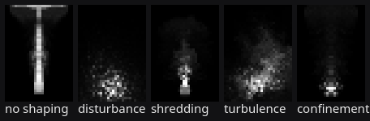

# Fluids solver spike

Roadmap milestone 5 ([3D_ROADMAP.md](3D_ROADMAP.md)) requires evaluating an established solver or
volume ecosystem before committing to a custom solver, and keeping cache import/render separate from
actually solving fluids. This is that evaluation, in the style of [3D_BACKEND_SPIKE.md](3D_BACKEND_SPIKE.md)
and [3D_ALEMBIC_SPIKE.md](3D_ALEMBIC_SPIKE.md): sources, live measurements, a verdict. Checked
2026-09-21 on the development machine (Linux, Python 3.12.13, RTX 3080 Ti on a USB4 eGPU, driver
615.71.09, CUDA 13.2 as reported by `nvidia-smi`). Every package below was installed into a throwaway
venv under `/tmp/nb-l6/venv`, never the shared project venv, and no route here is wired into the app yet.
Every GPU-touching measurement below was taken under `flock /tmp/nb-gpu.lock` (re-run 2026-09-22 to
confirm lock discipline against the shared RTX 3080 Ti; the numbers in this document are that lock-held run).

## Pyro production 3: up-res pass

Houdini's [Gas Up Res](https://www.sidefx.com/docs/houdini/nodes/dop/gasupres.html) keeps the coarse
simulation's general motion as the guide while producing a finer simulation; SideFX's [Pyro look
development](https://www.sidefx.com/docs/houdini/pyro/pyro_look.html) also recommends blocking the look at
lower resolution before paying for details below that voxel scale. `FluidUpres3D` follows that separation:
it takes a `FluidCache3D` volume, advances density, temperature, flame and fuel frame by frame using the
cached coarse velocity, adds deterministic high-frequency detail, and checkpoints each fine frame in its own
cache. The cached velocity is sampled in space and averaged across each adjacent coarse-frame pair; no
pressure solve is performed. `upres_factor` is 1, 2 or 4; output voxel size is divided by the factor. Density is
renormalized so density times voxel volume conserves integrated mass. This sequential pass currently runs on
the CPU; a sparse wgpu implementation and the 64-cubed to 256-cubed RTX 3080 Ti timing remain unfinished.

**Measured frame time:** pending a GPU-resident implementation. The first reference pass is NumPy/CPU, so
no 64-cubed to 256-cubed RTX 3080 Ti result is claimed here. GPU dispatch and eGPU timing remain an explicit
unfinished part of this step.

## OpenVDB and its Python bindings

**Question:** is there a pip-installable route to read `.vdb` grids on cp312 Linux and Windows, the way
`usd-core` reads USD?

**No.** Checked the PyPI JSON API for `openvdb`, `pyopenvdb`, `openvdb-python`, `nanovdb` and
`pynanovdb`: only `pyopenvdb` (project `theNewFlesh/pyopenvdb` on GitHub) exists, version 0.1.4, a single
`cp37-none-any` wheel built inside a Docker container, last updated for Python 3.7/3.8, requiring a manual
`LD_LIBRARY_PATH` fix-up per its own README to find `pyopenvdb.so` — not a wheel that installs and works
on cp312, and unmaintained. The name `openvdb` itself has no project on PyPI at all (404 from
`pypi.org/simple/openvdb/`).

The real, maintained OpenVDB Python bindings ship through **conda-forge** only: `conda-forge/openvdb`,
latest `13.0.0`, with `win-64`, `linux-64`, `linux-aarch64`, `osx-64` and `osx-arm64` builds (checked via
the Anaconda API, 2026-09-21; upstream `AcademySoftwareFoundation/openvdb` most recent GitHub release is
`v13.1.0`, published 2026-09-16). This is the same shape of problem the Alembic spike already
documented for PyAlembic: a real, current, Apache/MPL-family-licensed binding exists, but only through
conda, and this project does not ship a conda environment. No pip route was found for cp312 on either
platform, so **OpenVDB is not embeddable today**, and no read of a real `.vdb` file was attempted (there
was no working binding to attempt it with).

That left two paths: an in-house minimal VDB reader (the same strategy the Alembic spike took with Ogawa
instead of the official PyAlembic bindings), or deferring `.vdb` import until a pip route appears.
**Update (step B, 2026-09-26): the in-house route is built and has read real files.** It reads the
OpenVDB tree format itself, not NanoVDB's (see "Step B as built"); seven caches written by Blender
decode with the voxel counts and bounding boxes the files record for themselves.

## Mantaflow

Blender's fluid/smoke/fire solver core. Checked `thunil/mantaflow` on GitHub (the canonical upstream,
146 stars, `pushed_at` 2022-10-26 — nearly four years stale as of today): **Apache License 2.0**
(`LICENSE` file confirms it, no separate commercial restriction). It has no PyPI project: `pypi.org/pypi/mantaflow/json`
returns 404, and the PyPI project literally named `manta` is Joyent's unrelated Manta object-storage SDK
(`home_page: github.com/joyent/python-manta`) — the same name-collision trap as `alembic`, and the same
answer: never `pip install manta` expecting the solver.

Mantaflow's own README says its Python route is a **custom CMake build that produces its own embedded
Python interpreter binary** (a "manta" executable, not a module importable by a stock interpreter), built
from C++ with SCons/CMake, no prebuilt wheel of any kind for any platform. This is a from-source-only,
build-your-own-Python-binary tool aimed at research prototyping, not a pip dependency. It is also what
Blender vendors internally for its own Mantaflow smoke/fire sim, and Blender does not expose that as a
separate installable package either. **Not embeddable via pip on Linux or Windows**; no route checked
here gets it into `pyproject.toml` the way `usd-core` or `wgpu` are.

## PhiFlow

**Install:** `pip install phiflow` in the throwaway venv. PyPI ships **no wheel**, only an sdist
(`phiflow-3.4.0.tar.gz`), but the sdist builds into a pure-Python `py3-none-any` wheel in seconds with no
compiler — it is pure Python, just not pre-built. License **MIT** (`phiml`, its numerics core, is also
MIT). Installed size: `phi` 2.4 MB + `phiml` 4.1 MB (plus `scipy` 35 MB, `matplotlib`, `h5py` and other
transitive dependencies pulled in by default — PhiFlow does not need `matplotlib`/`h5py` to solve, only
to plot/export, so a trimmed install would be smaller, unmeasured here).

**Smoke example** (a 64×64 buoyant-smoke plume: `advect.mac_cormack` density, `advect.semi_lagrangian`
velocity, buoyancy force, `fluid.make_incompressible` pressure projection with `Solve('auto', ...)`,
written from PhiFlow's documented API — the GitHub repo's `demos/` directory no longer ships a
`smoke_plume.py`; the currently checked-in demos are `Top_Opt` and `wave_equation.py`):

| Backend | Device | 20 steps, 64×64 | ms/step |
| --- | --- | ---: | ---: |
| NumPy/SciPy (default) | CPU | 2.35 s | 117.4 |
| PyTorch (`phi.torch.flow`, `TORCH.set_default_device('GPU')`) | RTX 3080 Ti | 2.29 s | 114.5 |

(both runs taken under `flock /tmp/nb-gpu.lock` on 2026-09-22; within noise of the first, unlocked
2026-09-21 pass — 113.7 and 122.1 ms/step respectively — so lock contention was not skewing the earlier
numbers, but only the lock-held pass above is cited as the measurement of record.)

The default backend's pressure solve is a **direct SciPy sparse solve** (`scipy.sparse.linalg.spsolve`),
not an iterative method, so PhiFlow's own CPU path is not iterative-solver-bound the way our NumPy CG
spike (step 2) will be. The PyTorch/GPU run is **not meaningfully faster** — 114.5 vs. 117.4 ms/step,
2.5% apart, inside run-to-run noise — despite naming a GPU device. Its log shows why: PhiFlow builds
the pressure matrix as a `torch.sparse_csr_tensor` on the GPU, but the actual solve still goes through
`phiml/backend/_linalg.py`'s `scipy.sparse.linalg.spsolve` (the identical `SparseEfficiencyWarning`
appears in both the CPU and the "GPU" run's log), i.e. **the linear solve itself runs on the CPU
regardless of backend**, and the GPU run pays additional host↔device transfer and `torch.jit.script`
overhead for the advection steps without gaining anything on the part of the pipeline that actually
dominates runtime. This is a measured property of PhiFlow's current release (3.4.0) and this example's
solver settings, not a claim about what PhiFlow can do with a different solve configuration or a larger,
GPU-solver-bound problem — but at this grid size, every general acceleration promise a GPU backend name
implies did not materialize.

Both runs logged a `RuntimeWarning: Rank deficiency >= 1 detected` from the closed, all-Neumann boundary
condition in this example scene — a property of the box being fully closed (the classic
singular-up-to-a-constant pressure Poisson system), not a defect, and it converges anyway with a relaxed
tolerance (`Solve('auto', rel_tol=1e-3, abs_tol=1e-3)`; the untouched default tolerance raised
`Diverged` at a 3.1e-5 residual — a tolerance choice, not a real divergence).

At 117.4 ms/step, **PhiFlow's default CPU path is under 9 FPS at just 64×64** — a quarter the linear
resolution of one of the two target benchmark sizes in this spike — and the `phi.torch.flow` GPU backend
does not fix this, per the measurement above: as long as the pressure solve routes through
`scipy.sparse.linalg.spsolve`, naming a GPU device buys nothing, so there is no real-time-adjacent path
through PhiFlow's example solver on this hardware with either backend tested. A faster PhiFlow route
would need a genuinely GPU-resident linear solve (`phi.jax.flow` or a different `Solve` backend, neither
tried here), and even reaching that starting line requires standing up PyTorch or JAX. PyTorch with CUDA
support alone is an **869 MB wheel** (`torch-2.14.0+cu126`) that pulls a further ~1.5 GB of `nvidia-*`
CUDA runtime packages — the same order of size that led `context/lanes.md` to require L7's SHARP route
keep torch in an on-demand external runtime rather than inside the package (not yet built, but the
requirement is already written down for the same reason: torch is too heavy to ship). PhiFlow's own
numpy/CPU path is pip-installable and small; PhiFlow at usable speed, on this evidence, is not.

## Taichi

**Install:** `pip install taichi` — a real, current, multi-platform wheel set. cp312 wheels exist for
`manylinux_2_27_x86_64` (56.3 MB), `win_amd64` (83.3 MB) and macOS arm64 (50.3 MB); **Apache License
2.0**. Installed footprint on disk: 163 MB (it bundles its own LLVM 15 JIT backend). This is roughly
2–6× the size of a `usd-core` wheel (13.9–29.5 MB per platform) but is a genuine, no-compiler,
`pip install` route on both target platforms — closer in kind to `wgpu` (bundles a native binary, one
wheel per OS) than to PhiFlow (pure Python, needs an external GPU backend to be fast).

**Smoke example:** Taichi is a Python-embedded kernel language with a JIT compiler, not a solver library —
there is no single "run the fluids demo" call the way PhiFlow has `fluid.make_incompressible`. The
measurement here is a trivial elementwise kernel (a 320×320 `sin`/`cos` field, 50 kernel launches),
which is a **kernel-launch-overhead and backend-availability probe, not a fluid solve benchmark**:

| Backend | Device | 50 kernel launches | ms/launch |
| --- | --- | ---: | ---: |
| `ti.cpu` (LLVM x64) | CPU | 0.028 s | 0.56 |
| `ti.vulkan` | RTX 3080 Ti | 0.026 s | 0.52 |

(both taken under `flock /tmp/nb-gpu.lock` on 2026-09-22; the CPU number moved from an earlier unlocked
1.24 ms/launch pass on 2026-09-21 to 0.56 here, most likely JIT-cache warm-up on the first call rather
than lock contention, since the run under lock is faster, not slower — the lock-held pass above is the
measurement of record.) Both ran clean with no fallback. Taichi ships published stable-fluids/MAC-grid examples in its own
`taichi-dev/taichi` repo (not run here — out of scope for a launch-overhead probe, and re-implementing
our solver twice, once in NumPy and once in Taichi, was not worth the time this spike had); citing that
as a **known**, not measured, fact. If NumPy step 2 is too slow and a GPU path is wanted, Taichi is a
real alternative route to a compiled kernel — worth weighing against the wgpu compute route the backend
spike already adopted for rendering, since wgpu is already a dependency and Taichi would be a new,
heavier one (163 MB versus wgpu's existing footprint).

## Houdini's Pyro and Nuke's lack of a fluid solver

Checked SideFX's documentation (`sidefx.com/docs/houdini/nodes/dop/pyrosolver_sparse.html`,
`.../nodes/dop/pyrosolver.html`, `.../pyro/differences.html`; 2026-09-21). Houdini's Pyro is a DOP-network
grid solver operating on **sparse OpenVDB volumes** (density and temperature scalar fields, a
`Smoke Object (Sparse)` DOP, a `Pyro Solver` wrapping the DOP network); it is proprietary C++ shipped
inside Houdini, with no standalone Python package and no route outside a Houdini license. Its caches are
written as `.vdb` sequences — which is why "import VDB first" is the answer this spike converges on
independent of whether we ever embed a solver: it is the interchange format the tool that actually has a
production-grade fluid solver already writes.

Checked Foundry's Nuke reference guide (`learn.foundry.com/nuke/content/reference_guide/particles_nodes/`,
cited already in `3D_ROADMAP.md`; 2026-09-21): Nuke's built-in **Particle System is points** (emitters,
forces, sprites/geometry instancing for "fog, rain, snow" — L5's territory), not a grid-based PDE fluid
solver. Nuke has no smoke/fire volumetric solver of its own; Nuke 17's new Field nodes manipulate
volumetric data (including Gaussian splats) but do not solve fluids either. This confirms the roadmap's
framing: a compositor's job here is **importing and rendering** volume caches that an external solver
(most often Houdini Pyro, hence VDB) produced, and a from-scratch smoke solver is a differentiator, not
something compositors normally expect their comp tool to compute itself.

## Packageability summary

| Route | cp312 Linux | cp312 Windows | Install size | License | Packageable like `usd-core`? |
| --- | --- | --- | --- | --- | --- |
| OpenVDB / `pyopenvdb` | No pip wheel (conda-forge only) | No pip wheel (conda-forge only) | n/a | MPL 2.0 (core) | **No** |
| Mantaflow | No pip route (CMake source build, own Python binary) | No pip route | n/a | Apache 2.0 | **No** |
| PhiFlow (CPU/NumPy) | Yes, sdist→wheel, no compiler | Not verified, expected yes (pure Python) | ~6.5 MB core (+35 MB scipy) | MIT | Yes, but too slow to be worth it alone |
| PhiFlow + PyTorch (GPU) | Yes | Not verified | ~2.4 GB (torch+CUDA runtime) | MIT (+ BSD/PyTorch, proprietary NVIDIA runtime libs) | **No** — same reason Torch stays out of L7 |
| Taichi | Yes, real wheel | Yes, real wheel | 56–83 MB/platform, 163 MB installed | Apache 2.0 | Yes — heavier than `usd-core` but a genuine optional-extra candidate |

## Conclusion (which cache format, and what's packageable)

**Import VDB first**: it is the format Houdini's Pyro (the production fluid solver this project is not
trying to replace) actually writes, and it is the roadmap's own default guess. No pip-installable reader
exists for cp312 on either platform, so the reader is in-house (per the Alembic precedent) for a bounded
grid subset, not a dependency. It is built (`nodebased/vdbio.py`, step B) and has read real Blender
caches; nothing written by Houdini itself has been read yet.

**Nothing in this ecosystem is packageable inside the app the way `usd-core` is**, with one partial
exception: **Taichi** is a real, no-compiler, cp312-wheeled, Apache-2.0-licensed route on both platforms,
and could sit next to `wgpu` as a GPU compute backend if a from-scratch solver needed one — but it would
be a second, heavier (163 MB vs. wgpu's existing footprint) way to reach the same GPU the project already
talks to through `wgpu`, and step 2 measures whether that's needed before this spike recommends it.
OpenVDB and Mantaflow have no pip route on either platform at all. PhiFlow is pip-installable and light
on the CPU, but its default example is too slow to be interesting on its own (117.4 ms/step at 64×64,
under 9 FPS) and its PyTorch/GPU backend measured no faster on this hardware and this example (the
pressure solve stays on the CPU regardless of backend) — so there is no PhiFlow path measured here that
reaches real-time-adjacent speed, and even the unhelpful GPU backend requires PyTorch, which
`context/lanes.md` already treats as too heavy to embed (L7's SHARP route is required to keep torch in
an on-demand external runtime, not inside the package).

This pointed step 2 toward writing a small solver ourselves, NumPy first and `wgpu` compute (already a
dependency) if NumPy was too slow, rather than embedding any of the four ecosystems surveyed here. Step 2
is below. The verdict combining both is the last section of this document.

## Step 2: the 2D NumPy smoke solver and its measured cost

Code: `nodebased/fluid2d.py` (solver), `tests/test_fluid2d.py`, `tools/benchmark_fluid.py` (numbers below),
`tools/fluid_gpu.py` (the `wgpu` pressure solve). Nothing here is a node yet.

**What it is.** A MAC-grid smoke solver: staggered velocity (`u` on vertical faces, `v` on horizontal
faces), cell-centred density, temperature and pressure. One substep: emit from a disc source, advect
semi-Lagrangian (midpoint backtrace, **bilinear** interpolation, unconditionally stable, diffusive),
buoyancy `v += dt * (-alpha * density + beta * (temperature - ambient))`, vorticity confinement (curl,
gradient of its magnitude, `f = eps * N x w`), then projection by **conjugate gradient** on the Neumann
5-point Laplacian, warm-started from the previous pressure. **Boundaries:** a closed box, zero
wall-normal velocity on all four sides (free-slip), zero-gradient for density and temperature.
**Tolerance:** the CG stops when the largest cell divergence is at most `1e-3` (cells per frame), cap 1500
iterations; `tolerance` and `max_iterations` are parameters. Units follow `docs/SIMULATION.md`: cells and
frame units, `dt = 1 / substeps`. It plugs into `simcache.solve_to_frame` as `initial_state(seed)` and
`step(state, frame, substep, seed)`, with `checkpoint` and `restore` copying a state in and out of a
cache. Every substep is a pure function of the state it is handed and draws no random numbers, so two
runs, and a solve split across two caches, are bit-identical (asserted). Cancellation is checked between
substeps by `solve_to_frame` and every 8 CG iterations inside the pressure solve (asserted: a cancel
raised mid-frame returns in well under half a second and keeps the frames already banked).

**Tests.** Mass under advection in a uniform flow is conserved to 1e-4; with an emitting source the total
drifts within 10 percent of the emitted mass (semi-Lagrangian is not conservative under compression, and
the drift measured here was minus 7 percent at one substep per frame and plus 3 to 7 percent at two and
four); the divergence left after projection is under the tolerance on every cell; a buoyant plume's
centre of mass rises over 50 steps and stays above a no-buoyancy control; the wall-normal velocities are
zero.

**Numbers** (this machine, 2026-09-25, float32 fields, one substep per frame, plume warmed up for 10
substeps then 10 timed, NumPy 2.5.3 single-threaded elementwise; the RTX 3080 Ti for the `wgpu` rows,
run under the exclusive GPU lock; the host was moderately loaded (load average about 6, a 4-core model server), and repeat runs of the NumPy rows
varied by about 10 percent):

| Grid | Path | ms per substep | of which pressure | CG iterations | Max divergence left |
| --- | --- | --- | --- | --- | --- |
| 256 x 256 | NumPy CG | 108 | 98 | 455 | 9.8e-4 |
| 256 x 256 | `wgpu` pressure | 22 | 13 | (SOR sweeps, see below) | 9.1e-4 |
| 512 x 512 | NumPy CG | 748 | 698 | 888 | 9.9e-4 |
| 512 x 512 | `wgpu` pressure | 197 | 149 | (SOR sweeps, see below) | 8.9e-4 |

Everything except the pressure solve (advection, buoyancy, confinement, the divergence and gradient) costs
about 10 ms at 256 and about 50 ms at 512 in NumPy. The pressure solve is 90 percent of a step: plain CG
needs roughly as many iterations as the grid edge is wide times two, so its cost grows with the cube of the
edge. To reach 1e-5 instead of 1e-3 it needed 580 iterations at 256 and 1155 at 512, which is why the
default tolerance is the looser figure.

**The `wgpu` variant** replaces only the pressure solve, through the `pressure_solver` hook, and the NumPy
CG stays the reference. It is red-black Gauss-Seidel with over-relaxation (`omega = 2 / (1 + sin(pi / n))`),
because plain red-black Gauss-Seidel or Jacobi does not get there: with the same 1500-sweep cap it stopped
at a divergence of 1.2e-2 at 256 (12 times over tolerance) and would need on the order of the grid area in
sweeps. Plain float32 SOR also stalled at 1.6e-3 at 512 (the float32 floor on pressures that large), so the
GPU solves for a correction to a float64 residual held on the CPU (iterative refinement), reading the
pressure back every 64 sweeps to check it. Both paths meet the same stopping rule, and one projection of
the same warmed-up state differs between them by at most 2.3e-3 in velocity (asserted under 5e-3 in
`tests/test_fluid2d.py`, which skips without a wgpu adapter). A trajectory comparison over many steps is not
meaningful: the plume is chaotic, and two solves that both meet the tolerance drift apart.

The GPU pressure time is now dominated by the per-batch readback and CPU residual check, not the sweeps,
so the 512 figure is an upper bound for this approach. A GPU-resident conjugate gradient or a multigrid
preconditioner would remove that, but neither was built or measured.

**What the numbers imply for real-time scrubbing.** Per-substep cost here already includes everything
needed for one frame at one substep per frame. At 256 x 256, NumPy is about 9 frames per second and the
GPU pressure path about 45. At 512 x 512, NumPy is about 1.3 frames per second and the GPU path about 5.
The app's frame budget is 16 ms (`docs/PLAYBACK.md`) and its film rate is 24 frames per second, so:

- **Live solving while scrubbing forward is only within reach at 256 x 256 or smaller, and only on the
  GPU** (22 ms per substep is inside the 41.7 ms a 24 fps frame allows at one substep, not inside 16 ms,
  and every extra substep adds its own cost). 512 x 512 is not real-time on either path.
- **What does scrub in real time is the cache.** `docs/SIMULATION.md` already checkpoints every solved
  frame, so scrubbing backward, replaying, and playing a range that was solved once cost a cache read, not a
  solve. The first pass over new frames is the slow one, and it is the solver's cost per frame that decides
  how long that pass takes: about 2 seconds per 100 frames at 256 x 256 on the GPU, about 20 seconds at
  512 x 512, against about 11 and 75 seconds in NumPy.
- One 512 x 512 checkpoint is about 5.3 MB (five float32 grids), so a 1000-frame run is about 5 GB and
  passes the default 2 GiB disk budget in `simcache`; the fluid node will need its own budget or a lower cache
  resolution.

Unmeasured: multiple substeps per frame, larger buoyancy or faster flows (more CG iterations), and any
non-plume scene.

## Verdict (step 3, 2026-09-25)

**Recommendation: build our own solver (route A), on top of a volume scene member that is built first
and is shared with the fallback. Fallback: import-only (route C), which is the first stage of route A
anyway, so choosing it later costs nothing that was built.** The choice between the two is DiMo's; this
section states what the evidence supports.

### The three routes

| Route | What it is | Packaging cp312 Linux / Windows | GPU dependence | Determinism | Cache per frame at 256 cubed |
| --- | --- | --- | --- | --- | --- |
| A. Custom solver | Our MAC-grid smoke solver in NumPy with a `wgpu` pressure solve, extended to 3D | Nothing new: NumPy and the optional `wgpu` extra are already dependencies | Optional up to about 64 cubed, needed above (see the 3D estimate) | Bit-identical on the NumPy path (asserted in step 2); the GPU path meets the same divergence tolerance but is not bit-identical to NumPy | Solver checkpoint about 400 MB (six float32 grids); an exported density-only cache 33.5 MB dense in float16 |
| B. Embedded library | OpenVDB, Mantaflow, PhiFlow or Taichi inside the app | OpenVDB conda-forge only; Mantaflow source build with its own interpreter; PhiFlow needs torch (about 2.4 GB) to try the GPU and did not get faster; Taichi has wheels (56 to 83 MB) but is a kernel language, not a solver | Taichi: yes for speed. PhiFlow: the solve stayed on the CPU | Not established for any of them | Same as A for any solver; VDB caches are sparse |
| C. Import-only | Read `.vdb` sequences that Houdini Pyro (or Blender) wrote, draw them as volumes, never solve | An in-house reader is the only route: no pip wheel for OpenVDB. **Built (step B) and tested on real Blender caches**; Houdini-written files are not yet tried | None for reading; rendering can use `wgpu` | Trivially deterministic (fixed files) | Whatever the file holds; sparse VDB smoke is typically several times smaller than dense |

### Why not embed (route B)

The step 1 facts remove every candidate. OpenVDB has no cp312 wheel on either platform (conda-forge
only). Mantaflow has no wheel and its Python route is a custom interpreter build, last pushed in 2022.
PhiFlow installs but ran 117.4 ms per step at 64 by 64 (under 9 frames per second) and its PyTorch
backend measured 114.5 ms because the pressure solve stays on the CPU; a faster path needs torch, which
`context/lanes.md` already keeps out of the package. Taichi is packageable, but it supplies kernels, not a
fluid solver, and it would be a 163 MB second way to reach a GPU that `wgpu` already reaches. Taichi is
the one route worth keeping in reserve if `wgpu` compute proves too limiting for a 3D multigrid solve.

### Why custom over import-only

- Nuke has no fluid solver, so a compositor normally imports. But DiMo asked for fluids explicitly, and
  the roadmap keeps that request regardless of parity. Import-only answers "show my Pyro cache" and does
  not answer "make smoke".
- The solver is small. The 2D spike is one module, needs no new dependency, is deterministic, plugs into
  `simcache` unchanged, and was measured: 22 ms per substep at 256 by 256 with the `wgpu` pressure solve
  (about 45 frames per second), 197 ms at 512 by 512.
- The volume scene member, its renderer and the cache are needed by both routes. Building them first
  makes the two routes differ only in what fills the member: a reader or a solver.

### What the numbers do not support

- No solver here is real-time at 512 by 512, and 3D is out of reach live (below). The pitch is
  "bake once, scrub the cache", as for particles, not "live fluid".
- The custom route owns its bugs: semi-Lagrangian diffusion, no free-surface liquids, no sparse grids.
  This is a smoke and fire solver. Liquids, FLIP and sparse tiles are out of scope and stay with Houdini
  through route C.
- The wgpu pressure solve is SOR with a CPU residual check, not a GPU-resident multigrid. That is the
  known ceiling and the first thing to build for 3D.

### Order of work if route A is chosen

1. Volume member and renderer (`Scene.volumes`, `Render3D` raymarch), fed first by a synthetic
   analytic density. This lands the part both routes need.
2. `ReadVDB3D` on an in-house reader for the dense and NanoVDB-style subset (the Alembic precedent).
   This is route C complete (done in step B; the subset is the OpenVDB tree, see "Step B as built").
   Stop here if DiMo wants import-only.
3. The 2D solver as nodes (`FluidSource2D`-style image sources are a small extra; see the table).
4. The 3D solver at 64 and 128 cubed on the CPU as reference, the `wgpu` path after it.

## Decision (2026-09-26)

DiMo chose the fluids direction on 2026-09-26 at 12:43 AM PDT: the work is "worth putting effort into
for realistic and also extremely fast solutions", with Flowline, Paradigm and "the preciseness of
Houdini FX" as the bar. That settles the Verdict's open question in favour of route A (our own
solver), on the volume member built first. Three requirements come with it: the result is
deterministic in the viewer; it looks convincing on its own, with no diffusion or transform model
in the loop; and it also exports its intrinsic data (density, velocity, vorticity, temperature, depth,
motion vectors) so such models can be driven by it.

Plan "Fluids 1: volumes, VDB, the 3D solver, GPU, liquids", in order:

| Step | Deliverable | State |
| --- | --- | --- |
| A | The `Volume` scene member, the CPU reference raymarch and the control passes (density, motion, temperature, vorticity, depth) | built (this section's tables) |
| B | `ReadVDB3D` on an in-house reader | built (see "Step B as built") |
| C | The 3D smoke and fire solver on the CPU, with its nodes | built (see "Step C as built") |
| D | The GPU-resident solver (multigrid pressure, GPU advection, sparse tiles) | built (see "Step D as built") |
| E | FLIP liquids on the particle system, with surface extraction | built (see "Step E as built") |

Ownership for this plan: lane 6 owns the `Volume` member in `scene3d.py`, `nodebased/volumerender.py`,
the fluid modules, `vdbio.py` and this document. Lane 4 owns the GPU volume rendering and the look
development that follows it, so the CPU raymarch is written as its parity oracle: simple, exact where
a closed form exists, and fully specified in the module docstring of `nodebased/volumerender.py`.

### Step A as built

- `scene3d.Volume(density, voxel_size, origin, matrix, temperature, velocity)`: arrays indexed
  `[ix, iy, iz]`, cell-centred, `velocity` in the volume's own space in units per second, `fingerprint()`
  a content digest. `Scene.volumes` carries them; `Scene3D` and `Axis3D` multiply their matrix onto each
  volume's `matrix` exactly as they do for splats; `MergeGeo3D` refuses one by slot type.
  `scene3d.analytic_plume(resolution, seed)` makes a deterministic plume with a matching velocity field.
- `Plume3D` (a source node, like `Light3D`): an analytic plume of `plume_resolution` cells per side and
  `plume_seed`, under its own transform block. It stands in until `FluidSolver3D` and `ReadVDB3D` exist.
- The raymarch (`volumerender.py`): front to back, fixed `volume_step_size`, absorption and single
  scattering from every scene light (Directional, Point, Spot with its cone and falloff through
  `light_attenuation`), shadow rays through the volume with `volume_shadow_steps` equal segments,
  composited against the opaque mesh depth so a card in front hides the smoke and a card behind is dimmed
  by it. A frame whose estimated density lookups exceed 300 million is refused with a message naming the
  knobs to lower. The GPU path (`nodebased/gpuvolume.py`, docs/3D_FOUNDATION.md) raymarches the beauty
  image and matches this reference; the control passes, the `depth` output, the ray tracer and scenes with
  splats raise `gpu3d.Unsupported`, so `Backend` `auto` falls back and `gpu` reports it.
- Not modelled, and stated so nobody assumes it: meshes do not shadow volumes, volumes do not shadow
  each other, particles and splats are treated as behind a volume, transparent surfaces are not sorted
  against it.
- Control passes as `Render3D` `Output` choices (`volume_density`, `volume_motion`,
  `volume_temperature`, `volume_vorticity`) and the `depth` output, which now merges the volume's first
  hit. Definitions are in the `volumerender.py` docstring. The four `volume_*` names are also multichannel
  `passes`, and the smoke knobs reach that path (step B carry-over).

### Step B as built

`ReadVDB3D` (a source node; knobs in the node table below) reads a Houdini Pyro or Blender `.vdb`, or a
frame-token sequence, into a scene holding one `Volume`. The reader is `nodebased/vdbio.py`, written from
the public OpenVDB sources (`io/Archive.cc`, `io/File.cc`, `io/GridDescriptor.cc`, `io/Compression.h`,
`io/Compression.cc`, `tree/RootNode.h`, `tree/InternalNode.h`, `tree/LeafNode.h`, `math/Maps.h` in
<https://github.com/AcademySoftwareFoundation/openvdb>, master of 2026-09-26, file format version 225) and
Blosc's chunk layout (<https://github.com/Blosc/c-blosc>, `blosc/blosc.c`). OpenVDB documents the file
format only through that source, not in a separate specification.

**What it reads.**

- File versions 222 to 225 (OpenVDB 3.0 on: per-grid compression flags and node-mask compression). Older
  files are refused by version number. Files with and without the grid offset table: Blender streams its
  caches without one, so a grid there is found by decoding the ones before it.
- The default 5-4-3 tree only. Grid classes `float`, `half`, `double`, `vec3s` and `vec3d`, stored as
  32-bit or, for grids saved with the `_HalfFloat` suffix, as 16-bit halves. Every other value type
  (`int32`, `bool`, `mask`, points, and so on) is refused: `unsupported VDB grid class 'Tree_int32_5_4_3':
  ReadVDB3D reads float, half, double, vec3s, vec3d grids with the default 5-4-3 tree`.
- Value buffers uncompressed, zip (zlib), or Blosc with the LZ4 codec and byte shuffle, with or without
  active-mask compression, including all seven inactive-value forms of `Compression.h`. Blosc is decoded
  in pure Python (an LZ4 block decoder, block table and unshuffle); other Blosc codecs and bit shuffle are
  refused by name. OpenVDB's `blosc_compress_ctx` call uses LZ4 with byte shuffle only, Blosc is OpenVDB's
  default when it is built with it, and the Blender caches here use it, so refusing it would have refused
  most real files.
- Linear maps: `ScaleMap`, `UniformScaleMap`, `TranslationMap`, `ScaleTranslateMap`,
  `UniformScaleTranslateMap`, `AffineMap`, `UnitaryMap` and compounds of them. `NonlinearFrustumMap`
  (camera-space grids) is refused by name: `frustum-transform VDB grids are not supported (camera-space
  grids need a resample to a linear grid in Houdini first)`.

**How a grid becomes a `Volume`.** A grid is decoded into a dense float32 array over the bounding box of
its active voxels, one grid at a time, from a seekable stream, deterministically. Inactive voxels are zero
whatever the file stores under them; constant active tiles are filled; a grid with no active voxels, or
one whose box passes 2^27 voxels (a per-call limit, 512 MiB of float32), is refused with the size in the
message. The chosen grids share the union of their boxes and must share one transform. The grid transform
becomes `voxel_size` (the mean column length), `origin` (the box corner, `(index_min - 0.5) * voxel_size`,
with a plain translation folded in) and, only when it has rotation or shear, `Volume.matrix`; velocities are
rotated into the volume's space. `voxel_scale` scales positions, voxel size and velocities about the file's
own origin. OpenVDB voxel centres sit on integer index positions, which is what `origin` accounts for.

**Measured on real files** (seven Blender test caches, `tests/files/render/openvdb/` and `usd/` in
<https://github.com/blender/blender>; not in this repo, read from `NB_VDB_SAMPLES` or the workspace's
`scratch/vdb-samples`): all seven list their grids and decode; for every non-empty grid the decoded
active-voxel count and box equal the `file_voxel_count`, `file_bbox_min` and `file_bbox_max` the file
records. Coverage, from the chunk headers of those files: Blosc-LZ4 with byte shuffle in every shape the
files contain (single-block and multi-block chunks, both header flag variants `0x21` and `0x31`, memcpy
chunks under 128 bytes, and the empty 16-byte chunk), with and without active-mask compression, as half and as full
floats (`velocity_named_grid.vdb`: `density` and a Vec3f `vel`; `intelCloudLib_sparse.4.S.vdb`, 134,151
voxels), uncompressed half floats with 1,049,275 active voxels (`smoke.vdb`, read in 0.07 s), a streamed
file without an offset table (`cube.vdb`, Blosc) and an empty grid (`flame_noise`). Zip appears in none of
the seven, so zip is covered only by the writer's round trip (`vdbio.write_vdb`, tested for every storage
form) and by the OpenVDB source it was written from.

**Not done, and not verified.**

- Nothing written by Houdini itself has been read; the format follows the source and Blender's files, all of
  which are file version 224.
- Zip-compressed files are read from the source's description only (no real file to check); Blosc with
  bit shuffle or a codec other than LZ4 is refused.
- Level sets, points, integer and boolean grids, instanced trees, other tree layouts and multi-buffer trees
  are refused, not read. A file bigger than the voxel limit is refused, not cropped.
- The writer stores Blosc as a valid container with stored (uncompressed) streams; no OpenVDB build has been
  asked to read it back.
- No GPU path: the volume is CPU-side data like `Plume3D`.

**Carry-over from step A (done).** With lane 4's multichannel EXR on main, `Render3D` `passes` accepts
`volume_density`, `volume_motion`, `volume_temperature` and `volume_vorticity`, rendered with the same smoke
knobs as the single outputs (asserted equal), and `Write` puts them in the EXR as `volume_density.R/G/B`,
`volume_motion.X/Y` and so on. The step A test that asserts them in a written EXR is un-skipped.

### Step C as built

Code: `nodebased/fluid3d.py` (solver and nodes), `nodebased/fluid_gpu3d.py` (the `wgpu` pressure solve),
`tools/benchmark_fluid3d.py`, `tests/test_fluid3d.py` (solver) and `tests/test_fluid3d_nodes.py` (nodes). The
solver is `Smoke3D`, with the same API as `Smoke2D` (`initial_state`, `step`, `checkpoint`, `restore`, the
`pressure_solver` hook) on a 3D MAC grid indexed `[x, y, z]` (the order of `Volume`), +y up, lengths in cells and
time in frames, so `simcache.solve_to_frame` drives it unchanged.

**One substep.** Emit from the sources; advect velocity semi-Lagrangian (midpoint backtrace, trilinear) and the
scalars (density, temperature, fuel) semi-Lagrangian or, by default, MacCormack; combustion; cooling and
dissipation; buoyancy and the force list; vector vorticity confinement; projection.

- **Advection.** `advection` is `semi_lagrangian` or `maccormack`. MacCormack is forward-then-backward with an
  error correction, clamped to the min and max of the eight neighbours of the backtrace, and faded to plain
  semi-Lagrangian between one and two cells of travel per substep, where the reverse trace is no longer
  trustworthy. Unmodified, it gained a third of a plume's mass (measured: 1.27 to 1.52 times the emitted mass at
  frame 8, against 1.02 to 1.15 for semi-Lagrangian), so each scalar is rescaled to the total the
  semi-Lagrangian result has, which keeps the sharper structure (test: a 4-cell blob translated for six
  frames keeps 0.05 more of its peak than the semi-Lagrangian one; drift on a compact, fast plume is 1.01 to
  1.20 times the emitted mass for both schemes across 20 to 32 cells and one to four substeps). Velocity is always
  semi-Lagrangian. A backtrace leaving through an open boundary brings in fresh air (zero density and fuel,
  ambient temperature).
- **Boundaries.** `boundary_x`, `boundary_y`, `boundary_z` are `closed` (wall on both ends, free-slip) or
  `open` (both ends open to a p = 0 outside, so smoke leaves). A closed box has a singular pressure system, so
  the right-hand side is made zero-mean over the fluid cells; that also means a closed box absorbs net expansion.
- **Colliders.** A solid is a cell mask: triangles are voxelised conservatively (a triangle-against-cell
  separating-axis test, so every cell a triangle touches is marked and the surface is a 6-connected barrier), and a
  closed mesh is filled by flood-filling the outside and taking the rest. Faces next to a solid cell take the solid's
  velocity, the pressure system drops the solid rows (`Poisson3D`, a masked 7-point operator), density, fuel and heat
  inside a solid are zeroed. A moving collider re-voxelises every frame and takes each cell's velocity from the mean
  displacement of the triangles that touch it over the last frame (interior cells take the mesh's mean; a rigid
  approximation, and a mesh whose triangle count changes has zero velocity).
- **Fire.** With `fire` on, a cell with fuel at or above `ignition_temperature` burns a fraction
  `1 - exp(-burn_rate dt)` of its fuel per substep, releasing `burn_heat` per unit of fuel as temperature and
  `burn_smoke` as density, and the burn rate (fuel per frame) is the `flame` channel. `burn_expansion` times the burn
  rate is a divergence source in the projection: the residual the pressure solve drives to the tolerance is
  `div - expansion`, so burning cells push the air outward (asserted: `div - burn * expansion` is under the
  tolerance on every cell with an open top). Flames here are a burning, expanding, heating region; the raymarch
  does not draw the `flame` channel as emission yet.
- **Determinism and cancellation.** The solver draws no random numbers of its own (source noise is a hash of
  the seed and cell; turbulence is a seeded lattice), keeps its reductions single-threaded, and is a pure function
  of its `State`, so two runs, a scrub and a jump, and a resume from a checkpoint are bit-identical (asserted).
  A cancel is checked between substeps and every 8 pressure iterations (asserted under 3 seconds on a 48 cubed
  grid with a tolerance CG cannot meet; the frames already banked stay).
- **Pressure.** `conjugate_gradient` on the masked operator is the reference. `fluid_gpu3d.GpuPressure3D` is the
  same red-black SOR with iterative refinement as the 2D one, on a per-cell diagonal and neighbour bit mask so
  solids and open faces work; the stopping rule is checked on the CPU with the reference operator. One projection of
  the same warmed-up state differs between the two by 1.4e-3 to 1.6e-3 in velocity (measured, 64 and 128 cubed;
  asserted under 5e-3, with a solid and an open top, and skipped without an adapter).

**Sources, forces, colliders (the vocabulary).** World units and per-frame rates throughout; the node layer
converts to cells with the solver's `origin` and `division_size`. Sources: `point`, `sphere` (with `falloff`) and
the `surface` or `volume` of a geometry; `src_vel_*` holds the air at that velocity where it emits,
`src_inherit_velocity` adds the mesh's motion, noise modulates the emission. Forces: `buoyancy` (replaces the
solver's built-in lift, which is `NODE_LIFT` 0.08 and `NODE_SETTLE` 0.005 world units per frame squared), `gravity`
(weighs the smoke: the acceleration scales with the local density, since gravity on all of the air changes only
the pressure), `wind` (a uniform acceleration; on a closed box the pressure absorbs it, so it needs an open
boundary to move anything), `turbulence` (the curl of a smooth seeded lattice potential blended over time,
divergence free before the projection) and `drag`.

**Nodes and identity.** `FluidSource3D`, `FluidForce3D` and `FluidCollide3D` build a chain (type `fluid`);
`FluidSolver3D` turns the chain and its knobs into a run and outputs a `Volume` per frame; `FluidCache3D` keeps
solved frames. The run key is the digest of the chain of node identities (knobs, animation curves, expressions,
geometry digests), the solver's knobs, the frame rate and the resolved pressure backend, so any edit abandons the old
frames like an emitter edit does. A static geometry input is sampled once (a source at its own `start_frame`, a
collider at the first frame of the document's range); an animated one (`src_inherit_velocity` above zero, or
`FluidCollide3D.animated` on) is sampled per frame and identified by its digests over the document's time range
(at most 2,000 frames), which the evaluator recomputes on every evaluation. `pressure` `auto` picks the GPU from
one million cells (100 cubed) up when an adapter opens, and the choice is part of the run because the two solves
agree to the tolerance, not bit for bit. A grid past 16,777,216 cells (256 cubed) is refused with the numbers.
`FluidCache3D` stores exact solver checkpoints under the run (so a solve resumed from disk equals a straight one,
asserted) and, under a derived run, the served channels at `cache_precision`; what it serves is always that
quantised copy, so a fresh solve and a cache hit are identical. `cache_resolution` from the proposed table is not
built. A solved `Volume` carries `density`, `temperature`, `velocity` (cell-centred, world units per second),
the additive `flame` channel and the `stream` of its run; it draws through step A's raymarch and passes unchanged
(asserted: a solved frame renders with coverage, and the `volume_density` pass sees it).

**Measured** (this machine, 2026-09-26, float32 fields, one substep per frame, the built-in plume warmed up for 8
substeps then 4 timed, MacCormack advection, tolerance 1e-3, NumPy 2.5.3; the RTX 3080 Ti under the exclusive GPU
lock; the host was moderately loaded, load average about 4 at the start, so treat the figures as about plus or minus 10
percent; raw output in `scratch/nb-lanes/run/bench-fluid3d-L6.txt` in the workspace):

| Grid | Path | ms per substep | of which pressure | Other (advection etc.) | Pressure work | Max divergence left | Checkpoint per frame | Peak process memory |
| --- | --- | --- | --- | --- | --- | --- | --- | --- |
| 64 cubed | NumPy CG | 314 | 132 | 183 | 140 CG iterations | 9.5e-4 | 8.0 MB | 280 MB |
| 64 cubed | `wgpu` SOR | 231 | 56 | 176 | 120 sweeps | 5.8e-4 | 8.0 MB | |
| 128 cubed | NumPy CG | 6,221 | 4,332 | 1,890 | 258 CG iterations | 1.0e-3 | 64.2 MB | 1,174 MB |
| 128 cubed | `wgpu` SOR | 2,519 | 531 | 1,988 | 216 sweeps | 9.4e-4 | 64.2 MB | |

At 64 cubed with semi-Lagrangian advection a substep is 266 ms (pressure 120), so MacCormack costs about 50 ms
there; advection (three face velocities, three scalars, and MacCormack's second pass) is about 160 of the 183 ms
of non-pressure work at 64 cubed, confinement about 2. A checkpoint is eight float32 grids (three velocity
components, density, temperature, fuel, burn, pressure), 64.2 MB at 128 cubed.

**Against the extrapolation** (the "3D extension estimate" below, made from the 2D measurements): the pressure
solve was predicted well (132 against about 130 ms at 64 cubed; 531 against about 400 ms for the GPU at 128 cubed,
where the readback and CPU residual check add more than the SOR sweeps), but the NumPy CG at 128 cubed took 4.3
seconds against the predicted 2.3, and the non-pressure work took 2.6 times the estimate at 64 cubed (183 against about
70 ms) and 2.7 times at 128 cubed (1,890 against about 700 ms). The estimate scaled 2D's 0.15 to 0.19 microseconds
per cell for advection by 1.5 for the third velocity component; the real cost is about 0.7 to 0.9 microseconds per
cell, because eight-tap trilinear sampling through NumPy `take` runs about 30 times per substep (24 velocity
samples for the backtraces plus the field samples) and MacCormack adds a second stencil. Checkpoints are 1.3 times
the estimate because fuel and the burn channel are stored, and peak memory is about 3 times the estimate (1.2 GB
against 0.4 GB at 128 cubed). The GPU pressure path did not turn out cheaper overall: the non-pressure half
still runs on the CPU, so at 128 cubed the GPU row saves 60 percent of a substep, not 70. The corrected table is in
"3D extension estimate".

**Tests** (`tests/test_fluid3d.py`, `tests/test_fluid3d_nodes.py`): divergence after projection under the tolerance
on every cell, in a closed box, with a solid (fluid cells), with an open top, and with a fire expansion source;
mass under advection in a uniform flow and drift against the emitted mass; a plume rises and a cold one does not;
a collider blocks the plume, density stays out of the solid, no flow crosses solid faces, a moving slab pushes the
air; fire ignites above the ignition temperature and not below, consumes fuel and releases heat and soot; an open
boundary lets smoke leave and a closed one keeps it; determinism across runs, scrub versus jump and resume from a
checkpoint; checkpoint and restore exact and independent, and through the disk cache; cancellation prompt;
GPU parity; voxeliser (conservative, fills a closed box, leaves an open mesh); every node registered, typed, rounded,
bypassed, loading old documents; scrubbing back through `FluidCache3D` never re-solves (counted); a cache restarts
from disk without solving and resumes to the straight-solve bytes; budgets; a solved frame rendered through the
raymarch.

**Not built or not verified.** No GPU-resident solver (advection and confinement stay on the CPU; step D). The
`flame` channel is not drawn as emission. Colliders are voxel staircases with no sub-cell boundary treatment, and
a thin mesh thinner than a cell still blocks a whole cell. `cache_resolution` is not built. Only the built-in
plume was benchmarked: later plume states, fire, colliders and more substeps need more pressure iterations and are
unmeasured. Wind on a closed box does nothing by construction. The animated-geometry digest is recomputed on
every evaluation. The Windows build was not run. The properties-panel resolution readout is asserted in a
headless Qt test, not looked at on the real display.

## Proposed node set

Nuke has no fluid nodes, so the knob names come from Houdini's Pyro and Sparse Pyro Solver, with
Nuke's naming habits (XYZ fields, `mix`, `seed`, `start_frame`) where they apply. The table was the proposal;
the fluid nodes are now built (step C), with the knob names that shipped listed in docs/3D_FOUNDATION.md and the
differences noted in "Step C as built" (for instance `fluid_emit_from`, `src_*`, `force_kind` and `cache_channels`
are prefixed because knob names are global, `bounds_min_*` and `bounds_max_*` are separate XYZ fields, and
`cache_resolution` is not built).

| Node | Route | Knobs | Notes | Owner of the file |
| --- | --- | --- | --- | --- |
| `FluidSource3D` (built, step C) | A | `emit_from` (point, sphere, surface, volume of the `geo` input), `center` XYZ, `radius`, `falloff`, `density`, `temperature`, `velocity` XYZ, `inherit_velocity`, `noise_amount`, `noise_scale`, `start_frame`, `end_frame`, plus the transform block | Output goes to a `FluidSolver3D` input, like `ParticleEmitter3D` goes to a scene slot | L6, new `nodebased/fluid3d.py`; the registration in `core.py` and `knobs.py` is the shared additive edit |
| `FluidForce3D` (built, step C) | A | `kind` (buoyancy, gravity, wind, turbulence, drag), `buoyancy_lift`, `ambient_temperature`, `direction` XYZ, `strength`, `turbulence_scale`, `turbulence_speed`, `drag` | Separate nodes per force is the L5 pattern; this one node switches on `kind` to keep the count down | L6, `fluid3d.py` |
| `FluidCollide3D` (built, step C; `animated` per substep, Fluids 2 step P1) | A | `animated`; the collider is the optional `geometry` input | A geometry or scene becomes a solid cell mask (conservative voxelisation, filled when closed); frozen at the first frame of the document's range, or voxelised per substep (interpolated between the frame either side, its own velocity imposed on the boundary cells) with `animated` on, the same convention as `ParticleBounce3D.animated`. Not in the original proposal (it had a collider `geo` input on the solver) | L6, `fluid3d.py` |
| `FluidSolver3D` (built, step C) | A | `division_size` (voxel size), `bounds_min` and `bounds_max` XYZ, `resolution` (read-only, derived), `start_frame`, `substeps`, `seed`, `advection` (semi_lagrangian), `vorticity` (confinement), `dissipation`, `cooling_rate`, `boundary` (closed, open), `tolerance`, `max_iterations`, `pressure` (auto, cpu, gpu) | Takes sources, forces and an optional collider `geo`; outputs a typed volume member. `auto` picks `gpu` when a `wgpu` adapter exists, as `Render3D` does. 2D is the same node with a `dimension` choice (2D emits an image) or a sibling `FluidSolver2D` | L6, `fluid3d.py` (wraps `fluid2d.py`'s time model) |
| `FluidCache3D` (built, step C) | A | `cache_memory_mb`, `cache_disk_mb`, `cache_resolution` (store at a lower resolution), `cache_precision` (float32, float16), `channels` (density, temperature, velocity) | Same contract as `ParticleCache3D`: every frame is a checkpoint, scrubbing back never re-solves. Its budget matters more here (see the memory figures below) | L6, `fluid3d.py`, built on `simcache.py` (L5 retired, ownership passes to whoever touches it next) |
| `ReadVDB3D` | C, and A's export | `vdb_path` (a file or a frame-token pattern), `density_grid`, `temperature_grid`, `velocity_grid`, `frame_offset`, `voxel_scale`, plus the transform block | **Built (step B).** Reads one file or a numbered sequence; a named error for any grid class, transform or compression it does not support. The sequence frame range is whatever files exist (a missing frame is an error, as in `Read`), so there are no `frame_range` or `sequence` knobs | L6, `nodebased/vdbio.py` |
| `Volume member` (not a node) | A and C | `Volume(density, voxel_size, origin, matrix, temperature, velocity)` in `Scene.volumes` | **Built (step A).** A typed scene member the way L5 added `particles`; `Scene3D` and `Axis3D` merge it and apply their matrix; `MergeGeo3D` refuses it by type | Data class in `scene3d.py`; L6 owns it for this plan |
| `Render3D` volume drawing | A and C | On `Render3D`: `volumes` on/off, `volume_density_scale`, `volume_shadow_density`, `volume_scattering`, `volume_absorption`, `volume_red`/`green`/`blue` (smoke color), `volume_step_size`, `volume_shadow_steps`, `volume_fps`, `volume_depth_threshold`, plus the four `volume_*` outputs (the Pyro look, `volume_anisotropy`, `volume_multi_scatter`, the fire knobs and `volume_quality`, is in 3D_FOUNDATION.md "Volumes") | **Built as a CPU reference (step A)**: a raymarch over the member's grid, lit by the scene's lights, composited with meshes by depth. GPU compute is lane 4's | L6 (`volumerender.py`, the CPU reference); L4 the GPU |
| `Plume3D` | A | `plume_resolution`, `plume_seed`, plus the transform block | **Built (step A).** An analytic plume for demos and tests; a source node | L6 |
| `FluidRender3D` | optional | `channel`, `density_scale`, `slice_axis`, `slice_position` | A debug view of one grid channel as an image. Only if the raymarch is late | L6 |
| `WriteVDB3D` (was proposed as `FluidWrite3D`) | Fluids 2, V1 | `vdb_write_path`, `vdb_write_overwrite`, `vdb_write_compression`, `vdb_write_half`, `vdb_write_narrow_band` | **Built (Fluids 2 step V1; see "WriteVDB3D as built").** Writes the scene's one `Volume` (density, temperature, vel, flame) or one liquid surface (a narrow-band level set) to `.vdb` on request | L6, `vdbio.py` (`write_scene`), `vdbexport.py` |

**File ownership summary.** L6 owns `fluid2d.py`, `fluid3d.py`, `vdbio.py`, `fluid_gpu` tooling and
the docs. The volume member lives in `scene3d.py` (L3) and its drawing in `scene3d.py` and `gpu3d.py`
(L4); L6 writes those as exact requests in its report and does not edit them. The registries in `core.py`,
`knobs.py`, `tiers.py`, `theme.py` and the properties labels in `app.py` are the shared additive edits.
Every node here needs the registrations and tests the standing rules list (bypass through
`core.bypass_slot`, old documents loading, docs table with its bundled copy). The reader and the volume
member follow the `ReadUSD3D` and `ReadAlembic3D` shape: a path and a root knob, a `load_scene` that returns
a `Scene`, a `fingerprint` for the cache key, and a clear error for unsupported files.

## 3D extension estimate

Written at step 2 from the 2D measurements, corrected at step C against the 3D solver (measured at 64 and 128
cubed; the 256 cubed rows are extrapolated from the measured 128 cubed ones and stay extrapolations).

**What changes from 2D to a 3D MAC grid.** A third velocity component `w` on the z faces, giving the
staggered layout `(n+1, n, n)`, `(n, n+1, n)`, `(n, n, n+1)`. Advection gains a trilinear backtrace
(eight taps instead of four). Vorticity becomes a vector (curl has three components, confinement uses
`N x w` with a 3D gradient). The pressure Laplacian becomes 7-point. The `simcache` contract,
determinism rules, cancellation checks and the `pressure_solver` hook carry over unchanged. Boundaries
gain two more walls. New work: a collider mask for a solid `geo` input, and open (non-closed)
boundaries, which the 2D spike does not have. All of it is built (step C).

**The original extrapolation** (kept for the record): cells 128 cubed is 2.1 million (32 times 256 squared);
non-pressure work 0.15 to 0.19 microseconds per cell per substep from 2D times 1.5 for the third component; CG at
3.0 to 3.3 nanoseconds per cell per iteration times 1.4 for the 7-point stencil, with iterations proportional to the
edge (about 240 at 128). It predicted about 200 ms per substep at 64 cubed (130 pressure) and about 3,000 ms at 128
cubed (2,300 pressure), about 1,000 ms with the GPU pressure solve (400 pressure), a 50 MB checkpoint and 0.4 GB of
working memory at 128 cubed.

**The corrected table.**

| Grid | Cells | Path | ms per substep (estimated at step 2) | ms per substep (measured, step C) | Pressure share (measured) | Checkpoint per frame | Peak process memory |
| --- | --- | --- | --- | --- | --- | --- | --- |
| 64 cubed | 0.26 million | NumPy CG | about 200 | 314 | 132 | 8.0 MB | 280 MB |
| 64 cubed | 0.26 million | `wgpu` SOR | not estimated | 231 | 56 | 8.0 MB | |
| 128 cubed | 2.1 million | NumPy CG | about 3,000 | 6,221 | 4,332 | 64 MB | 1.2 GB |
| 128 cubed | 2.1 million | `wgpu` SOR | about 1,000 | 2,519 | 531 | 64 MB | |
| 256 cubed | 16.8 million | NumPy CG | about 40,000 | about 85,000 (extrapolated) | about 69,000 | 537 MB | about 9 GB |
| 256 cubed | 16.8 million | `wgpu` SOR | about 11,000 | about 24,000 (extrapolated) | about 8,500 | 537 MB | about 9 GB |

The 256 cubed rows scale the measured 128 cubed ones: pressure by cells times two (the iteration count grows with
the edge), the rest by cells; NumPy loses cache locality above 128 cubed, so they lean optimistic. The GPU rows keep
the non-pressure work on the CPU, which is why they stay large.

**What was wrong in the estimate.** The pressure solve scaled as predicted for the GPU path and about 1.9 times
worse than predicted for NumPy CG at 128 cubed (4.3 seconds against 2.3); the non-pressure work cost about 2.7
times the estimate (0.7 to 0.9 microseconds per cell instead of 0.2 to 0.3), because trilinear sampling in NumPy is
eight gathers plus arithmetic and a substep runs about 30 of them; checkpoints carry two more grids (fuel, burn)
than assumed; and peak memory is about three times the working-set guess. Advection, not the pressure solve, is now
the largest single cost on the GPU path and about a third of a substep on the CPU path at 128 cubed.

**Cache size.** Eight float32 grids per checkpoint (three velocity components, density, temperature, fuel, burn,
pressure): 537 MB per frame at 256 cubed, so the default 2 GiB disk budget in `simcache` holds three frames; at 128
cubed it is 64 MB per frame, 31 frames; at 64 cubed 8 MB, 250 frames. `FluidCache3D` keeps the exact
checkpoints under its own budgets and serves the channels the node asks for at `cache_precision`; a density-only
float16 frame is 4.2 MB at 128 cubed, dense (a sparse VDB layout of a smoke plume is usually several times smaller,
a general property of VDB not measured here). The exact solver checkpoint could drop pressure at the cost of a colder
warm start, but that would make a resumed solve differ from a straight one, so it is not done.

**Where the GPU becomes mandatory** (measured at 64 and 128, one substep per frame, so multiply by substeps):

- **Up to 64 cubed:** NumPy is enough for a bake: about 0.3 seconds per substep, about 31 seconds per 100 frames
  (the estimate said 20), not live scrubbing.
- **128 cubed:** NumPy needs about 10 minutes per 100 frames (the estimate said 5); the GPU pressure path about 4
  minutes (the estimate said under 2). Comfortable only as a background bake.
- **256 cubed:** about 2.4 hours per 100 frames in NumPy and about 40 minutes with the GPU pressure solve (both
  extrapolated); only a GPU-resident solver (step D) is a serious route, and at this size the cache budget is the next
  wall.
- **Live interactive 3D at any size above 64 cubed** is out of reach on this hardware with the design measured
  here. 3D fluid is a bake-and-scrub feature.

**Still to build or measure.** Measurements with fire, colliders, more
substeps and mature plumes; speeding up the trilinear gathers in NumPy (the largest lever left on the CPU path).

### Step D as built

Code: `nodebased/fluid_gpu_solver.py` (the solver, 38 compute shaders in WGSL), `nodebased/sparsevol.py` (the
sparse tile grid), `tools/benchmark_fluid_gpu.py`, `tests/test_fluid_gpu_solver.py`. Measured 2026-09-26 on the RTX
3080 Ti over USB4 (driver 615.71.09, wgpu 0.32.0, Vulkan), under the exclusive `/tmp/nb-gpu.lock`, one substep per
frame, after 40 warm-up substeps.

**What it is.** `GpuSmoke3D` is `Smoke3D` with the whole substep on the card: emission lists, MacCormack and
semi-Lagrangian advection with the mass rescale (a fixed-order device reduction), combustion, decay, buoyancy, gravity,
wind, drag, vorticity confinement, face constraints for solids and boundaries, the pressure projection. The fields stay in
device buffers between substeps. Per substep the host uploads only the emission lists, the force parameters and (when a
collider moves) the solid mask, and reads back one number: the largest cell residual. A `State` is read back when its
arrays are asked for (a frame checkpoint, a test); `GpuState.arrays` is lazy, and once the solver takes another step an
unread state is gone, which `simcache.solve_to_frame` never runs into because it checkpoints each frame before the next.

**Pressure: multigrid.** A V-cycle on red-black Gauss-Seidel (two sweeps down, two up, 24 on the coarsest grid, grids
halved until an edge is 4 cells), aggregation restriction (sum of the eight children) and injection prolongation
scaled by 1.8 on a closed box and 1.5 with open faces, Galerkin coarse operators built on the GPU each substep from the
solid mask (so a moving collider needs no host work), the residual and its maximum on the GPU. The scale factors come
from a NumPy prototype of the same cycle (a factor of 1 contracts the residual by about 0.5 per cycle with open faces, 2.0 stalls
there; on a closed box 1.8 to 2.0 reaches 0.1 to 0.2 per cycle). It needs 4 to 12 cycles to the default tolerance of 0.001
on a plume (5 to 7 in the closed box, 7 to 12 with open faces, more at larger sizes) and 4 to 6 on random right-hand sides,
where the NumPy conjugate gradient needs 100 to 200 iterations (`tests/test_fluid_gpu_solver.py`, `Multigrid`). `GpuMultigrid3D.solve` is also a
drop-in `pressure_solver` hook for the CPU solver.

**Determinism.** The cycle count is calibrated on the first substep whose initial residual is above the tolerance
(cycle, read one number, repeat) and recorded in `State.meta["mg_cycles"]`; every later substep runs exactly that many
cycles and reads the residual once, adding cycles (and raising the record) only when it is still above the tolerance. The
count is a function of the state, and every reduction has a fixed order, so the same inputs give bit-identical grids and a
solve resumed from a stored frame (a new solver, an upload) equals the straight run bit for bit, dense and sparse (both
are tests).

**Parity with the CPU reference** (tests, relative error is the largest absolute difference over the largest CPU value):
a 32 cubed plume for 10 frames 0.15 to 0.27 percent on velocity, 0.23 percent on density and temperature, total density
within 0.02 percent, largest divergence 0.0001 (the CPU stops at 0.001); open boundaries 0.2 to 0.4 percent; fire with
expansion, ambient temperature, cooling and dissipation 0.03 to 0.4 percent; a solid box and a force list (wind, drag,
gravity, turbulence) 0.03 to 0.3 percent. A 64 by 96 by 64 open plume run for 12 frames drifts 4.5 percent: the two
solves agree to the tolerance and a turbulent plume amplifies the difference, which is why `pressure` is part of the
run identity.

**Sparse tiles.** With `pressure = resident_sparse` (or `GpuSmoke3D(sparse=True)`) every kernel runs over the list of
active 8 cubed tiles, built on the GPU each substep (activity per tile, one tile of dilation, a deterministic ascending
compaction, an indirect dispatch). A tile is active where density, temperature above ambient, fuel or flame exceed
`sparse_threshold` (0.001), or a face speed exceeds `sparse_velocity` (0.05 cells per frame), or a source footprint
touches it. Tiles that leave the mask are zeroed in every buffer, so mass below the threshold is dropped, not frozen.
Inactive space is open air (pressure 0): the plume expands into it and the outflow through a border face is what activates
the neighbour. The fields stay dense in device memory (the saving is in the work, not the bytes on the card); the level 0
multigrid work follows the tile list and the coarse levels are dense. What is stored sparse is the cache side: the state
readback carries the active tiles and their neighbours, the served volume frames of a `resident_sparse` run are
`sparsevol.SparseGrid` tiles, and `Volume.from_sparse(grid)` builds the dense arrays the ray marcher reads when the frame is
asked for (`Volume.sparse` keeps the grid, `Volume.to_sparse()` makes one from any volume). With every tile forced active
sparse equals dense bit for bit (a test); on a 96 cubed open plume after 3 frames with the default thresholds 21 percent
of the tiles are active and density, temperature and velocity agree within 5 percent (2 percent typical), total density
within 0.5 percent.

**Speed** (ms per substep of a plume in a closed box, the step C scene; the pressure/other split comes from a separate
run with a synchronisation between phases, so it sums to more than the timed total):

| Grid | GPU dense | of which pressure (profiled) | multigrid cycles | NumPy (step C) |
| --- | --- | --- | --- | --- |
| 64 cubed | 4.7 ms | 4.3 ms | 5 | 314 ms (250 to 280 ms measured again today) |
| 128 cubed | 14.7 ms | 12.2 ms | 6 | 6,221 ms (the wgpu SOR pressure hook: 2,519 ms) |
| 256 cubed | 81.5 ms | 66.5 ms | 7 | about 85,000 ms, extrapolated (the SOR hook: about 24,000 ms) |

With open boundaries, cooling and dissipation (the plume fills more of the box and the system is better conditioned
but needs more cycles) 64 cubed takes 6.3 ms, 128 cubed 18 to 20 ms and 256 cubed 120 to 145 ms, at 7, 9 and 12 cycles.
**Against the targets:** 128 cubed is 15 to 20 ms per substep, about 50 substeps a second, far under the one second asked
for; 256 cubed is 80 to 145 ms per substep, so 100 frames at one substep each is 8 to 15 seconds of GPU work where the CPU
needed about 2.4 hours. The pressure solve is about 80 percent of a substep at every size, and advection is next
(12 to 22 ms at 256 cubed).

**USB4.** The measured link is about 0.9 GB/s to the card and 1.4 to 1.7 GB/s back. The per-substep residual readback is
four bytes and does not show. Reading a whole checkpoint back does: 34 to 37 ms at 128 cubed (more than the substep
that made it) and 650 to 870 ms at 256 cubed (eight float32 grids, 512 MB), so a 256 cubed bake that checkpoints every
frame spends about 75 to 90 seconds per 100 frames on the link against 8 to 15 on the GPU. The solver is fast enough to
scrub; the checkpoint policy is now the limit, and reading back only what the cache node serves (density, or the
active tiles) is the next lever.

**Sparse speed** depends on how much of the box the flow reaches, and an incompressible flow reaches it quickly.
In the closed box and the open scene above the tile mask covers 99 to 100 percent of a 256 cubed grid by substep 40 and
sparse costs the same as dense (125 ms against 119 to 146 in the open scene) or more (the tile bookkeeping is 2 to 3 ms;
the closed box at full fill is nearly singular, 44 cycles, 364 ms). Earlier in a plume's life it pays: at 256 cubed after 6
substeps 49 percent of the tiles are active and a substep takes 76 ms against 111; after 14 substeps with a face-speed
threshold of 0.3 cells per frame 32 percent are active and it takes 54 ms against 112 (the higher threshold trades
accuracy in the slow return flow). At 128 cubed sparse only breaks even.

**Memory on the card** (buffers the solver allocates, and the total nvidia-smi reports for the process with the driver's
context): 64 cubed 27 MB (285); 128 cubed 217 MB (599); 256 cubed 1.7 GB (2.9 GB). Sparse adds a blocked-cell flag grid,
tile lists and the readback pack buffer: 39 MB, 313 MB and 2.5 GB (5.7 GB) at the three sizes. A grid whose estimated
footprint passes 8 GiB, or a buffer past the adapter's binding limit, raises `fluid_gpu_solver.Unsupported`.

**Wiring and fallback.** `FluidSolver3D` `pressure` gains `resident` and `resident_sparse`; `auto` picks `resident`
from one million cells when it fits the card (`fits`), then the wgpu pressure hook, then the CPU. An explicit `resident`
that cannot run is refused with the reason (like `gpu`); `create_solver` returns the CPU `Smoke3D` with
`fallback_reason` set when the adapter lacks compute or the grid is over the budget. The solver logs the adapter on
creation (`GPU fluid solver on NVIDIA GeForce RTX 3080 Ti (DiscreteGPU, Vulkan): ...`); `gpu3d.adapter_report()` prints the
full description in the test log.

**Limits and what was not done.** Turbulence forces are evaluated on the CPU and uploaded each substep (several
turbulence forces are summed and applied at the position of the first, which differs from the CPU order only when a drag
sits between them). MacCormack runs in float32 with a fixed-order device sum for the mass rescale. In sparse mode smoke that
travels more than one tile (8 cells) in a substep is cut off, so keep travel per substep under 8 cells with `substeps`.
The exact solver checkpoints in `simcache` are still dense; the tile mask is stored in them so a resume is exact. Only the
RTX 3080 Ti under Vulkan on Linux was run; no other adapter, no Windows, no visual check of the raymarched result on the
display.

### Step E as built

Files: `nodebased/flip3d.py` (the solver and the node layer), `nodebased/liquid_surface.py` (level set, mesh, curvature,
foam), `tools/benchmark_flip3d.py`; tests `tests/test_flip3d.py`, `tests/test_liquid_nodes.py`,
`tests/test_liquid_surface.py`.

**The solver** is FLIP/PIC on the MAC grid of `fluid3d.py` (same indexing, `Stencil` trilinear weights, `Poisson3D`
machinery and `conjugate_gradient`), with particles carrying position and velocity. One substep: emit and thin or
refill (3 to 12 per cell; interior gaps under 3 are topped up to 3 with the mean velocity of the neighbours, cells
over 12, or 1.5 times `particles_per_cell` if that is larger, lose their highest ids); particles to the three face
grids; gravity, the chain's `FluidForce3D` forces (applied to a density of one in the liquid cells) and optional
explicit viscosity; classify cells as liquid (holds a particle), solid (a `FluidCollide3D` cell) or air, with the domain
walls solid; project with the 7-point Laplacian over the liquid cells, p = 0 in air (the free surface) and Neumann at
solids, through the same `pressure_solver` hook as the smoke solver; extrapolate the new and the old grid velocity four
layers into the air with the same valid masks; grid to particles as `flip_ratio` times FLIP (`v_p` plus the
interpolated change) plus the rest PIC; RK2 advection in as many sub-steps as keep travel under one cell (at most 6); a
particle that would enter a solid cell stays where it was and one that leaves the domain is put back on the wall.
Randomness is `default_rng((seed, frame, substep, 1))` only, and reductions are `bincount` and the single-threaded
einsum, so a run is bit-identical however its frames were reached; `checkpoint` and `restore` copy a State.

The State stores particles in world units (position; velocity in world units per frame; age, life, size, colour, id),
the arrays of `particles.instance_from_state`, so `ParticleCache3D` and `ParticleRender3D` take a liquid without change.
Frame cost note: the run identity includes the chain, every solver knob and the resolved pressure backend.

**What the tests measure** (16 by 16 by 8 cells, gravity 0.3 cells per frame squared, `flip_ratio` 0.9, two substeps per
frame): a 5 by 10 by 8 dam break keeps 92 to 105 percent of its particles over 150 frames, its top surface settles to the
depth of a flat pool of that volume within 0.6 cells with a spread under 0.7, its mean speed falls under half its peak,
and the column reaches the far wall; a drop into a 4-cell pool lifts particles more than 2 cells above the pool and
disturbs the free surface; no particle is ever inside a solid block and liquid climbs over it; the liquid pressure
system is symmetric and conjugate gradient solves it to the tolerance; a still liquid in a full tank stays at rest;
cancellation, checkpoint and restore, and same seed, same bits. A wider run outside the suite (24 by 24 by 12, 240 frames)
kept 95 percent of its volume at `flip_ratio` 0.9 and 88 percent at 0.5, so a low `flip_ratio` costs volume through PIC
damping, as expected.

**Nodes.** `FluidSource3D` gains `fluid_type` (`smoke`, `liquid`; documents saved before it load as smoke). A liquid
source fills its footprint with 8 particles per cell at its start frame, or pours when it has a velocity;
`FluidSolver3D` ignores liquid sources and `FluidLiquidSolver3D` ignores smoke ones. `FluidLiquidSolver3D`
outputs a `ParticleInstance` with the signed-distance `Volume` on `.surface`; `pressure` is `cpu`, `gpu` (the wgpu SOR
hook of step B, which reads the liquid system's own diagonal) or `auto` (gpu from a million cells when an adapter
exists); the multigrid and resident solvers of step D assume a smoke system and are refused. `ParticleCache3D` caches a
liquid (the same store and budgets); `FluidCache3D` takes a volume and is not reused. Particle force nodes wired after a
liquid pass it on unchanged (its forces are `FluidForce3D`).

**Surface.** `FluidSurface3D`: a Zhu-Bridson level set (`phi = |x - weighted mean position| - r`, kernel
`(1 - (d / R)^2)^3`, support R = 3 particle spacings) sampled at the cell centres of the solver grid divided
`surface_resolution` times; `particle_radius` 0 means one particle spacing, which puts the mesh volume at 105 percent of
the particle volume for a ball (91 percent at 0.8 spacings); marching tetrahedra on the six Kuhn tetrahedra of each
cube (no lookup table; faces match between neighbours, so the mesh is watertight; vertices are welded per grid edge),
the field padded by one cell of its edge value and one of air and the mesh clamped to the domain box, so liquid against a
wall is capped at the wall; every triangle wound along the field gradient and normals from that gradient, which makes
them outward; `smoothing` rounds of Taubin smoothing (volume changes under 4 percent for 4 rounds). Smoothing the field
itself with a box filter shrank a ball to 40 percent of its volume because the interior of a particle level set is a
shallow plateau, so it is not used. **Foam** (`FluidFoam3D`): a particle is tagged when its velocity relative to the mean
of the particles within one cell exceeds `foam_speed` and the mean curvature of the level set there exceeds
`foam_curvature`; relative velocity is what keeps a blob falling as one from being called foam. In a 16 cubed tank
with a ball dropped into a pool (13,342 particles) the tags are 0 at frames 1 and 2 (rest), 6 as the ball falls, 34 and 37
at frames 8 and 10 (the impact, about 0.3 percent of the particles), 21 at frame 12, 22 at the rebound at frame 30, and 1 by
frame 80, at the defaults of 0.6 world units per second and 1.5 per world unit.

**Measured** (`tools/benchmark_flip3d.py`, the AMD Strix Halo CPU, NumPy 2.5, single-threaded reductions; a dam-break block
filling half of each axis, 8 particles per cell, one substep per frame, mean of 3 after 2 warm-up substeps):

| Grid | Particles | CPU CG pressure: ms per substep (pressure ms, iterations) | Particles per second | wgpu SOR pressure: ms per substep (pressure ms, sweeps) | Particles per second | Checkpoint |
| --- | --- | --- | --- | --- | --- | --- |
| 64 cubed | 261,873 | 281 (98, 76) | 0.93 million | 186 (14, 96) | 1.41 million | 15 MB |
| 128 cubed | 2,095,024 | 5,235 (3,185, 146) | 0.40 million | 2,277 (303, 160) | 0.92 million | 120 MB |

Surface work on the same states at resolution 1: the level set takes 0.82 s at 64 cubed and 7.4 s at 128 cubed, the mesh
26 ms (55,268 triangles) and 206 ms (212,708 triangles). At 128 cubed the peak resident set was 1.4 GB on the CPU and 2.0 GB
with the GPU hook. The pressure solve is the CPU's larger share at 128 cubed and the GPU hook cuts it about tenfold; what is left
(the particle-grid transfers, the extrapolation and the maintenance, all NumPy on the CPU) is 2 seconds per substep at 128 cubed,
so a scrubbable 128 cubed liquid needs the particle transfers on the GPU, which is not built. This is a bake tool at 128 cubed and
interactive only up to about 48 cubed.

**Limits, stated plainly (M2, 2026-10-03).** `surface_tension` applies optional free-surface curvature acceleration and defaults
to 0, preserving old runs bit-for-bit. Tests show a 2D-slice drop rounds and a thin stream separates into multiple drops. GPU
FLIP transfers now perform particle-to-grid, free-surface mask, grid-to-particle and RK2 position updates using active sparse
tiles; the CPU remains the reference, and the dam-break test stays within tolerance. Liquid and smoke domains have six
independent open/closed faces. Liquid leaving an open face is removed and included in `escaped_mass`. Whitewater follows the
liquid (foam), rises buoyantly (bubbles) or travels ballistically (spray); it fades by lifetime, reports per-type counts, and
spray entering the pool returns to the liquid. Ocean Splash authors 4-frame foam and 2-frame spray/bubble lifetimes.

**Measured transfers.** `tools/benchmark_flip3d.py --gpu`, dam-break, RTX 3080 Ti. The earlier one-shot, unwarmed run took
369/831/2,286 ms per substep at 64³/96³/128³. After replacing particle-coordinate axis sorting in sparse-tile discovery
with a bounded tile-lattice dilation, a warmed run (two warm-up and two timed steps) took 136/486/1,562 ms at those sizes;
pressure alone was 15/62/200 ms. This is a meaningful improvement, while 128³ still misses the under-40-ms target by 39x.
The remaining CPU particle binning, pressure-field handling, extrapolation and host/device transfers make this GPU-assisted
path a bake tool at 128³. Surface construction still costs a level-set pass per evaluated frame, so disable `liquid_sdf` on
large grids when only particles are needed. Refraction remains lane 4's work; real-display QA is pending.

The warmed 128³ phase profiler (`tools/benchmark_fluid.py --liquid-phases`, two warm-ups, one timed step) measured
1,535.8 ms on the RTX 3080 Ti. Extrapolation took 575.8 ms; FLIP host/device copies took 366.2 ms, pressure copies
96.6 ms, emission and field maintenance 171.9 ms, and other substep work 166.3 ms. Pressure compute and synchronization
took 103.8 ms. The post-step surface level set took 6,857.3 ms and meshing 148.9 ms. A CPU whitewater post-pass took
242,727.6 ms; the GPU neighbor list was refused at 13.6 GB against a 2.1 GB adapter buffer limit. See the Lane 6 N1
step notes for the full phase table. The 40 ms goal is a subsequent bar; N1's first bar is under 100 ms.
With post-step surface work skipped, the warmed solver substep measured 1,535.8 ms on the RTX 3080 Ti,
1,285.1 ms on the AMD Radeon 8060S Graphics (RADV STRIX_HALO), and 1,492.9 ms on llvmpipe (LLVM 22.1.8,
256 bits). Each adapter result is one timed step. Extrapolation alone is 575.8 ms, exceeding N1's 100 ms
bar by 475.8 ms.
After moving extrapolation to compute passes, one warmed step took 1,050.2 ms on the RTX 3080 Ti (166.9 ms
extrapolation), 728.9 ms on the AMD Radeon 8060S (35.9 ms), and 1,014.0 ms on llvmpipe (83.0 ms).
The RTX extrapolation phase fell by 408.9 ms, while the total step still exceeds N1's bar by 950.2 ms;
other CPU phases and transfers remain. Surface reconstruction and GPU-resident particles/grids remain outside this partial step.

## Plan: Fluids 2 (DiMo 9/27)

DiMo, 2026-09-27 10:13 AM PDT: "proceed with your order and most definitely get to the part where there are
artist tools". Order: VDB out (V1), the Pyro production pass (P1 to P3), Liquids 2 (L1 to L3), combustion (C1),
artist tools last (A1, A2). V1 and half of P1 (animated colliders) are below; the other half of P1 (dynamic
bounds) and P2 to A2 are separate steps, not started by this one.

### Combustion C1 as built

`FluidSolver3D.fire` is off by default. When enabled, fuel at or above `ignition_temperature` reacts by
`(1 - exp(-burn_rate * dt / flame_lifespan)) * (1 - fuel_inefficiency)` each substep. The unconsumed
fuel remains in the `fuel` field. Reacted fuel adds `temperature_output` heat and `smoke_output` density;
the per-substep reaction rate is the `flame` output used by lane 4's blackbody emission from temperature.
`gas_release` multiplies that rate into the divergence source before pressure projection. The older
`burn_heat`, `burn_smoke` and `burn_expansion` fields remain as visible legacy compatibility knobs for saved graphs.
`FluidSource3D.src_fuel` emits reactant. `WriteVDB3D` stores density, temperature,
velocity, flame and remaining fuel when present.

This is the project's deterministic fuel-based combustion model, with one effective reactant lifespan.
SideFX's current Pyro flame field is an advected reactant field with independently shaped smoke,
temperature and expansion outputs; the historical fuel workflow ignites fuel in hot cells and derives a
burn field. We use the latter as the closer fit for fuel-emitting sources. Reference: [SideFX Pyro Flames](https://www.sidefx.com/docs/houdini/pyro/flames.html).

The small reference image is an in-process 16-frame CPU solve rendered through `Render3D`'s volume path,
with the existing blackbody emission, smoke scattering and fire-light controls. The PNG preview applies
the usual display transfer after a simple highlight compression. GPU agreement and determinism are
covered by targeted fluid tests; real-display visual review remains with Gonzo.

### Step V1 as built

Code: `nodebased/vdbio.py` (`write_scene`, `_volume_grids`, `_write_transform`; `write_vdb` extended to take a
`grid_class`/`background` map instead of one value for the whole file), `nodebased/vdbexport.py` (`export_vdb`,
the `WriteVDB3D` node's disk-writing half, mirroring `geoexport.py`/`splatexport.py`), the `WriteVDB3D` node
(`core.py`, `knobs.py`, `tiers.py`, `theme.py`, `nodecatalog.py`, the export buttons in `app.py`), tests
`tests/test_vdbio.py` `WriteSceneTests` and `tests/test_3d_write_vdb_node.py`.

**What it writes.** `WriteVDB3D` takes a `scene` input, like every other `Write*3D` node (route a
`FluidSolver3D`/`FluidCache3D`/`Plume3D` volume, or a `FluidLiquidSolver3D` liquid, through a `Scene3D` first,
as `Render3D` already requires). A fluid `Volume` becomes fog-volume grids: `density` always, `temperature`,
`vel` (a `Vec3f` grid) and `flame` only when the solve carries them, each with its own default active mask
(`write_vdb`'s existing `value != 0`), so a small puff's file only has leaves where the puff actually is — no
new sparsity logic was needed for these, since `write_vdb`'s tree builder (`_build_tree`) already skips an
8-cubed block with nothing active in it. A liquid's signed-distance surface (`ParticleInstance.surface`, a
`Volume` whose `density` field is phi) becomes one `level set` grid named `surface`, active only where
`abs(phi) <= narrow_band * voxel_size` (`vdb_write_narrow_band`, default 3, the same narrow-band convention a
real OpenVDB level set uses), with the band's own half-width as the background value read outside it. A scene
with both a volume and a liquid, or more than one of either, is refused by name (write them from two nodes).
The grid transform is a single `AffineMap` derived from the `Volume`'s own `origin`, `voxel_size` and `matrix`,
solved so that `read_grid`/`load_volume` reconstruct the same three exactly (`_write_transform`'s docstring
carries the derivation); this is checked for a rotated, translated matrix as well as the identity case.
`vdb_write_compression` is `zip`, `none` or `blosc`; only `zip` and `none` compress for real (this module's own
Blosc encoder was already documented as writing a valid, uncompressed container, not a real encoder), stated on
the node and in 3D_FOUNDATION.md rather than left implicit. `vdb_write_half` stores 16-bit halves.
`vdb_write_path` follows the project's own `%04d`/`####` sequence patterns (the "$F4" framing in the brief is
Nuke's name for the same padded-frame convention this project already uses everywhere else); an existing file
is refused unless `vdb_write_overwrite` is on, checked for every frame before any file is written, as
`WriteSplat3D` already does. Evaluating the node never writes; it passes its scene through unchanged, including
when disabled (`bypass_slot`'s generic single-input fallback, no special case needed).

**Why a node, not a `FluidCache3D` format option.** `FluidCache3D` caches solver checkpoints (all channels,
`cache_precision`) for scrubbing; the brief's deliverable is an interchange file for Houdini and Blender, which
is a different job with different knobs (compression, half-float, path) and a different lifecycle ("on
request", not "every frame the cache serves"). `WriteGeo3D` and `WriteSplat3D` already draw exactly this line
for meshes and splats: caching solved data and exporting it to an external format are separate nodes even
though both start from the same scene, so `WriteVDB3D` follows that precedent rather than growing
`FluidCache3D`'s already-large knob set with a mostly-unrelated export format.

**Round trip.** `tests/test_vdbio.py` `WriteSceneTests` writes a `Volume` (density, temperature, a `Vec3f`
velocity) and reads every grid back through this module's own `read_grid`/`load_volume` (the same reader
`ReadVDB3D` calls), within float tolerance; a rotated, translated `matrix` round-trips the same way. A liquid
surface's level set round-trips inside its narrow band; outside it, voxels are correctly absent rather than
wrong (a level set only ever claims the band). A `Volume` with no `temperature`/`velocity`/`flame` writes only
`density` (no invented empty grids); a fully-zero `Volume` writes a file whose one grid has no active voxels,
which this reader (like real OpenVDB) refuses on read by name, the same refusal an all-zero cache from any
other source gets. A large narrow-band grid (32 cubed, a filled-sphere SDF) keeps under a third of the dense
voxel count active and the file under half the dense byte count, which is what "sparse leaves only where
needed" means for a level set. The node-level tests cover sequence patterns, frame padding, the overwrite
guard, bypass, refusals (bad extension, no upstream, empty scene) and that a document without `WriteVDB3D`
loads unaffected.

**Interop proof (updated in G2).** Blender 5.3.0 Alpha is installed and independently loads all four
named smoke grids (density, temperature, fuel and vector velocity) from a `WriteVDB3D` file. A
headless Geometry Nodes sample at all 512 voxel centres reads density values; its minimum, maximum
and mean agree with the written float32 array within rounding (`tools/check_blender_vdb.py`). The
earlier V1 probe loaded only grid descriptors: the writer omitted each grid's `name` metadata entry.
Adding that entry fixed Blender's `.load()` failure. Houdini and `hython` are unavailable here, so
Houdini compatibility remains unverified.

**Built.** A `Scene3D` can hold several independently solved smoke/fire volumes, each with a distinct
solver cache identity and its solver name retained for export. `WriteVDB3D` writes one named VDB per
volume or liquid surface in the scene. Its `cache_resolution` fraction box-filters every fluid field;
0.5 halves each axis on even-sized domains and preserves integrated mass. Shared `FluidCollide3D`
chains allow one rigid-body or liquid-surface collider to drive smoke solvers.

**Still unverified or limited.** Sparse fields remain packed through the cache reader, CPU Render3D
sampling and the viewport's CPU volume draw. Sparse scenes bypass the dense GPU texture uploader and
use that CPU path; direct sparse GPU tile sampling remains open. A frustum or non-linear transform
(the `Volume` member has none to give it).
Grid-level metadata beyond `class`, `name`, `file_bbox_min/max` and `file_voxel_count` (real OpenVDB
files often carry more, e.g. `is_local_space`, `is_saved_as_half_float`). The Windows build was not run.

### Step P1 as built: animated colliders and adaptive domain

Code: `nodebased/fluid3d.py` (`Collider`, `Smoke3D._solid_for`, `Smoke3D.step`, `chain_for`),
`nodebased/fluid_gpu_solver.py` (`GpuSmoke3D.step`, one-line change), `nodebased/flip3d.py` (the FLIP solver's
`step`, one-line change), the `FluidCollide3D` registration (`core.py` SPECS/LIMITS/`upgrade_document`,
`knobs.py`), docs. Tests: `tests/test_fluid3d.py` `ColliderTests`/`DeterminismTests`,
`tests/test_fluid3d_nodes.py` `ColliderNodeTests`/`OldDocumentTests`, `tests/test_fluid_gpu_solver.py`
`ResidentSubstep`.

**What changed.** `FluidCollide3D`'s knob is renamed `velocity_from_motion` -> `animated`, the same name
`ParticleEmitter3D`/`ParticleBounce3D` already use for the identical idea (`upgrade_document` carries an old
document's value over under the new name). Off by default, so an existing document solves bit-identically
(`ColliderTests.test_a_static_collider_with_animated_on_matches_off` also covers a wired-but-non-animated
`geometry` input: `Collider.animated` is `animated_flag and track.animated`, so "on" against a track that
never actually changes is the frozen path regardless). On, `Collider.mask` now takes `(frame, substep,
substeps)` and, instead of freezing the geometry at whichever whole frame the solid was last rebuilt for,
samples it at both `frame` and `frame + 1` and linearly interpolates the triangle positions to the fractional
time `substep / substeps` -- the same "sample the frame either side, interpolate per substep" idea
`ParticleBounce3D.animated` already uses for its own transform sampling (docs/SIMULATION.md, "Bounce and
collisions (animated)"), applied here to raw triangle positions since a fluid collider is voxelised rather
than raytraced. The collider's own velocity (the two samples' per-triangle displacement, in world units per
frame) is imposed on the boundary faces through the existing `_face_constraints` no-through condition,
unchanged from how the old `velocity_from_motion` already worked -- what is new is that it is now correct
*within* a frame when `substeps > 1`, not just from one frame to the next. `Smoke3D._solid_for` and `.step`
gained a `substep` parameter threaded through from `simcache.solve_to_frame`'s existing per-substep call; at
`substeps = 1` the fractional time is always 0, so a `substeps = 1` sim (the common case, and every existing
test) samples exactly the frame's own position, bit-identical to the previous code path. `GpuSmoke3D` and the
FLIP liquid solver (`flip3d.py`) both inherit `_solid_for` from `Smoke3D` unchanged, so passing `substep`
through their own `step` methods (one line each) is the whole GPU and liquid side of this: the collider mask
and velocity are computed once, identically, wherever the substep runs.

**Run identity.** `chain_for`'s `FluidCollide3D` branch now also puts an explicit `identity["animated"]` flag
alongside the existing `identity["geo"]` digest (already hashed over the whole document time range, once per
edited node, when `animated` is on -- unchanged from the original `velocity_from_motion` code, since that was
already sampling the same way). `tests/test_fluid3d_nodes.py`
`test_editing_a_collider_keyframe_invalidates_the_cache_and_an_unrelated_node_does_not` confirms editing any
keyframe in that range changes the run while an unrelated node does not; note the digest only covers the
document's own configured time range (`doc["time"]["first"..last]`), so a keyframe placed past the document's
own `last` frame is invisible to it, same limit `src_inherit_velocity`'s animated source geometry already has.

**Verified.** A swept box through a still, uniform smoke slab leaves nothing behind (`density` stays zero
inside the solid) and is thinner in the region it already passed through than in the region it has not
reached yet (the wake). CPU and GPU agree within the same tolerance `ResidentSubstep`'s other tests use
(`1e-2` relative) for an animated collider at `substeps = 2`. Two runs of the same animated-collider sim are
bit-identical, and resuming from a mid-run checkpoint equals a straight solve, exactly like the existing
non-collider determinism tests. A fast-moving collider (several cells per frame at a small `division_size`)
can drive the explicit scheme unstable regardless of `animated`; this is the scheme's own CFL-type limit, not
new, and not something this step changed or fixed.

**M1 complete.** Smoke/fire and FLIP liquid nodes expose `auto_resize`, `padding` and per-axis `max_size`.
Authored solver bounds remain fixed by default, including on newly created nodes: existing fluid graphs and
tests rely on explicit dimensions as a physics contract. Artists opt into 8-cell-aligned growth and shrink
with `auto_resize`; the Explosion and Dam Break presets enable it explicitly and omit hand-sized boxes.
Active density/fuel, free-surface/particle, source and collider bounds drive the frame box. The liquid's lower
world-space floor stays anchored while its other bounds adapt. Fields and MAC velocities are remapped
together, particles remain in world space, and each checkpoint/cache frame carries its own shape and origin.
The GPU solver rebuilds sparse tile allocations after a box change. Viewport outlines, Render3D volumes and
VDB frames use the frame-specific bounds.

Parity tests compare adaptive output to an oversized fixed domain; additional tests cover clipping at the old
top, mass through shrink, bit-identical checkpoint restart across a resize, cache restoration, liquid mesh /
whitewater bounds, anchored floor, collider bounds and GPU sparse allocation. The existing Blender smoke-value proof reads the dynamically
sized VDB and confirms its dimensions, transform and density statistics. The targeted GPU solver module
passed on NVIDIA GeForce RTX 3080 Ti, AMD Radeon 8060S Graphics and llvmpipe. Houdini remains unverified.

### Step P2 as built: shape controls

Code: `nodebased/fluid3d.py` (`Smoke3D._field_source`/`_field_weight`/`_disturb`/`_shred`/`_shape_turbulence`,
`Smoke3D._cell_velocity`/`_curl` factored out of `_confine` for reuse, `Smoke3D._decay`'s dissipation branch,
`FluidStream.solver`'s parameter passthrough), `FluidSolver3D` registration (`core.py` SPECS/LIMITS/CHOICES,
`knobs.py`), `docs/images/fluids_shape_controls.png` (`tools/fluids_shape_controls_image.py`). Tests:
`tests/test_fluid3d.py` `ShapeControlTests`/`ShapeControlGpuParityTests`, `tests/test_fluid3d_nodes.py`
`SolverNodeTests`.

**What it adds.** Houdini Pyro's "Shape" tab vocabulary, as five knobs directly on `FluidSolver3D` rather than
a `FluidForce3D` chain, each **0 ("off") or "none" by default so a document saved before this step solves
bit-identically** (`ShapeControlTests.test_each_control_at_zero_equals_off`):

- **Dissipation's control field.** `dissipation` already existed; `dissipation_field`, `_range_lo`, `_range_hi`
  and `_ramp` let it act on only the cells where a field is in range, instead of everywhere.
- **Disturbance.** `disturbance`/`disturbance_size`: a hashed lattice of `disturbance_size`-cell blocks, one
  random velocity kick per block, reseeded from `(seed, frame, substep)` every substep so consecutive substeps
  see independent kicks (`ShapeControlTests.test_disturbance_raises_high_frequency_energy`: turning it on for
  one more substep of an already-risen plume raises the velocity field's high-wavenumber power by well over an
  order of magnitude). Gated by `disturbance_field`/`_range_lo`/`_range_hi`/`_ramp`.
- **Shredding.** `shredding`: vortex stretching, the symmetric strain-rate tensor (the velocity gradient's
  symmetric half) applied to the local vorticity *direction* (not the raw vorticity -- see below). This is the
  mechanism that thins a smooth vortex sheet into filaments in real 3D turbulence, and is exactly zero for a
  flow with no variation along one axis, since 2D flows have no vortex stretching
  (`ShapeControlTests.test_shredding_stretches_a_3d_flow_and_is_exactly_zero_for_a_flat_one`, a synthetic
  helical field against a flat one). No control field (not asked for, and shredding already needs an existing
  velocity gradient to do anything).
- **Turbulence.** `turbulence`/`swirl_size`/`grain`/`pulse_length`: curl noise from
  `nodebased.particles.turbulence_field` (already used by `ParticleTurbulence3D`), evaluated at cell centres,
  blended between two lattice draws every `pulse_length` frames so the pattern keeps changing rather than
  looping (the same "blend two time slices" idea `Force._turbulence` already uses for `FluidForce3D`'s own
  turbulence force kind). Gated by `turbulence_field`/`_range_lo`/`_range_hi`/`_ramp`.
- **Confinement.** Houdini's name for the vorticity confinement strength this solver already had
  (`vorticity`); no new knob, just the vocabulary and a dedicated test
  (`ShapeControlTests.test_confinement_preserves_more_vorticity_over_50_frames_than_none`).

**The shared control field.** `_field, _range_lo, _range_hi, _ramp` on dissipation, disturbance and turbulence
all resolve through one `Smoke3D._field_weight`: `none` (the default) applies the control everywhere, unchanged
from before this step; `density`, `temperature`, `speed` or `vorticity` gives 1 where that field is inside
`[range_lo, range_hi]`, 0 outside, with a linear falloff `ramp` wide (a fraction of `range_hi - range_lo`) on
each side. `ShapeControlTests.test_disturbance_field_limits_the_effect_to_where_the_field_is_in_range` and
`..._turbulence_field_limits..._` call `_disturb`/`_shape_turbulence` directly on a synthetic hot-half/cool-half
state and check the cool half's faces (a one-cell buffer past the boundary, since `add_cell_force` spreads a
cell's push to both its faces) stay at exactly zero.

**Why shredding is normalised and capped.** The first version added the strain tensor applied to the raw
vorticity vector (not its direction); at any strength above about 1 it diverged within a handful of frames,
because a bigger velocity gradient produces a bigger stretch, which produces an even bigger gradient next
substep -- a real positive feedback (3D vortex stretching is the textbook mechanism believed to drive Euler
blow-up, so this is not just a code bug). Using the vorticity's unit direction instead of its magnitude drops
one power of "how steep is this substep's velocity field" from the term; capping the induced velocity change
per cell to the local speed (floored, so a still cell can still start moving) removes the rest of the
runaway headroom. Every strength up to 50 stays finite over 30 frames with this in place
(`ShapeControlGpuParityTests`, and manually checked up to 50 while writing this step); the artist-facing cost
is that very high strengths saturate rather than getting stronger, not that they diverge.

**The resident GPU solver refuses these.** `pressure = resident` or `resident_sparse` (`fluid_gpu_solver.py`'s
`GpuSmoke3D`, the whole substep on the GPU in WGSL) does not implement any of these five controls; rather than
silently ignoring them, `FluidStream.solver` raises `FluidSolver3D: disturbance, shredding, turbulence and the
control-field remap are not supported yet on the resident GPU solver` when any of `disturbance`, `shredding`,
`turbulence` or `dissipation_field` is not at its default
(`tests/test_fluid3d_nodes.py test_the_resident_gpu_solver_refuses_an_active_shape_control`, run for real
against this machine's RTX 3080 Ti). `pressure = gpu` (the wgpu pressure-solve hook, `fluid_gpu3d.py`) is
unaffected: shaping happens in this same Python step regardless of which backend resolves the pressure
projection, so the CPU CG solve and the GPU SOR solve agree within the existing tolerance with every shape
control turned on together (`ShapeControlGpuParityTests`; "GPU" there means the pressure solve, not the
shaping).

**The comparison image.** The same rising plume, a front max-intensity projection of density after 26 frames,
with no shaping and then one control on at a time (disturbance visibly grainy, shredding thinner and more
dispersed, turbulence swirled, confinement more curl detail near the cap). Generated by
`tools/fluids_shape_controls_image.py` (re-runnable, not tested, like the other benchmark scripts in `tools/`).

**Not built.** A control field for shredding or confinement (not asked for). A ramp shape other than linear
(Houdini's own ramp widget is a curve; this step's `ramp` is one width, not a curve). The resident GPU solver
implementing any of the five controls in WGSL.

## Gate items for roadmap milestone 5, fluids

Recorded in `docs/3D_ROADMAP.md`. Decided: solver-versus-library evaluation done and route A
recommended with route C as the fallback. Met: reproducible seeds and determinism, restart and checkpoint (through
`simcache`), cancellation, mass and divergence tests, in 2D (step 2) and in 3D (step C); the volume member, VDB
import (step B), the 3D CPU solve with collision fixtures (a static and a moving solid, an open boundary, fire) and
resource budgets for volume caches (`FluidCache3D`'s memory and disk budgets and the 16.8 million cell cap) at step
C. Met at step D: a GPU-resident solver fast enough to scrub at 128 cubed (15 to 20 ms per substep) and to bake 256 cubed in seconds of GPU time, with the per-frame checkpoint readback over USB4 as the remaining cost. Met at step E: FLIP liquids on the particle system with a free-surface pressure solve, collider cells, a level-set surface and a splash tag, deterministic, checkpointed and cancellable, cached through `ParticleCache3D`, with the GPU SOR pressure hook (a GPU-resident FLIP is not built and 128 cubed is a bake at 2 to 5 seconds per substep). Not met: flame emission rendering, refraction and reflection of the liquid surface (requested of lane 4), and a look at the nodes on the real display.

### Liquids 2, L1: viscosity and narrow-band FLIP

The liquid velocity diffusion is a backward-Euler solve, `(I + kL)u_new = u_old`, on each MAC face grid. A deterministic Jacobi-preconditioned conjugate-gradient iteration replaces explicit diffusion and its timestep-dependent stability cap. Viscosity remains on the CPU when pressure uses the GPU hook; pressure is the only GPU-accelerated liquid solve. With `viscosity_by_attribute=temperature`, particle temperature modulates the local diffusion coefficient: hot liquid starts at the base viscosity and cool liquid ramps up to ten times that value. Liquid-source temperature seeds the attribute and it cools deterministically by 0.5% per frame.

`narrow_band` (0 means the existing full-particle mode) retains FLIP particles within the selected number of cell layers of the interface. The closed interior is reconstructed as a liquid level-set mask, and its velocity persists on the MAC grid between steps. The paddle continues to use the animated collider path shared with smoke. A still 24 × 16 × 24 tank containing a 20 × 12 × 20-cell block retained 33,264 particles versus 45,864 in full FLIP at a 2-cell band: 27.5% fewer (1.38× reduction), with the same 5,733-cell interior volume and a level top within one cell. An 8-frame dam-break check kept the grid-measured volume within 20% of its initial value. Tests also measure thermal viscosity damping, paddle-induced motion, and bit-identical narrow-band states.

The backward-Euler diffusion is in the spirit of Batty and Bridson's variational treatment of viscous free surfaces; it uses the existing deterministic CG backend. Narrow-band FLIP follows Ferstl et al.'s key split—surface particles with bulk liquid represented on a grid. Their paper warns that naive particle removal destabilizes energy; retaining and projecting the interior grid velocity is the coupling used here. Sources: Batty and Bridson, “Accurate Viscous Free Surfaces for Buckling, Coiling, and Rotating Liquids” (2008), <https://github.com/christopherbatty/VariationalViscosity3D>; Ferstl et al., “Narrow Band FLIP for Liquid Simulations” (2016), <https://onlinelibrary.wiley.com/doi/10.1111/cgf.12825>.

### Artist tools A2: fluid presets and shelf tools

Nine small JSON recipes live in `nodebased/data/presets/fluids/`. The existing generic preset loader
walks this directory, so these entries appear in the existing **Presets** browser and can be searched
under the **Fluids** category. Each recipe contains a low-resolution solver, source, cache, a camera
and a light, and a 64 × 48 PNG thumbnail. Smoke recipes route a volume through a scene into Render3D;
liquid recipes route a reconstructed surface the same way. The smoke recipes use a 6 × 6 × 6 or
smaller-interactive grid (0.25 world-unit division size) and liquid presets cap the test grid to the
same range. The explosion recipe enables fuel combustion and gas release; dust hit animates a collider;
honey drip uses thermal viscosity; ocean splash uses a narrow band and bounded whitewater emission.

| Preset | Thumbnail |
| --- | --- |
| Candle |  |
| Campfire |  |
| Explosion |  |
| Smoke column |  |
| Dust hit |  |
| Dam break |  |
| Pour into a glass |  |
| Honey drip |  |
| Ocean splash |  |

**Shelf tools and knob presets:** a Fluids group and four geometry shelf/radial actions are now in
the NODES dock and radial menu: select geometry, choose **Make smoke from
selected geometry**, **Make liquid from selected geometry**, **Make collider**, or **Make fire from
selected**. Each makes a solver, cache, render scene, camera and light in one undoable action. The
collider tool detects keyed transforms and enables animated collision. Every fluid node's Knobs tab
has **Save knob preset** and **Load knob preset**; named snapshots are stored per node type in user
settings and loading applies the full snapshot as one undoable batch. The four actions and preset
buttons live alongside the already-listed fluid category and preset browser; per-node snapshots never
change the simulation cache identity until their values are applied.

## Lane 6 step notes

### M2: surface tension and whitewater life (partial)

Added the zero-default `surface_tension` control as a curvature force on the free surface. The CPU test checks exact equality
between omitted and explicit zero, confirms a nonzero control creates an interface force, and measures a 2D slice drop becoming
rounder. The six liquid faces can be opened
independently; an 8-cubed seeded pool with its bottom open drains all 8 particles in one substep and records 1 cell-volume as
escaped mass. Whitewater keeps its separate spray, surface-following foam and buoyant bubble motion; each particle now fades
through alpha over its lifetime, and solver stats expose foam, spray and bubble counts. GPU FLIP transfer parity, smoke's
per-face wall controls, measured drop-beading/stream breakup and liquid GPU adapter proof are complete. The only remaining
M2 gate is the under-40-ms 128-cubed substep target; current warmed measurement is 1,562 ms.

### N1: liquid GPU residency

The first warmed 128³ phase profile on the RTX 3080 Ti measured 1,535.8 ms per substep. Extrapolation led the in-step
cost at 575.8 ms, followed by FLIP host-to-device copies (225.1 ms), emission and field maintenance (171.9 ms), other
substep work (166.3 ms), and FLIP device-to-host copies (141.1 ms). Pressure compute and synchronization was 103.8 ms;
pressure copies totaled 96.6 ms. Particle-to-grid and grid-to-particle/advection kernels were each 0.4 ms. The post-step
level set took 6,857.3 ms, mesh generation 148.9 ms, and the CPU whitewater post-pass 242,727.6 ms. GPU whitewater
exceeded the adapter buffer limit (13.6 GB requested, 2.1 GB supported), so it fell back to CPU. The full measurements
are in `docs/SIMULATION.md`; reproduce the profile with `tools/benchmark_fluid.py --liquid-phases`.
One timed, post-step-excluded substep measured 1,535.8 ms on the RTX 3080 Ti, 1,285.1 ms on the AMD Radeon
8060S Graphics (RADV STRIX_HALO), and 1,492.9 ms on llvmpipe (LLVM 22.1.8, 256 bits). The targeted FLIP
GPU-transfer tests passed on all three adapters. Extrapolation alone exceeded the 100 ms N1 bar by 475.8 ms.
The compute extrapolation follow-up reduced the measured 128³ step to 1,050.2 ms on the RTX 3080 Ti,
728.9 ms on AMD Radeon 8060S Graphics (RADV STRIX_HALO), and 1,014.0 ms on llvmpipe. GPU-transfer and
extrapolation parity tests passed on all three.

The finish pass added `pressure = resident` for liquids (`nodebased/flip_gpu_resident.py`): particles, MAC grid, validity
masks, extrapolation and the surface field stay on the card between substeps. Binning is atomic counts, a scan and a
per-cell sort by id (a fixed order, so sums and runs are reproducible); maintenance, the pressure solve (the smoke
multigrid's operator with air as the free-surface kind of blocked cell, over-correction 1.3), extrapolation, FLIP/PIC
transfer and advection are compute passes; emission stays on the host with the reference's seeded draws, and interior-gap
top-ups use a counter-based hash. The warmed 128³ substep measured 31.0 ms on the RTX 3080 Ti (the 100 ms bar and the 40 ms
goal both met), 55.7 ms on the AMD Radeon 8060S and 429.4 ms on llvmpipe; pressure is the largest phase at 14.5 ms on the RTX.
The surface level set runs on the card in 10.4 ms (6,857.3 ms on the CPU). Tests cover agreement with the CPU reference,
bit-identical checkpoint and restart (including a pouring source), cancel inside a substep leaving the committed state and
the cache untouched, the scan, sort and top-up kernels, and the GPU level set, on all three adapters. Viscosity, surface
tension, a narrow band and auto-resize are not on the card: the stream falls back to `gpu` and says why. The phase tables
are in `docs/SIMULATION.md`; reproduce with `tools/benchmark_fluid.py --liquid-phases --backend resident`.

### G2: live viewport simulation stats

Right-click the 3D viewport and choose **Show simulation stats**. The choice persists in user
preferences. With a FluidSolver3D or FluidCache3D selected, the viewport shows its solved grid size,
voxel size, active density voxels, last available solve time, viewport draw time, frame-state memory,
cached frame count, and resolved solver backend with adapter name. Solve time shows a dash for a frame
loaded from disk in a new session because that measurement is not stored in the cache file. The
readout samples the node cache only while shown, on a separate Qt update after the viewport frame.
The frame's own overlay scheduling cost measured below 1 ms on changing plume frames.
It is editor chrome; Render3D's image is unaffected.

### G2: smoke fields in one VDB

WriteVDB3D exports a single smoke volume's density, temperature, fuel, and cell-centred velocity
into named grids in one file. Velocity is a Vec3f grid named `vel`; an optional flame grid is also
kept. A padded file pattern writes a range, and the existing overwrite check covers every target
before writing. ReadVDB3D now restores fuel and flame alongside its existing density, temperature,
and velocity fields. A four-field synthetic smoke volume was written through WriteVDB3D and
evaluated through ReadVDB3D; each array matched within float32 rounding.

### G2: Blender smoke-value proof

Blender 5.3 Alpha loaded the file this node writes, including density, temperature, fuel and
three-channel `vel`. Its Geometry Nodes sampler read density at every voxel centre on an 8-cubed
test volume. Minimum 0.25, maximum 0.46 and mean 0.355 agreed with the written float32 array
within 0.000001. The earlier Blender failure was the missing `name` metadata entry in each grid;
the writer now includes it. Houdini compatibility remains unverified because Houdini is unavailable.

### H2: production-size up-res and path-trace baseline (partial)

Measured one factor-4 frame of a clipped vertical smoke column with the up-res implementation as it exists
today. Linux host, one process per measurement, `/usr/bin/time` peak RSS; up-res timings exclude process
startup but include GPU setup where applicable. The table's sparse figure is a `SparseGrid` built from the
dense result afterward. It measures stored-frame size and mean-preserving round-trip only; CPU and GPU
still compute and allocate dense fine grids.

| Coarse → fine | Backend | Time/frame | Peak process memory | Dense density | Sparse density + tile coordinates |
| --- | --- | ---: | ---: | ---: | ---: |
| 64³ → 256³ | CPU | 0.081 s | 584 MiB | 64 MiB | 8.9 MiB (13.9%) |
| 64³ → 256³ | GPU | 0.658 s | 512 MiB | 64 MiB | 8.9 MiB (13.9%) |
| 128³ → 512³ | CPU | 0.555 s | 4,434 MiB | 512 MiB | 62.2 MiB (12.1%) |
| 128³ → 512³ | GPU | 1.852 s | 1,818 MiB | 512 MiB | 62.2 MiB (12.1%) |

The plume field was clipped below 0.25 density before up-res so its support is sparse. Mean output density
was 0.047927469 at 256³ and 0.048392139 at 512³; CPU and GPU printed the same means at shown precision.
Both sizes fit on this host and the 512³ GPU result fit the RTX 3080 Ti. These numbers establish dense-path
baselines and the potential stored-frame saving; they do not satisfy the requested active-tile computation
or sparse-vs-dense frame-time comparison.

Path-trace baseline: a 256³ plume in a `Scene` passed to `pathtrace.render(..., backend="gpu")`, 32 × 32
pixels, four bounces, 64 samples. After a one-sample warmup, the slope between repeated 8- and 72-sample
renders was 0.363 ms/sample. Peak process memory was 703 MiB. Two repeated 64-sample images were pixel
identical (max absolute difference 0). No cost was removed, so this is a baseline only; the expected coarse
majorant-grid empty-space skip and a before/after image-noise comparison remain open.

Targeted `tests.test_fluid_upres` passed on the default NVIDIA GeForce RTX 3080 Ti, forced integrated AMD
Radeon 8060S, and forced CPU llvmpipe adapters. This verifies the existing GPU reconstruction on those
adapters; no WGSL or buffer-packing code changed in this partial step.

### H2: compact active-tile reconstruction (finish pass)

`fluid_upres.upres_sparse_grid` now reconstructs and retains only fine tiles that hold density or fuel.
Its CPU and GPU kernels sample directly into packed 8³ blocks; neither constructs a dense fine
output during reconstruction. `cached_upres` uses these blocks for first-frame reconstruction,
guided transport and advance from a prior sparse frame. Seeded turbulence and shredding are
applied only to the active tiles. M3 keeps the sparse cache in `Volume` and samples its active tiles
directly in CPU Render3D and the viewport's CPU volume draw. The sparse `volume_density` pass agrees
with the dense mean within 1%, and the test forbids `SparseGrid.to_dense` during playback. On Linux,
resident RSS added by a one-tenth-volume-density field measured 8.01 MiB dense versus 1.45 MiB sparse
at 128³, and 63.98 MiB dense versus 9.15 MiB sparse at 256³ (18.0% and 14.3%). Reproduce with
`tools/benchmark_sparse_playback_memory.py`. Sparse scenes currently bypass the dense GPU texture
uploader and use CPU sampling; direct GPU tile upload remains open. The earlier up-res proof at
32³ → 128³ used 16.5% of dense density-plus-fuel storage and reproduced the dense mean density within 1%; the per-voxel difference was below 0.000002. GPU tile values were
checked against CPU on the NVIDIA GeForce RTX 3080 Ti, AMD Radeon 8060S Graphics and llvmpipe.
Two-frame guided transport was also compared on CPU and GPU on all three adapters. A guided
128³ → 512³ GPU frame with density and velocity took 1.115 s, stored 268.61 MiB across
all four scalar-equivalent channels (13.1% of their 2,048 MiB dense size), and reached
1,181 MiB peak process RSS. The existing dense `Volume` interface remains the primary
memory limit during playback.

Fresh-process measurements on this Linux host used a clipped vertical plume, factor four,
one density channel, and include GPU setup. Peak RSS includes Python and driver allocations.
All eight runs completed. These use the same input within this table; the earlier baseline above
used a different column profile and remains intact for historical comparison.

| Coarse → fine | Layout | Backend | Time/frame | Peak RSS | Stored density |
| --- | --- | --- | ---: | ---: | ---: |
| 64³ → 256³ | Dense | CPU | 0.100 s | 581 MiB | 64.00 MiB |
| 64³ → 256³ | Sparse | CPU | 0.168 s | 733 MiB | 9.94 MiB |
| 64³ → 256³ | Dense | GPU (RTX 3080 Ti) | 0.610 s | 438 MiB | 64.00 MiB |
| 64³ → 256³ | Sparse | GPU (RTX 3080 Ti) | 0.588 s | 347 MiB | 9.94 MiB |
| 128³ → 512³ | Dense | CPU | 0.650 s | 4,398 MiB | 512.00 MiB |
| 128³ → 512³ | Sparse | CPU | 0.818 s | 3,695 MiB | 67.45 MiB |
| 128³ → 512³ | Dense | GPU (RTX 3080 Ti) | 1.862 s | 1,726 MiB | 512.00 MiB |
| 128³ → 512³ | Sparse | GPU (RTX 3080 Ti) | 0.653 s | 492 MiB | 67.45 MiB |

The sparse GPU path is 2.85× faster than dense GPU reconstruction at 512³ and stores 13.2%
as many density bytes. At 256³ the sparse CPU path is slower and peaks higher than dense CPU
because constructing candidate-tile sample coordinates costs temporary arrays. The benchmark
is reproducible with `tools/benchmark_upres_sparse.py`; invoke one layout and backend per
process for comparable peak-memory readings.

### H2: path-traced empty-space skipping

The GPU path tracer now packs a 16³-voxel coarse majorant grid per smoke volume. Each coarse
cell bounds its density and the one-voxel trilinear halo; the shader skips empty cells and
draws tentative collisions from each occupied cell's local bound. A debug switch
(`gpupathtrace.ENABLE_VOLUME_SKIP`) keeps the previous global-majorant path available for
before/after comparisons. Fire's track-length estimator uses the same local bound.

On the NVIDIA GeForce RTX 3080 Ti, a 256³ narrow plume in a 128 × 128 render with
extinction scale 30 took **1.204 ms/sample before** and **0.397 ms/sample after** (3.03×).
These are the slopes between warmed 8- and 72-sample runs; the first compile/one-sample
render was excluded. The reproducible command is `tools/benchmark_volume_skip.py`.
At 32 × 32 and 64 samples, mean absolute RGB change from skipping was 0.002682;
changing only the baseline seed yielded 0.003936. Mean brightness differed by 0.94%.
The image difference is below the measured 64-sample noise on this case.

The new image test and sparse-upres GPU test passed on the NVIDIA GeForce RTX 3080 Ti,
AMD Radeon 8060S Graphics and llvmpipe. The image test explicitly enables volume-only
GPU tracing on AMD and llvmpipe for comparison; the existing production guard still
restricts soft-scene GPU tracing on those adapters pending the separate mixed splat-and-smoke
driver issue. The existing GPU soft-scene suite also passed on the NVIDIA card.

### M1 complete: adaptive smoke and liquid domains

Smoke/fire and FLIP liquid solver nodes provide `auto_resize`, `padding` and per-axis `max_size`. Old
serialized nodes retain fixed bounds through the schema migration, while newly created nodes default to
adaptive bounds. Active fields, liquid particles/free surface and source extents drive growth and shrink in
8-cell tile increments. Spatial fields and MAC velocities are carried through resizes; particles retain
world coordinates. Checkpoints and cached volumes restore each frame's domain shape and origin. The GPU
solver rebuilds dense/sparse allocations when the box changes. Viewport outlines and Render3D/VDB volumes
consume frame-specific bounds. Explosion and Dam Break presets opt in and omit hand-sized boxes.

Tests cover old-top clipping, adaptive-versus-oversized parity, mass preservation during shrink, exact
checkpoint restart across resize, cache restoration, liquid surface/whitewater bounds, and sparse GPU
allocation. Blender 5.3 Alpha loaded a resized VDB and matched its dimensions, origin and density statistics.
The targeted GPU suite passed on the RTX 3080 Ti, AMD Radeon 8060S Graphics and llvmpipe.

## K2 rigid bodies — finish 1

`RigidBody3D` defines box and sphere bodies plus convex hulls from connected meshes and compound bodies from up
to eight convex mesh parts. `RigidSolver3D` produces a scene at each frame, with deterministic replay and an
in-memory frame cache. It supports gravity, density-derived mass, explicit mass, friction, restitution, sleeping,
rotation and torque. Contact tests cover a box settling on the floor, a five-box stack over 200 frames, and
sphere-collision momentum within 1 percent. Additional graph tests verify convex/compound geometry, torque in
the rendered transform, frame caching and registration.

A connected FLIP liquid supplies a waterline for density-based buoyancy; the returned scene carries the
bounded equal-and-opposite velocity impulse for liquid particles intersecting the body. The source FLIP cache
is immutable, so this is a bounded scene-output coupling rather than a persistent two-way fluid bake. The body
scene can feed `FluidCollide3D` with `animated` enabled; a moving rigid body then transfers boundary velocity to
smoke, verified against a still collider. `Floating Block` and `Moving Rigid Collider` are available in the fluid
preset browser.

Fracture is out of scope. Other limits: CPU solver, discrete contacts, diagonal box/sphere inertia, no joints or
continuous collision detection, and convex hull generation is capped at 128 unique vertices for non-convex input
meshes; already-convex meshes can use their supplied triangles beyond that size.
