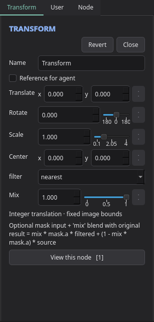
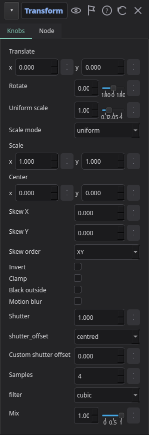

# Transform properties panel

DiMo's 9/27 comparison: the original panel beside the shared-template cleanup.

| Before | After |
|---|---|
|  |  |

The new header carries the editable node name and compact view, agent-reference, help, revert and
close actions. Transform's controls now expose sub-pixel affine transforms, per-axis scale, skew,
edge behavior and shutter sampling. New nodes use cubic filtering; migrated projects retain nearest.
